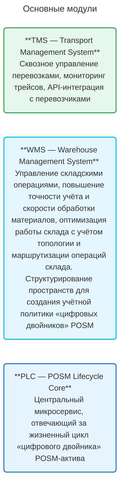

# О Центре Управления Процессами

**Центр Управления Процессами (ЦУП)** — это единая цифровая платформа для управления операционными процессами компании. 

**ЦУП применим:**
* в логистике: планирование и исполнение перевозок, управление транспортными средствами и подрядчиками, контроль маршрутов и сроков;
* на складах: управление приёмкой, размещением, хранением, комплектацией и отгрузкой товарно-материальных ценностей (ТМЦ);
* в мерчендайзинге: организация и контроль полевых работ по монтажу, обслуживанию и демонтажу оборудования у клиентов;
* в управлении: формирование финансовых документов, аналитика KPI, документооборот и коммуникация между участниками процессов (сотрудниками, подрядчиками и клиентами).

## Основные модули

{.center width=1200}

## Готовые функциональные блоки продукта

1. Пользователи и контрагенты 
2. Договоры и поручения
3. Справочники (Конфигураторы)
├── Номенклатура 
└── Пространства
4. Заказ
├── Создание заказа в мануальном режиме или через exсel-шаблон
└── Планирование и мониторинг заказа на диаграмме Ганта или в недельном представлении календаря
5. Заявки на склад (система документооборота)
├── Поступление
├── Списание
└── Проведение документов