# Что такое Пачка?

**Пачка** — наша новая единая среда для рабочих коммуникаций. Все рабочие задачи необходимо обсуждать здесь: обсуждать проекты в чатах. ставить задачи и созваниваться по видеосвязи. 
Разобраться в Пачке несложно — в этом вам поможет короткий обзор ниже, где описаны все главные разделы и полезные функции.

# Вход в Пачку

Регистарция в пачке происходит через письмо-приглашение, отправляемое на электронную почту. 

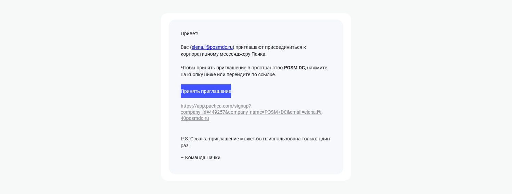{.center width=1200}

После перехода по ссылке нужно ввести код, который мы пришлём вам на ту же почту. 
На этом регистрация в пачке завершена!



У вас может быть несколько пространств (подробне об этом в разделе [«Пространства»](#prostranstva)). 
В этом случае после ввода кода будет отображено окно «Доступ к пачке ограничен». 

{.center width=1200}

Необходимо кликнуть по команде «Вернуться в лобби» и там выбрать рабочее пространство POSMDC. После чего доступ будет разрешен. 



# Что есть в Пачке

Краткий обзор системы.

## Меню

Слева расположена навигационная панель. Через неё вы попадаете в ключевые разделы:

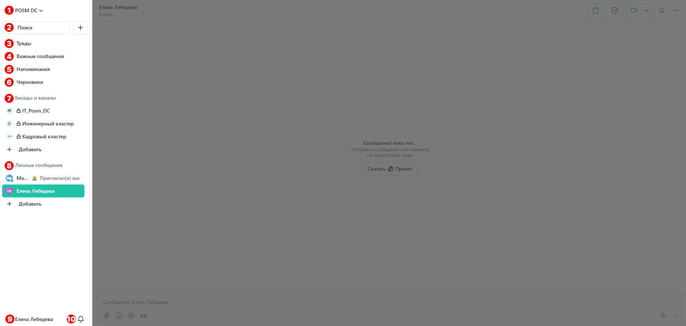{.center width=1200}

1. **Пространства** — переключение между рабочими областями.
2. **Поиск** — быстрый доступ к чатам, людям и сообщениям.
3. **Треды** — все обсуждения, которые ведутся под сообщениями.
4. **Важные сообщения** — сохранённые сообщения, чтобы не потерять.
5. **Напоминания** — список ваших напоминаний и задач.
6. **Черновики** — неотправленные сообщения со всех устройств.
7. **Беседы и каналы**
8. **Личные сообщения** 
9. **Профиль** — ваши настройки и информация о себе.
10. **Уведомления** — системные оповещения.

## Пространства

Пространство — это отдельная рабочая область, привязанная к вашему корпоративному аккаунту. К одному аккаунту можно подключить до 10 пространств. Если вы участвуете в нескольких проектах, все они будут доступны в одном аккаунте.

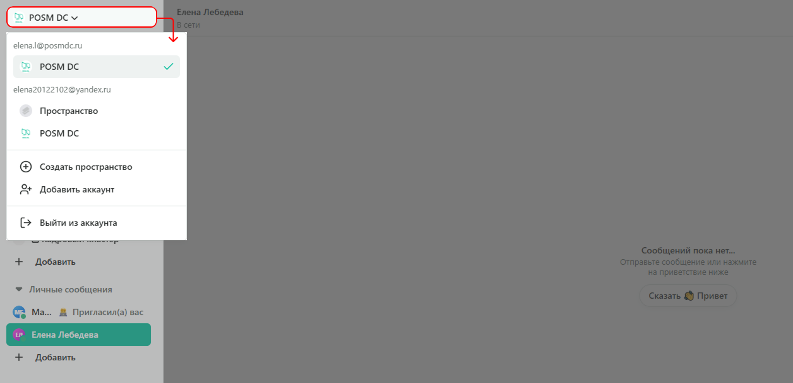{.center width=1200}

Доступные пространства будут отображаться в лобби. Лобби — это экран, где пользователь видит список аккаунтов (и привязанных к ним пространств), в которые он вошёл. В лобби можно добавить ещё один аккаунт, выбрать или создать пространство, выйти из одного или всех аккаунтов

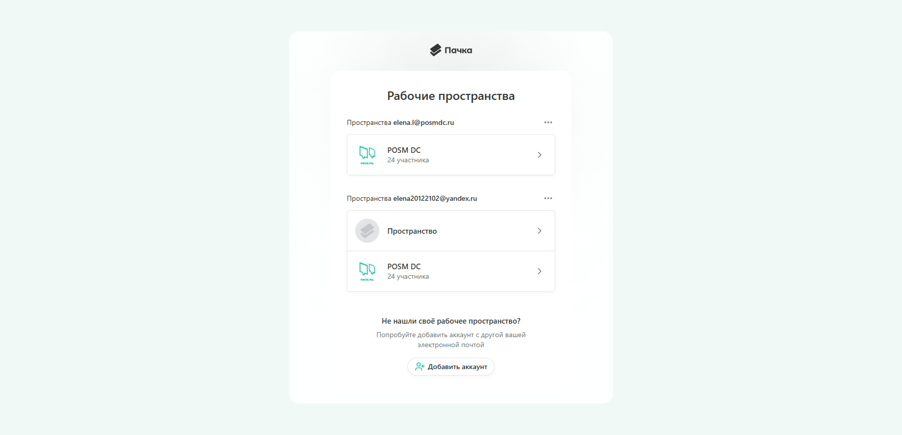{.center width=1200}

В лобби можно попасть:
- после авторизации, если к аккаунту привязано несколько пространств или это авторизация в ещё один аккаунт.
- после выхода из аккаунта через боковое меню пространства или в разделе «Аккаунт» в личном профиле.

Если к аккаунту привязано только одно пространство, то после авторизации оно сразу откроется, минуя экран лобби



Общение между участниками из разных пространств в одном чате невозможно, даже если вы лично имеете доступ к обоим.



## Поиск

Поисковая строка помогает быстро находить нужные чаты, участников или сообщения — но только в тех диалогах, куда вас пригласили.

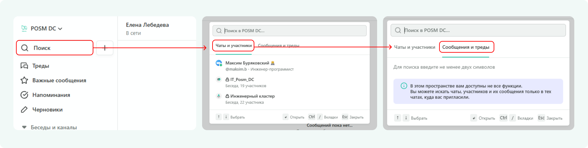{.center width=1200}

Также рядом с полем поиска есть символ «+», благодаря которому можно создать тред или видеочат в треде.



Создать новый чат (беседу или канал) может только администратор данного рабочего пространства.



{.center width=1200}

## Треды

Треды (в интерфейсе они называются «Комментарии») — это отдельные ветки обсуждения под конкретным сообщением. Они нужны, чтобы не захламлять общий чат. 

Как это работает:
- любой участник чата может начать тред под любым сообщением;
- тред открывается в правой боковой панели;
- все новые сообщения в ветке появляются там же;
- в тредах можно переписываться и прикреплять файлы.

Кроме того, все треды по всем сообщениям будут собраны на одноименной вкладке в боковом меню. 

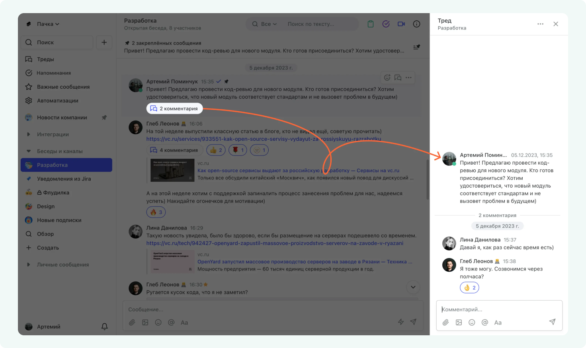{.center width=1200}

## Действия с сообщениями

Наведите курсор на сообщение или кликните правой кнопкой мыши — справа появится панель инструментов.

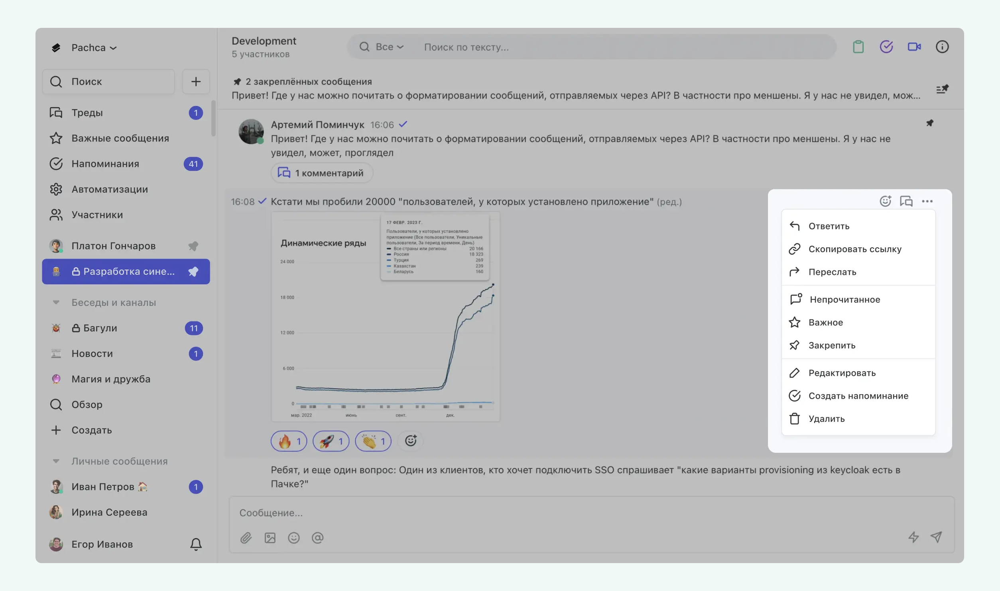{.center width=1200}

- по клику на **смайлик**, откроются эмодзи, которые можно использовать как реакции на сообщение;
- по клику на **иконку диалога** откроется отдельное окошко, где можно начать обсуждение (тред), не мешая участникам чата;
- **ответить** — ответить на сообщение в текущем чате
- **скопировать ссылку** — скопировать ссылку на конкретное сообщение: по ней откроется само сообщение в нужном чате и в контексте беседы, но для этого необходим доступ к чату, где сообщение было отправлено;
- **переслать** — переслать сообщение в один или несколько чатов;
- **непрочитанное** — отметить сообщение как непрочитанное, чтобы вернуться к нему позже - чат с непрочитанным сообщением пометиться индикатором в левом меню;
- **важное** — сохранить сообщение в список важных сообщений, доступный в основном меню;
- **закрепить** — можно закрепить несколько сообщений сразу;
- **редактировать** — внести правки в текст сообщения;
- **создать напоминание** — быстро создать напоминание по выбранному сообщению: его содержание подтянется в текст напоминания, после чего можно сразу его сохранить или по желанию выбрать время, важность и ответственных;
- **удалить** — удалить отправленное сообщение.

Также у сообщений есть статус: 
- серая галочка — сообщение доставлено;
- синяя галочка — сообщение прочитано. 

Список прочитавших участников можно увидеть, наведя курсор на галочку.

## Напоминания и задачи

Все ваши напоминания собраны в одном разделе. Они сортируются автоматически:
1. Просроченные.
2. Ближайшие 7 дней.
3. Остальные (срок больше недели или не указан).

Для удобства есть фильтры и поиск: можно посмотреть задачи, которые поставили вам, вы сами, личные, по конкретным чатам, все или только завершённые

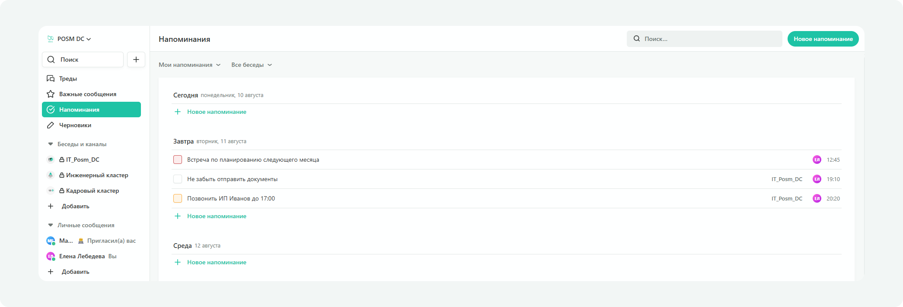{.center width=1200}

### Как создать напоминания

**Способ 1.** Через раздел «Напоминания» — кнопка «Новое напоминание» в правом верхнем углу.

**Способ 2.** Из чата (только из личных или групповых бесед, не из каналов):
- на компьютере: нажмите на фиолетовую иконку чекбокса в правом верхнем углу → «Новое напоминание»;
- в мобильном приложении: иконка чекбокса в правом нижнем углу → «+».

**Способ 3.** Из любого сообщения: наведите курсор, нажмите на троеточие → «Создать напоминание». Текст сообщения скопируется в описание, а напоминание привяжется к чату.

### Карточка напоминания

По умолчанию карточка напоминания содержит поля: тип, описание, прикрепление к беседе, приоритет, срок выполнения и ответственные.

1. **Тип** — напоминание может быть с типом звонок, встреча, простое напоминание, событие, письмо. Выбирайте по желанию, данная настройка не влияет на функционал.
2. **Приоритет** — можно отметить как «Важно» или «Очень важно». Такие задачи подсвечиваются оранжевым или красным
3. **Срок выполнения** — самый важный параметр. Укажите дату и время, чтобы получить уведомление. Если нужно перенести задачу, просто перетащите её в календаре на другой день — время сохранится (если не было указано, станет 00:00)
4. **Ответственные‍** — назначьте коллег или теги. Всем им придёт уведомление в установленный срок. Время срабатывания привязано к часовому поясу каждого пользователя.

Напоминание можно прикрепить к беседе — тогда оно появится в списке задач внутри этого чата.

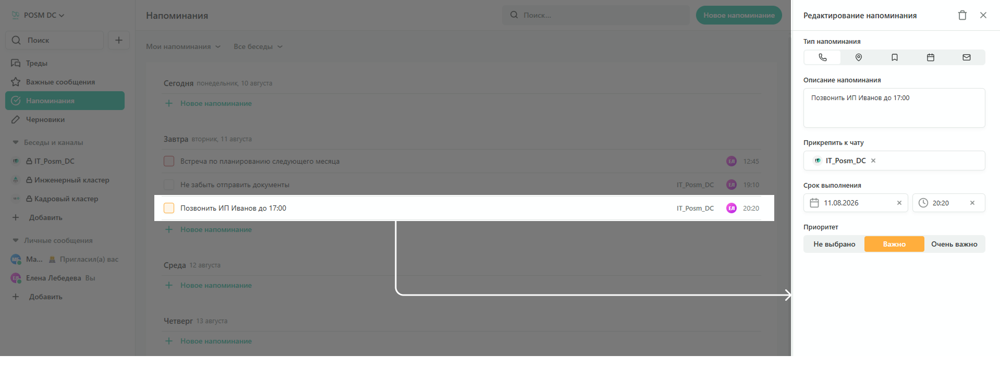{.center width=1200}

## Черновики

Всё, что вы начали писать, но не отправили, автоматически сохраняется в разделе «Черновики». Это работает в личных, групповых чатах и тредах. Сохраняются ссылки и форматирование.

Черновики синхронизируются между устройствами — можно начать сообщение на компьютере, а дописать и отправить с телефона.

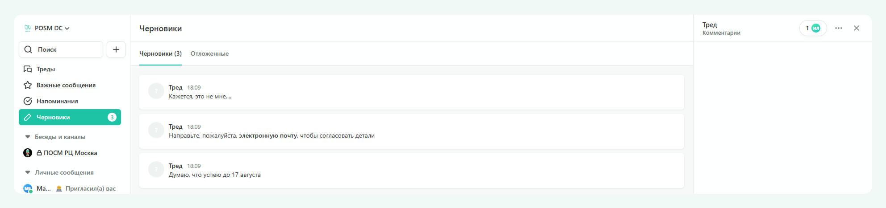{.center width=1200}

## Виды чатов

В **беседах** любой участник чата может написать новое сообщение — здесь можно обсудить что-то командой.

В **каналы** могут писать только создатель и назначенные им редакторы — здесь, в зависимости от канала, будут размещаться новости и другая важная информация, которая будет сохранять структуру и не теряться в потоке обсуждений.

**Личные сообщения** предназначены для общения один на одих - используйте их для решения тех вопросов, которые не требуют коллективного обсуждения. 

{.center width=1200}

В правой части экрана есть меню управления чатом (три точки). Там можно:
- включить/отключить уведомления;
- закрепить чат;
- отметить сообщения как непрочитанные;
- пригласить новых участников (если есть доступ).

{.center width=1200}

Под любым сообщением можно оставить комментарий — это и есть тред. Все обсуждения проходят в боковой панели, а в основном чате остаётся только суть. Уведомления о новых комментариях приходят во вкладку «Треды».

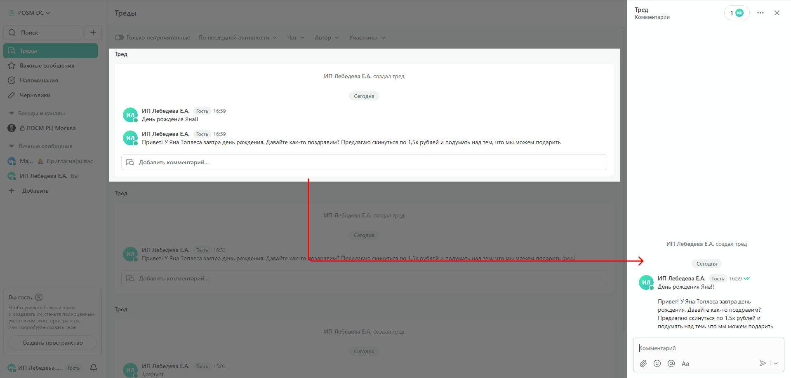{.center width=1200}

## Профиль

В профиле вы указываете информацию о себе — она видна коллегам. Также здесь можно:
1. Включить двухфакторную аутентификацию для защиты аккаунта.
2. Установить статус (например, «В отпуске» или «На встрече»), чтобы коллеги знали, когда вас лучше не беспокоить.
3. Настроить уведомления под себя.

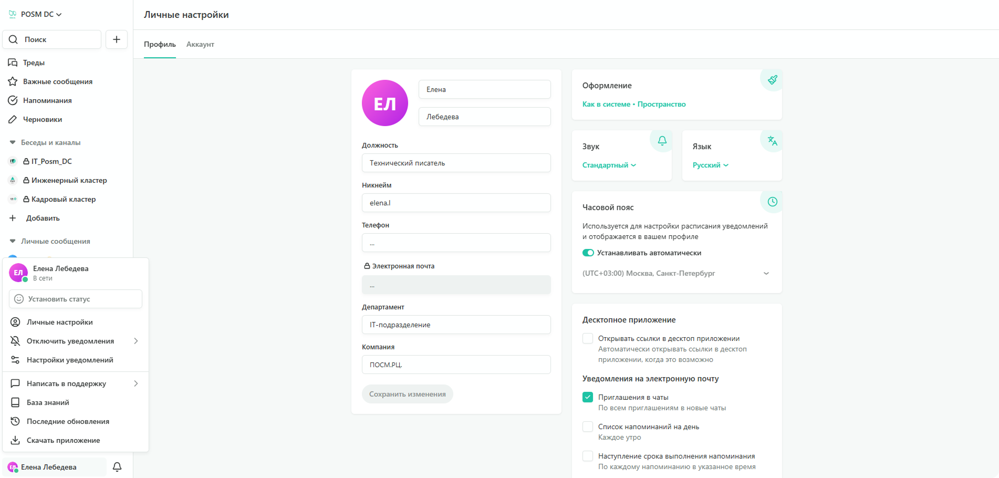{.center width=1200}

## Видеозвонки

Видеозвонки возможно начать из четырех точек:
1. Беседа или канал - видеозвонок будет доступен для всех участников чата;
2. Тред - только для участников треда;
3. Личные сообщения - только ваш собеседник (звонок тет-а-тет);
4. Личные сообщения с самим собой - особый случай: здесь можно скопировать ссылку и отправить её тем, у кого ещё нет аккаунта в Пачке. Они смогут присоединиться по ссылке без регистрации. 

Чтобы начать звонок, нажмите на значок видеокамеры в верхнем меню. 

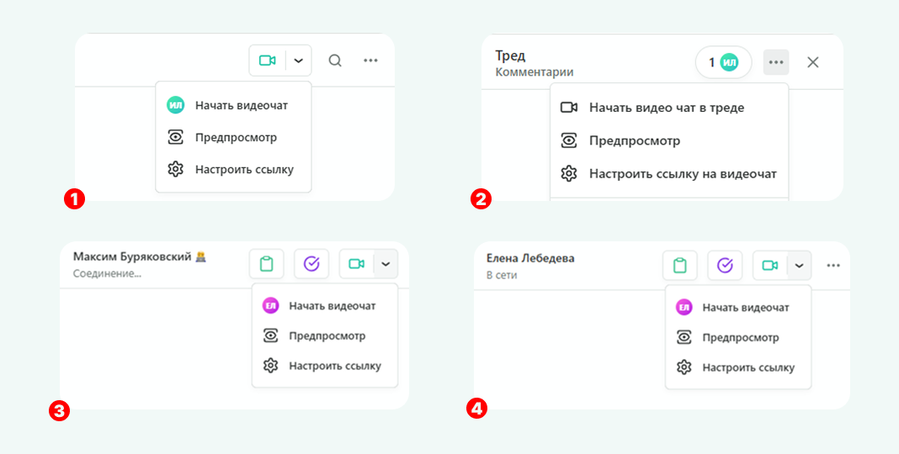{.center width=1200}

Появится окно с предварительными настройками, где можно ввести имя, выбрать источники звука и видео, добавить задний фон и задать доп. настройки.

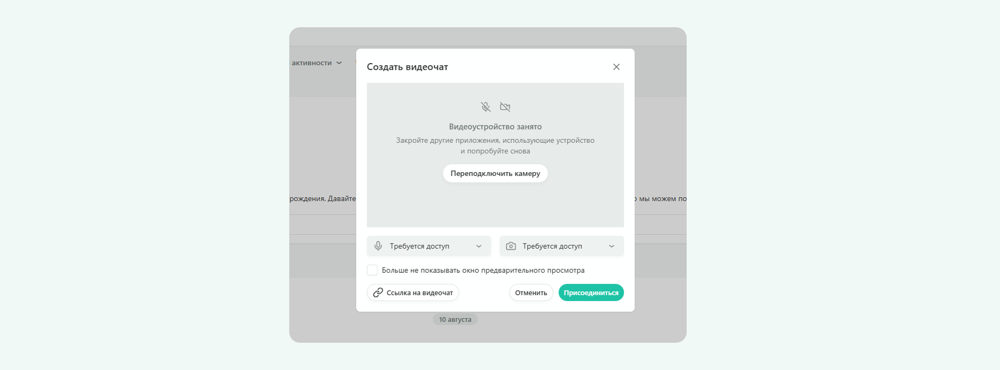{.center width=1200}

После того как вы инициировали звонок, в чате появляется автоматическое сообщение о начале видеозвонка. Все, кто имеет доступ к этому чату, увидят его и смогут присоединиться в любой момент — пока звонок активен
