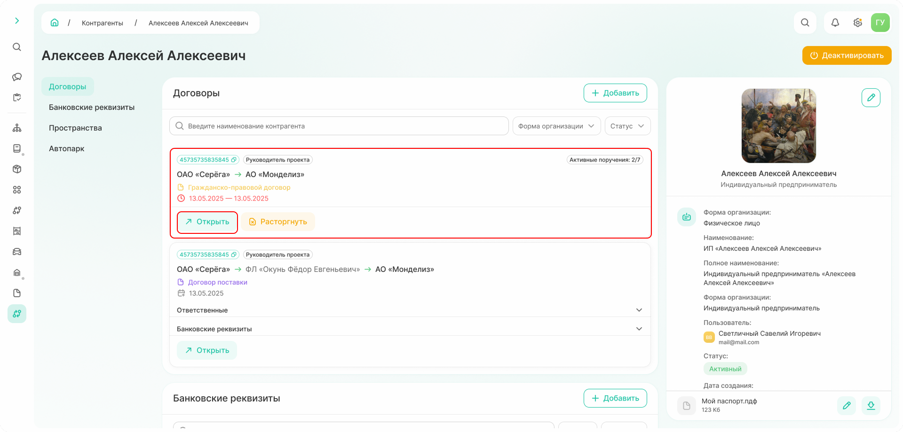
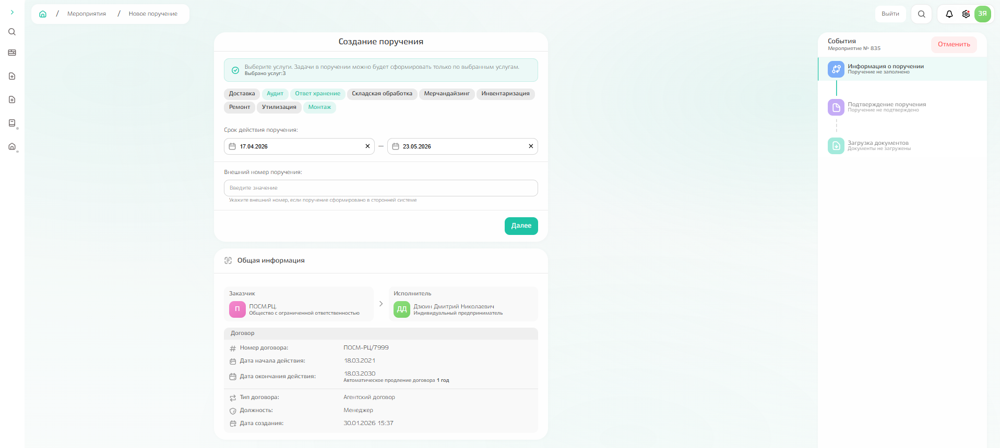
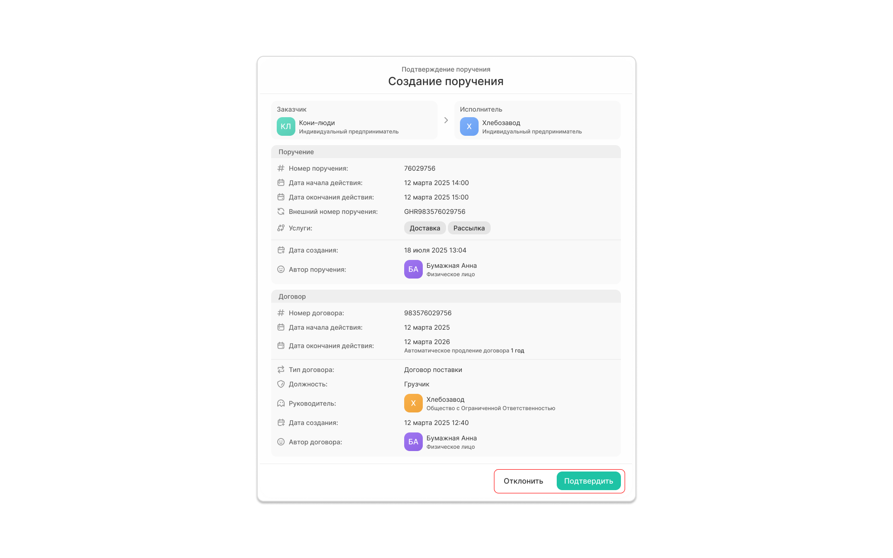
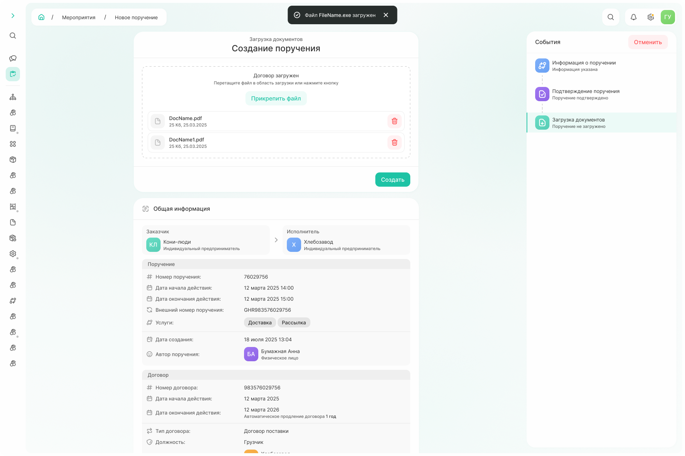
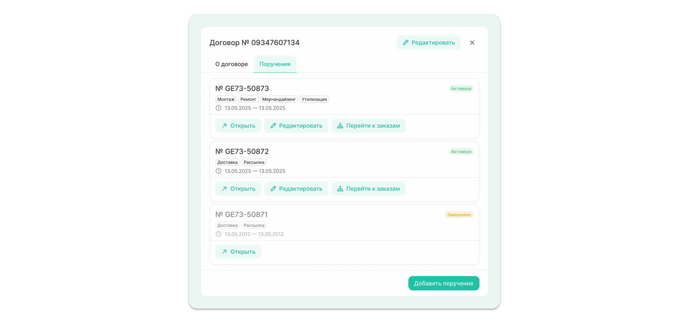
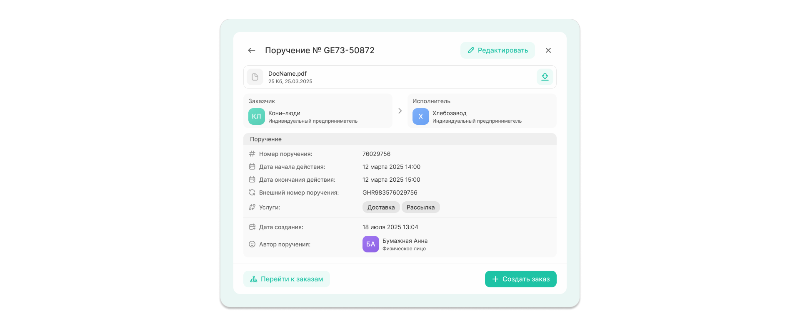

# Как создать поручение

**Поручение** — документ, предоставляющий право на оказание услуг. Поручение **всегда создается в рамках договора.**

Чтобы открыть договор, перейдите в подсистему «Справочники» → «Контрагенты» и найдите блок «Договоры». 



Если у договора есть поручения, то в верхнем углу отобразится счетчик активных поручений к общему числу.

 

{.center width=1200}

## Шаг 1. Заполнение информации о поручении

Выберете договор, в рамках которого хотите создать поручение, и по команде «Открыть» → «Добавить поручение» откройте форму создания поручения.

Укажите:
- услуги: выбрать можно только среди указанных в договоре;
- срок действия поручения;
- внешний номер поручения: заполняется, если поручение сформировано в сторонней системе;
- номенклатуру. 

{.center width=1200}

По команде «Далее» поручение закрывается и отправляется генеральному директору на согласование. До тех пор, пока генеральный директор не согласует поручение, оно будет недоступно. 

## Шаг 2. Согласование поручения

После создания поручения в списке мероприятий **генерального директора** появится поручение, которое можно либо отклонить, либо подтвердить. 

{.center width=400}



- При подтверждении

    Пользователь, создавший поручение, видит подтвержденное поручение в списке своих мероприятий и может завершить создание поручения, загрузив документы (шаг 3).

- При отклонении

  1. Генеральный директор указывает причину отклонения и может прикрепить файлы для уточнения причины отказа;

    {.center width=400}

    2. Пользователь, создавший поручение, видит отклоннёное поручение в списке своих мероприятий. По клику на мероприятие откроется форма, где можно посмотреть причину отклонения и доработать документ.  

    

    Поручение может быть отклонено несколько раз. Все изменения хранятся в системе: для просмотра переключайтесь между событиями в левой части экрана. 

      

    {.center width=1200}



## Шаг 3. Загрузка документов

Файл по поручению загружается в формате pdf по команде «Прикрепить файл» или перетаскиванием в область загрузки.   

{.center width=1200}

Создание поручения завершается по команде «Создать». 
Система выведет сообщение об успешном создании поручения с указанием внутреннего номера и возможностью просмотра информации (команда «Перейти к поручению»).

{.center width=400}

## Просмотр информации о поручениях

Информацию о поручениях также можно посмотреть при выборе конкретного договора из карточки контрагента: если в рамках договора уже созданы поручения, будет отдельная вкладка «Поручения».

{.center width=600}

Поручения можно просмотреть (команда «Открыть»), отредактировать (команда «Редактировать»), а также перейти к заказам, созданным в рамках этого поручения (команда «Перейти к заказам»).

К заказам можно перейти и при просмотре поручения, а также создать новый заказ.

{.center width=600}

Создание заказа описано в разделе [«Заказ»](./how_to_request.md). 
