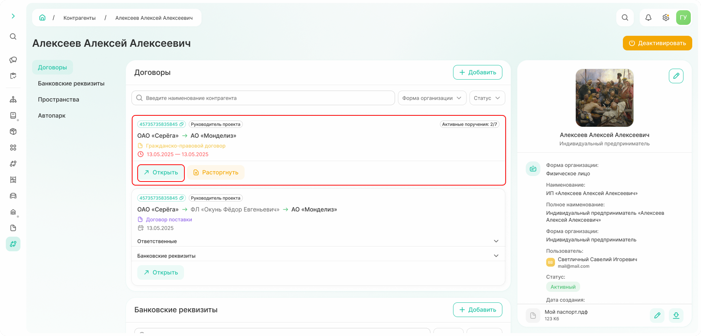
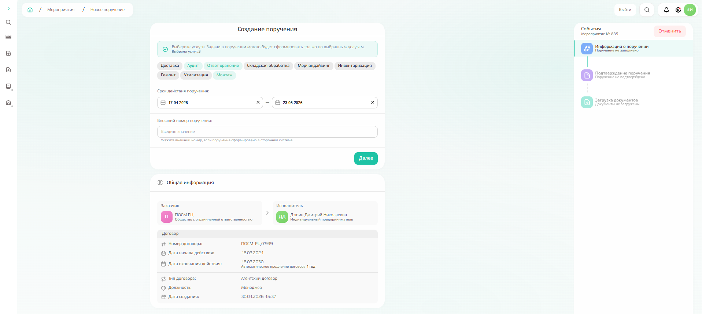
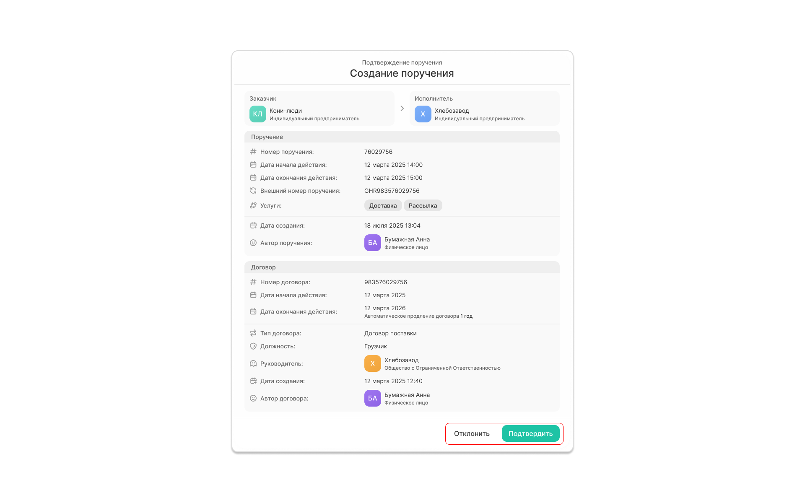
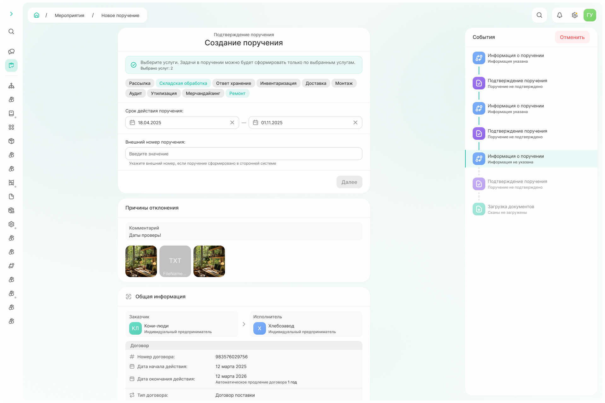
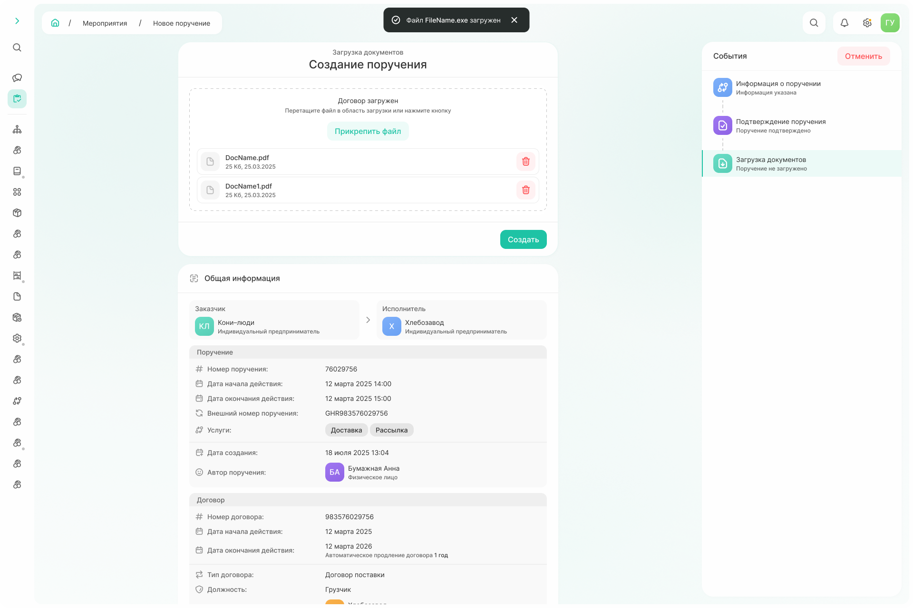
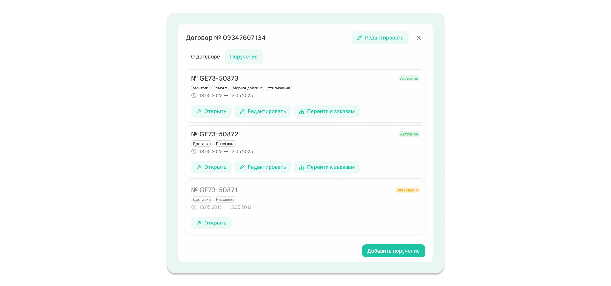
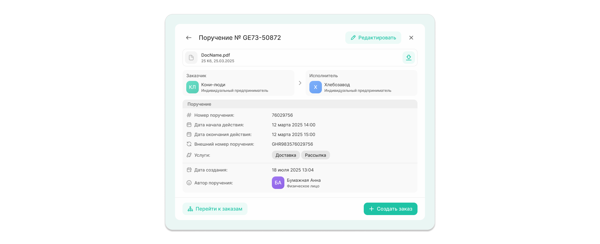

# Как создать поручение



**[Поручение][1]** — элемент управления, являющийся высокоуровневым указанием от клиента на выполнение услуг. 



Поручение **всегда создается в рамках договора**, поэтому для создания поручения необходимо в начале открыть договор, которому создаваемое поручение будет подчинено. 

Чтобы открыть договор, перейдите в подсистему «Справочники» → «Контрагенты» и найдите вкладку «Договоры». 
*Прим. Если у [договора][2] есть поручения, то в верхнем углу отобразится счетчик активных поручений к общему числу.*

{.center width=1200}

## [Событие][8] 1. Заполнение информации о поручении

Выберете договор, в рамках которого хотите создать поручение, и по команде «Открыть» → «Добавить поручение» откройте [форму][3] создания поручения.

Блок с общей информацией выводит информацию из выбранного договора.
Вам же необходимо указать:
- услуги: можно выбрать только среди указанных в договоре 
*Прим. выбранная услуга будет окрашена в зеленый цвет*;
- срок действия поручения;
- внешний номер поручения: заполняется, если поручение сформировано в сторонней системе;
- [номенклатуру][4]. 

{.center width=1200}

По команде «Далее» поручение закрывается и отправляется генеральному директору на согласование. До тех пор, пока генеральный директор не согласует поручение, оно будет недоступно. 

## Событие 2. Согласование поручения

После создания поручения в списке [мероприятий][5] **генерального директора** появится поручение, которое можно либо отклонить, либо подтвердить. 

{.center width=1200}



- При подтверждении

    Пользователь, создавший поручение, видит подтвержденное поручение в списке своих мероприятий и может завершить создание поручения, загрузив документы (шаг 3).

- При отклонении

    1. Генеральный директор указывает причину отклонения и может прикрепить файлы для уточнения причины отказа;

    {.center width=1200}

    2. Пользователь, создавший поручение, видит отклоннёное поручение в списке своих мероприятий. По клику на мероприятие откроется форма, где можно посмотреть причину отклонения и доработать документ.  

    

    Поручение может быть отклонено несколько раз. Все изменения хранятся в системе: для просмотра переключайтесь между событиями в левой части экрана. 

    {.center width=1200}

      



## Событие 3. Загрузка документов

Файл по поручению загружается в формате pdf по команде «Прикрепить файл» или перетаскиванием в область загрузки.   

{.center width=1200}

Создание поручения завершается по команде «Создать». 
Система выведет сообщение об успешном создании поручения с указанием внутреннего номера и возможностью просмотра информации (команда «Перейти к поручению»).

{.center width=1200}

## Просмотр информации о поручениях

Информацию о поручениях также можно посмотреть при выборе конкретного договора из [карточки контрагента][6]: если в рамках договора уже созданы поручения, будет отдельная вкладка «Поручения».

{.center width=1200}

Поручения можно просмотреть (команда «Открыть»), отредактировать (команда «Редактировать»), а также перейти к [заказам][7], созданным в рамках этого поручения (команда «Перейти к заказам»).

К заказам можно перейти и при просмотре поручения, а также создать новый заказ.

{.center width=1200}

Создание заказа описано в разделе [«Заказ»](./how_to_request.md). 

[1]: https://lebelena.github.io/diplodoc-example/ru/glossary.html#lcp:~:text=%D0%B7%D0%B0%D0%BA%D1%80%D0%B5%D0%BF%D0%BB%D0%B5%D0%BD%D0%BD%D0%BE%D0%B5%20%D0%B7%D0%B0%20%D0%BA%D0%BE%D0%BD%D1%82%D1%80%D0%B0%D0%B3%D0%B5%D0%BD%D1%82%D0%BE%D0%BC-,%D0%9F%D0%BE%D1%80%D1%83%D1%87%D0%B5%D0%BD%D0%B8%D0%B5,-%E2%80%93%20%D0%B2%D1%8B%D1%81%D0%BE%D0%BA%D0%BE%D1%83%D1%80%D0%BE%D0%B2%D0%BD%D0%B5%D0%B2%D0%BE%D0%B5%20%D1%83%D0%BA%D0%B0%D0%B7%D0%B0%D0%BD%D0%B8%D0%B5%20%D0%BE%D1%82

[2]: https://lebelena.github.io/diplodoc-example/ru/glossary.html?tabs=defaultTabsGroup-fxlxutvy_%25d0%2594%25d0%25be%25d0%25b3%25d0%25be%25d0%25b2%25d0%25be%25d1%2580_accordion#lcp:~:text=%D0%B3%D0%BE%D1%80%D0%B8%D0%B7%D0%BE%D0%BD%D1%82%D0%B0%D0%BB%D1%8C%D0%BD%D0%BE%D0%B9%20%D1%81%D0%BE%20%D1%81%D1%80%D0%BE%D0%BA%D0%B0%D0%BC%D0%B8-,%D0%94%D0%BE%D0%B3%D0%BE%D0%B2%D0%BE%D1%80%20(LCP),-%E2%80%93%20%D1%81%D1%83%D1%89%D0%BD%D0%BE%D1%81%D1%82%D1%8C%2C%20%D0%BF%D0%BE%D0%B4%D1%82%D0%B2%D0%B5%D1%80%D0%B6%D0%B4%D0%B0%D1%8E%D1%89%D0%B0%D1%8F%20%D1%81%D0%BE%D0%B3%D0%BB%D0%B0%D1%88%D0%B5%D0%BD%D0%B8%D0%B5

[3]: https://lebelena.github.io/diplodoc-example/ru/glossary.html?tabs=defaultTabsGroup-fxlxutvy_%25d0%2594%25d0%25be%25d0%25b3%25d0%25be%25d0%25b2%25d0%25be%25d1%2580_accordion#lcp:~:text=%D0%9C%D0%BE%D0%B4%D0%B0%D0%BB%D1%8C%D0%BD%D0%BE%D0%B5%20%D0%BE%D0%BA%D0%BD%D0%BE/%D1%84%D0%BE%D1%80%D0%BC%D0%B0

[4]: https://lebelena.github.io/diplodoc-example/ru/glossary.html?tabs=defaultTabsGroup-fxlxutvy_%25d0%2594%25d0%25be%25d0%25b3%25d0%25be%25d0%25b2%25d0%25be%25d1%2580_accordion#lcp:~:text=%D0%9D-,%D0%9D%D0%BE%D0%BC%D0%B5%D0%BD%D0%BA%D0%BB%D0%B0%D1%82%D1%83%D1%80%D0%B0%20(LCP),-%E2%80%93%20%D1%81%D0%B2%D0%BE%D0%B4%D0%BD%D1%8B%D0%B9%20%D0%BF%D0%B5%D1%80%D0%B5%D1%87%D0%B5%D0%BD%D1%8C%20%D0%BE%D0%B1%D1%89%D0%B8%D1%85

[5]: https://lebelena.github.io/diplodoc-example/ru/glossary.html?tabs=defaultTabsGroup-fxlxutvy_%25d0%2594%25d0%25be%25d0%25b3%25d0%25be%25d0%25b2%25d0%25be%25d1%2580_accordion#lcp:~:text=%D0%9C-,%D0%9C%D0%B5%D1%80%D0%BE%D0%BF%D1%80%D0%B8%D1%8F%D1%82%D0%B8%D0%B5,-%E2%80%93%20%D1%8D%D1%82%D0%BE%20%D0%B4%D0%BE%D1%81%D1%82%D1%83%D0%BF%D0%BD%D0%BE%D0%B5%20%D0%B4%D0%BB%D1%8F

[6]: https://lebelena.github.io/diplodoc-example/ru/glossary.html?tabs=defaultTabsGroup-fxlxutvy_%25d0%2594%25d0%25be%25d0%25b3%25d0%25be%25d0%25b2%25d0%25be%25d1%2580_accordion#lcp:~:text=%D0%9A%D0%B0%D1%80%D1%82%D0%BE%D1%87%D0%BA%D0%B0%20%D0%B7%D0%B0%D0%B4%D0%B0%D1%87%D0%B8/%D0%BA%D0%BE%D0%BD%D1%82%D1%80%D0%B0%D0%B3%D0%B5%D0%BD%D1%82%D0%B0/%D0%BF%D0%BE%D1%80%D1%83%D1%87%D0%B5%D0%BD%D0%B8%D1%8F%20%D0%BF%D0%BE%20%D0%B4%D0%BE%D0%B3%D0%BE%D0%B2%D0%BE%D1%80%D1%83

[7]: https://lebelena.github.io/diplodoc-example/ru/glossary.html?tabs=defaultTabsGroup-fxlxutvy_%25d0%2594%25d0%25be%25d0%25b3%25d0%25be%25d0%25b2%25d0%25be%25d1%2580_accordion%2CdefaultTabsGroup-ny49tt3u_%25d0%2597%25d0%25b0%25d0%25ba%25d0%25b0%25d0%25b7%2520%28%25d0%25b2%2520%25d0%25a1%25d0%25a3%25d0%25a3%29_accordion#lcp:~:text=%D1%8F%D0%B2%D0%BB%D1%8F%D0%B5%D1%82%D1%81%D1%8F%20%D1%87%D0%B0%D1%81%D1%82%D1%8C%D1%8E%20%D0%B7%D0%B0%D0%BA%D0%B0%D0%B7%D0%B0-,%D0%97%D0%B0%D0%BA%D0%B0%D0%B7%20(LCP),-%E2%80%93%20%D0%B4%D0%BE%D0%BA%D1%83%D0%BC%D0%B5%D0%BD%D1%82%2C%20%D0%BE%D0%BF%D0%B8%D1%81%D1%8B%D0%B2%D0%B0%D1%8E%D1%89%D0%B8%D0%B9%20%D0%BA%D0%BE%D0%BD%D0%BA%D1%80%D0%B5%D1%82%D0%BD%D1%8B%D0%B9

[8]:https://lebelena.github.io/diplodoc-example/ru/glossary.html#:~:text=%D0%BE%D0%B1%D0%BE%D1%80%D1%83%D0%B4%D0%BE%D0%B2%D0%B0%D0%BD%D0%B8%D1%8F%20%D0%B2%20%D1%80%D0%B5%D0%B3%D0%B8%D0%BE%D0%BD%D0%B0%D1%85-,%D0%A1%D0%BE%D0%B1%D1%8B%D1%82%D0%B8%D0%B5%20(LCP),-%E2%80%93%20%D0%BF%D0%BE%D1%81%D0%BB%D0%B5%D0%B4%D0%BE%D0%B2%D0%B0%D1%82%D0%B5%D0%BB%D1%8C%D0%BD%D0%BE%D1%81%D1%82%D1%8C%20%D0%B7%D0%B0%D1%84%D0%B8%D0%BA%D1%81%D0%B8%D1%80%D0%BE%D0%B2%D0%B0%D0%BD%D0%BD%D1%8B%D1%85%20%D0%B4%D0%B5%D0%B9%D1%81%D1%82%D0%B2%D0%B8%D0%B9