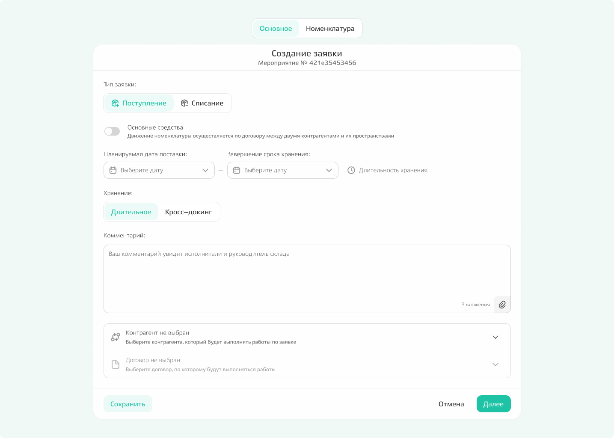
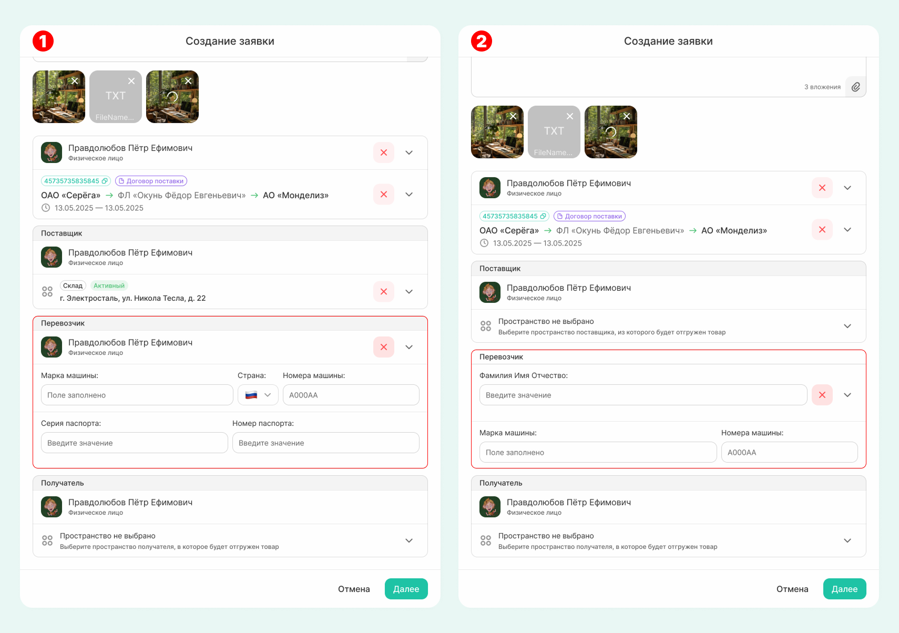
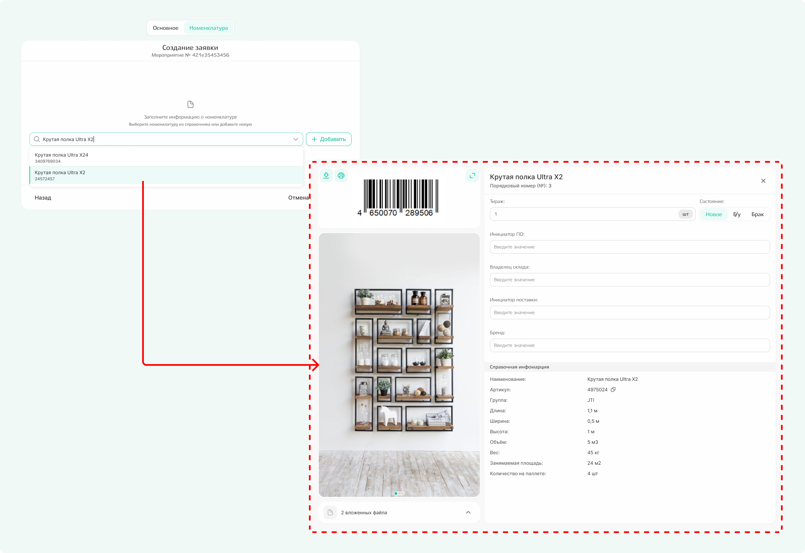
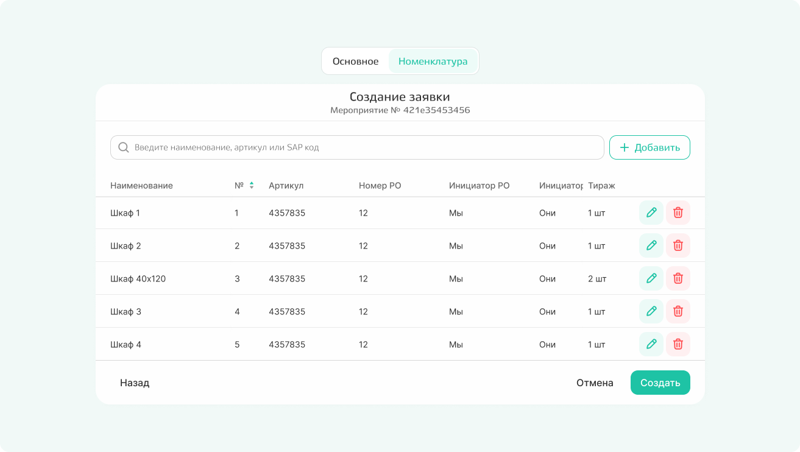
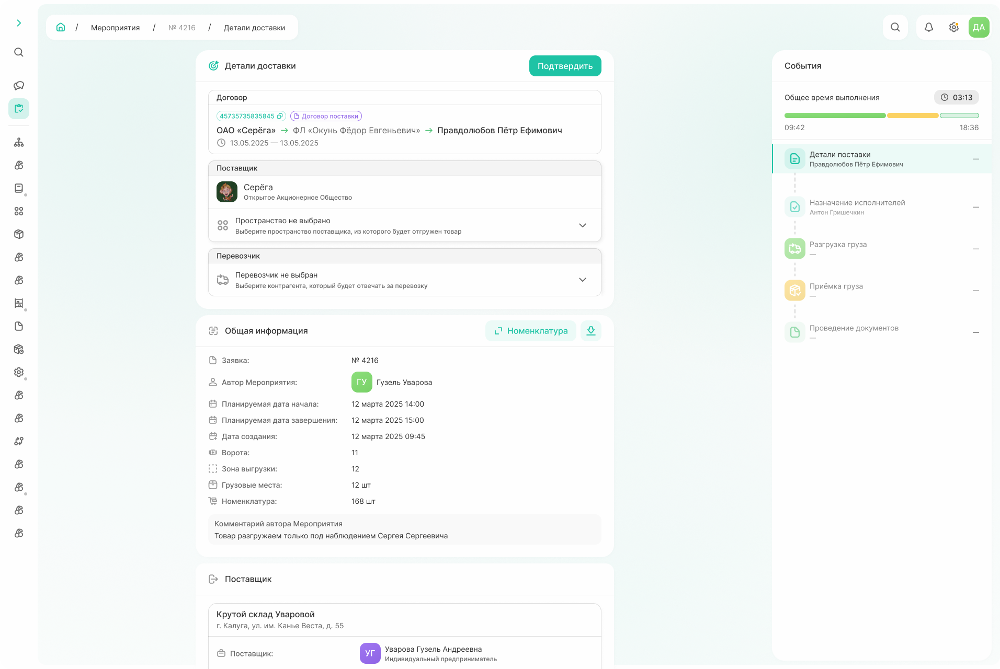
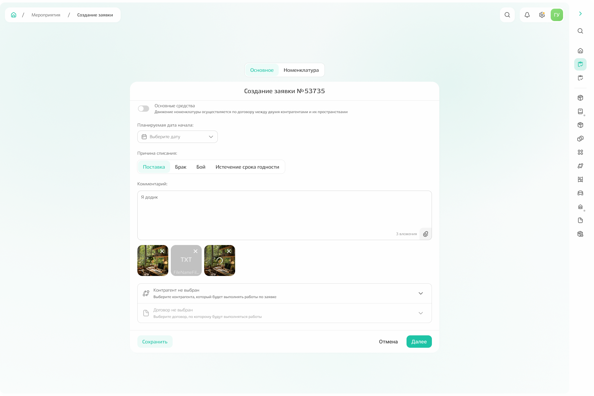
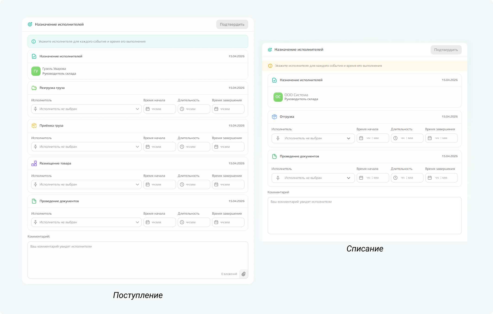

# Как создать заявку

Заявка — это документ, который необходим для работы с номенклатурой внутри компании. 

У заявки есть:
- автор — тот, кто создает заявку и заполняет основную информацию, это может быть только менеджер или руководитель склада;
- ответственный — руководитель склада, назначается автоматически в соответсвии с указанным пространством в договоре;
- исполнитель — назначается руководителем склада.

Выберите тот тип заявки, который хотите создать: поступление, списание или  инвентаризация и заполните данные на вкладках «Основное», «Номенклатура» в соответствии с выбранным типом. 
  


Вкладка с номенклатурой будет недоступна, пока не будет заполнена основная информация.



## 1. Заполнение информации по заявке

Выполняет либо руководитель склада, либо автор заявки.



- Поступление
  
  **На вкладке «Основное» указываются**
    - планируемые даты начала и завершения,
    - хранение для номенклатуры: отсутствует, длительное, [кросс-докинг](*key_storage),
    - комментарии: виден для исполнителей, при необходимости можно прикрепить файлы для конкретизации, 
    - контрагент, который выполняет работу по заявке,
    - договор, в рамках которого выполняется работа на складе.

    {.center width=1200}

    После выбора договора появляются и предзаполняются поля «Поставщик» и «Получатель». Вручную можно указать пространство, откуда товар будет отгружен (для поля поставщика) и указать пространство, куда товар будет выгружен (поле получателя). 

    При наличии информации также заполняется поле «Перевозчик». 
    Есть два способа:
    1. Выбирается контрагент, ответственный за перевозку. После чего становятся доступными для заполнения поля, где указывается марка, страна и номер машины, а также серия и номер паспорта.
    2. По команде «Добавить» можно создать пользовательский контакт: в этом случае для перевозчика указывается ФИО, марка и номера машины, однако, данные по этому перевозчику сохранятся только для этой заявки, в следующих раз надо будет вводить информацию заново.        

    {.center width=1200}

    

    Если по заявке нет информации о перевозчике, пространствах поставщика и получателя, то данные поля можно не заполнять. 

    

  **На вкладке «Номенклатура»** введите в поиске наименование, артикул или SAP-код необходимой номенклатуры и по команде «Добавить» откройте карточку номенклатуры. Заполните все поля и по команде «Сохранить» добавьте номенклатуру в заявку.  
   
    {.center width=1200}

    Когда вся номенклатура добавлена, нажмите команду «Создать».

    {.center width=600}

    В появившемся окне проверьте указанную информацию и по команде «Подтвердить» отправьте заявку в работу на склад. 

    {.center width=1200}

- Списание

    **На вкладке «Основное» указываются**
    - планируемые даты начала и завершения,
    - причина списания номенклатуры,
    - комментарии: виден для исполнителей, при необходимости можно прикрепить файлы для конкретизации, 
    - контрагент, который выполняет работу по заявке,
    - договор, в рамках которого выполняется работа на складе.

    {.center width=1200}

    После выбора договора появляются и предзаполняются поля «Поставщик» и «Получатель». Вручную можно указать пространство, откуда товар будет отгружен (для поля поставщика) и указать пространство, куда товар будет выгружен (поле получателя). 

    При наличии информации заполняется поле «Перевозчик». 
    Есть два способа:
    1. Выбирается контрагент, ответственный за перевозку. После чего становятся доступными для заполнения поля, где указывается марка, страна и номер машины, а также серия и номер паспорта.
    2. По команде «Добавить» можно создать пользовательский контакт: в этом случае для перевозчика указывается ФИО, марка и номера машины, однако, данные по этому перевозчику сохранятся только для этой заявки, в следующих раз надо будет вводить информацию заново.        

    {.center width=1200}

    

    Если по заявке нет информации о перевозчике, пространствах поставщика и получателя, то данные поля можно не заполнять.  

    

    **На вкладке «Номенклатура»** введите в поиске наименование, артикул или SAP-код необходимой номенклатуры и по команде «Добавить» откройте карточку номенклатуры. Заполните все поля и по команде «Сохранить» добавьте номенклатуру в заявку.  
   
    {.center width=1200}

    Когда вся номенклатура добавлена, нажмите команду «Создать».

    {.center width=600}

    В появившемся окне проверьте указанную информацию и по команде «Подтвердить» отправьте заявку в работу на склад. 

    {.center width=1200}

- Инвентаризация

    

    Функционал в разработке.  

    



## 2. Назначение исполнителей

Следующий шаг — назначение исполнителей по заявке. 

Если автором заявки был менеджер, то назначить исполнителей он не может. Однако, пока исполнители не выбраны, может отменить или отредактировать ранее внесенные данные. 

{.center width=600}

Если автором заявки был руководитель склада, после заполнения основной информации он сразу переходит к назначению исполнителей.

{.center width=1200}

Набор карточек, по которым необходимо назначить исполнителей, зависит от количества мероприятий в заявке. Для каждого мероприятия — свой ответственный. 

Время выставляется, исходя из дат, указанных автором заявки (планируемая дата начали и дата окончания), и по умолчанию распределяется равномерно на все мероприятия. Как руководитель склада вы можете выставить свое время независимо от даты, указанной автором заявки. 

После того как вся информация заполнена, сохраните данные по команде «Подтвердить». После сохранения по всей цепочке событий для каждого мероприятия отобразится исполнитель и планируемые даты выполнения работ.  

{.center width=1200}



Руководитель склада может запускать и останавливать любые мероприятия, даже если он на них не назначен как исполнитель.

 

## 3. Выполнение работ по заявке

Цепочка событий для разных типов заявок отличается. 

[*key_storage]: Кросс-докинг — логистическая схема, по которой грузы принимаются на складе и тут же, без размещения в зоне длительного хранения, перегружаются для дальнейшей отправки конечному получателю.

