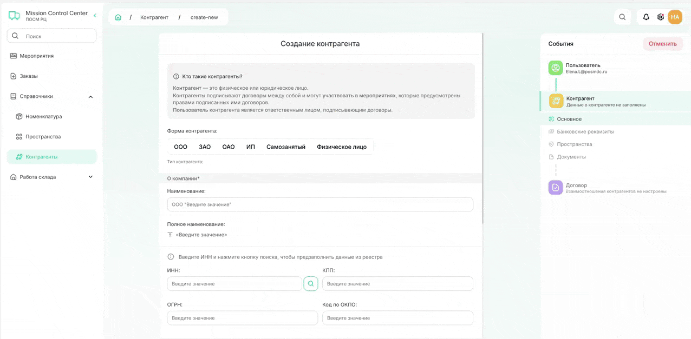
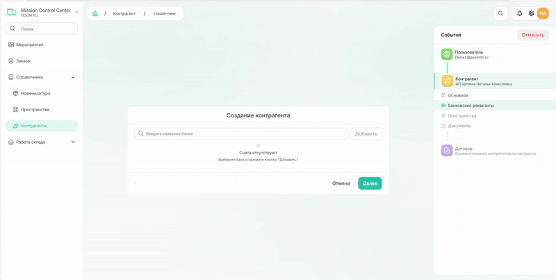

# Как создать контрагента

### 1. Создание пользователя для контрагента

**Контрагент** — это юридическое или физическое лицо, которое заключает договоры и участвует в мероприятиях согласно условиям этих договоров.

**Пользователь контрагента** — это ответственное лицо, которое подписывает договоры от имени контрагента.



Для контрагента **всегда должен быть пользователь**, поэтому перед созданием контрагента нужно добавить для него пользователя или найти существующего в системе.



**Шаг 1.** Перейдите в раздел «Справочники» → «Контрагенты», нажмите «Создать контрагента» и введите электронную почту.

{width=1200}

  
  
<em>Рис. 1. Создание контрагента</em>



Почта может быть с любым [доменом](*key_domen). 
**Важно**, если контрагент уже зарегистрирован с другим адресом, система создаст нового пользователя.



**Шаг 2.** После ввода e-mail возможно два варианта:

**Пользователь новый**
Откроется форма для заполнения данных. Заполните все поля и нажмите «Создать пользователя».

{width=800}

**Пользователь уже есть в системе**
Появится форма с предложением связать существующую запись с создаваемым контрагентом. Нажмите «Продолжить».

{width=800}

### 2. Заполнение информации о контрагенте

**Шаг 3.** Заполнение основной информации отличается для разных типов контрагентов.



- Физ лицо/самозанятый

  Все поля заполняются вручную:

  {width=1200}

- ИП

  Данные можно заполнить автоматически. Введите ИНН и нажмите на значок лупы. Паспортные данные вносите вручную.
   {width=1200}

- Юридическое лицо

  Данные можно заполнить автоматически. Введите ИНН и нажмите на значок лупы. Система подгрузит актуальные данные из ЕГРЮЛ. Часть полей заполняется вручную.

  {width=1200}

  

  **Только при автоматическом заполнении полей по ИНН** в карточку контрагента добавятся данные о видах деятельности.
  
  



**Шаг 4.** Добавьте банковские реквизиты контрагента:
   * Выберите банк из списка
   * Нажмите «Добавить»
   * Заполните данные о расчетном счете, БИК и корреспондентском счете

{width=1200}

У контрагента может быть несколько счетов.
Вы можете редактировать реквизиты счета: расчетный счёт, БИК и корреспондентский счет. Счет также можно деактивировать или удалить.



При удалении счета все связанные финансовые операции будут удалены. Рекомендуется сохранять историю финансовых операций и деактивировать счета. 



**Шаг 5.** Добавьте пространства для контрагента.

{width=1200}

Количество пространств не ограничено.
{width=800}

**Шаг 6.** Загрузите документы. Файлы должны быть в формате PDF.

{width=1200}

### 3. Договор и регистрация на портале

**Шаг 7.** На последнем шаге прикрепите договор, который регулирует отношения между контрагентом и ПОСМ РЦ.

Для этого:
* Прикрепите скан договора
* Назначьте ответственных
* Добавьте пространства, относящиеся к договору
* Укажите банковские реквизиты контрагента

{.center width=1200}

После этого система создаст контрагента и отправит на его почту логин и пароль.



Прикрепление договора можно пропустить и добавить его позже в карточке контрагента. В этом случае система создаст контрагента, но не отправит логин и пароль. Они придут после того, как вы прикрепите договор.
При добавлении новых договоров к существующему контрагенту логин и пароль не меняются.



Чтобы открыть карточку созданного контрагента, нажмите «Перейти к контрагенту».

{.center width=1200}

[*key_domen]: Домен почты — часть электронного адреса после знака «@». Например: @yandex.ru, @gmail.com, @posmdc.ru, @mail.ru или любой другой.
