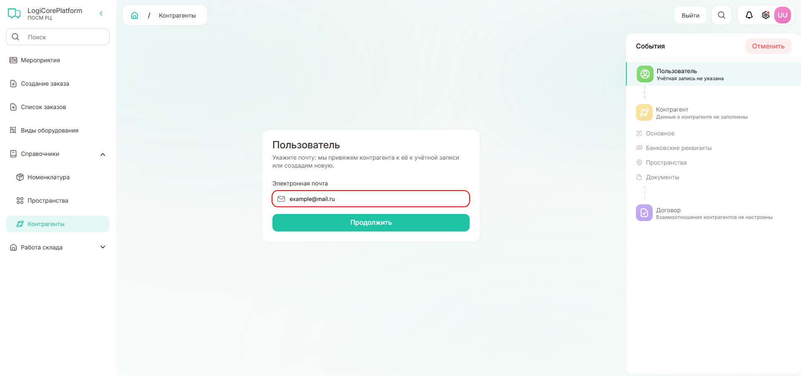
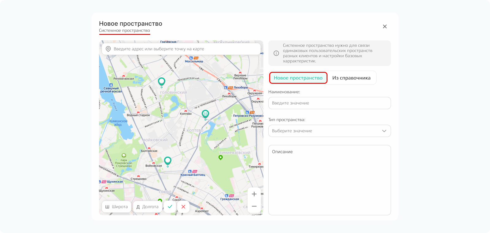
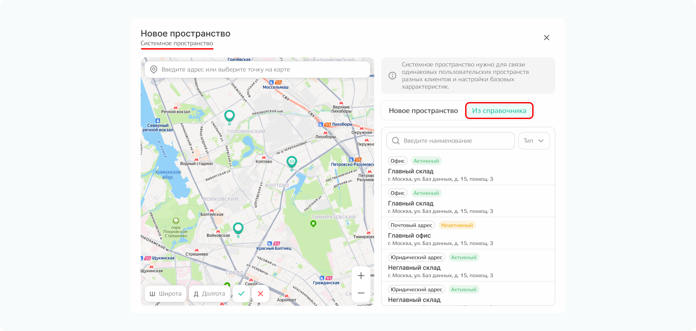
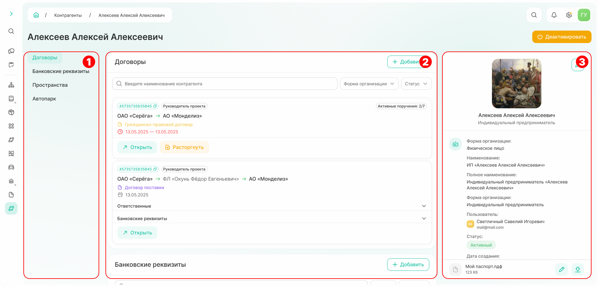
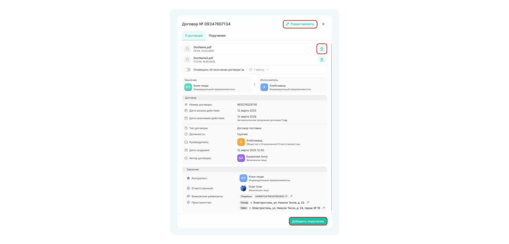
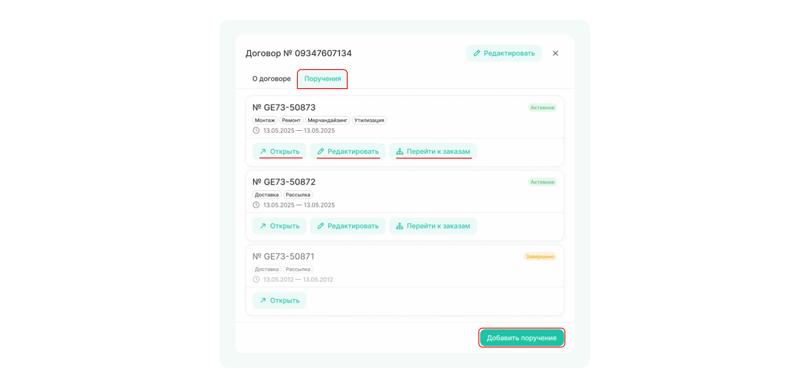
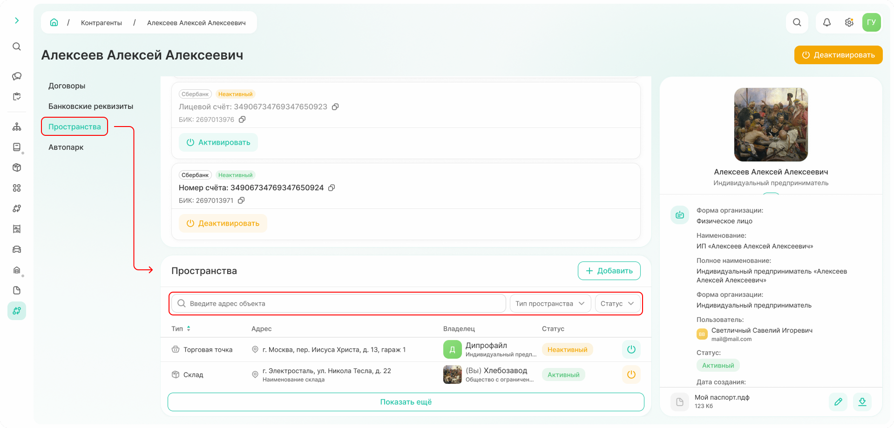

# Как создать контрагента

## 1. Создание пользователя для контрагента

**Контрагент** — это юридическое или физическое лицо, которое заключает договоры и участвует в мероприятиях согласно условиям этих договоров.

**Пользователь контрагента** — это ответственное лицо, которое подписывает договоры от имени контрагента.



Для контрагента **всегда должен быть пользователь**, поэтому перед созданием контрагента нужно добавить для него пользователя или найти существующего в системе.



### Шаг 1. Создание пользователя
Создать контрагента можно из раздела «Справочники» → «Контрагенты» → «Создать контрагента» или из раздела «Мероприятия» → «Создать мероприятия» → «Новый контрагент».

{width=1200}



Почта может быть с любым [доменом](*key_domen). 
**Важно**, если контрагент уже зарегистрирован с другим адресом, система создаст нового пользователя.



### Шаг 2. Внесение информации о пользователе

После ввода e-mail возможно два варианта:

#### 2.1. Пользователь новый
Заполните все поля и нажмите «Создать пользователя».

{width=800}

#### 2.2. Пользователь уже есть в системе
Появится форма с предложением связать существующую запись с создаваемым контрагентом. Нажмите «Продолжить».

{width=800}

## 2. Заполнение информации о контрагенте

### Шаг 3. Основная информация

Заполнение основной информации отличается для разных типов контрагентов.



- Физ лицо/самозанятый

  Все поля заполняются вручную:

  {width=1200}

- ИП

  Данные можно заполнить автоматически. 
  Введите ИНН и нажмите на значок лупы. Паспортные данные вносите вручную.
  
   {width=1200}

- Юридическое лицо

  Данные можно заполнить автоматически. 
  Введите ИНН и нажмите на значок лупы. Система подгрузит актуальные данные из ЕГРЮЛ.

  {width=1200}

  

  **Только при автоматическом заполнении** полей по ИНН в карточку контрагента добавятся данные о видах деятельности.
  
  



### Шаг 4. Банковские реквизиты 

Добавьте банковские реквизиты контрагента:
   * Выберите банк из списка
   * Нажмите «Добавить»
   * Заполните данные о расчетном счете, БИК и корреспондентском счете

{width=1000}

У контрагента может быть несколько счетов.
Для редактирования доступны: расчетный счёт, БИК и корреспондентский счет. Счет также можно деактивировать или удалить.

Количество банковских реквизитов не ограничено.



**При удалении счёта все связанные с ним финансовые операции будут удалены.** Рекомендуется деактивировать счета, чтобы сохранить историю операций 



### Шаг 5. Пространства

Пространство нужно, чтобы создавать заказ и определять место, откуда забирается и куда осуществляется поставка номенклатуры.



Добавляемое пространство привязывается к контрагенту. Контрагент становится его владельцем, что важно для работы с номенклатурой и разграничения прав доступа. 



Добавление пространства происходит в 2 этапа: создание или выбор существующего системного пространства, далее — работа с пользовательскими пространствами.

#### Системное пространство  

Системное пространство служит для группировки пользовательских пространств (фактически существующих объектов).
Это позволяет объединять пространства, которые имеют одинаковые географические координаты, но могут быть записаны в системе с разными вариантами адресов. 

Также пользовательские пространства, подчиненные системному, имеют одинаковую структуру или топологию. Например, этаж состоит из секторов, сектор из рядов, ряд из ярусов, а ярус из мест хранения. 
Для разных системных пространств топология может как совпадать, так и отличаться. 



**При создании контрагента топология не задается пользователем.** Система по умолчанию создает зону погрузки, внести изменения и добавить описание всей иерархии можно позже, найдя созданное пространство в справочнике.



Есть два варианта: создать новое пространство или выбрать существующее пространство из справочника. 



- Новое пространство

  Укажите наименование, выберите тип пространства (офис, склад, торговая точка, юридический адрес, адрес для корреспонденции) и при необходимости добавьте описание.

  {width=600}

  Адрес можно задать несколькими способами:
  - ввести известный адрес в поисковой строке в верхней части карты — система найдет адрес и поставит метку автоматически;
  - установить метку вручную, найдя нужное место на карте с помощью мыши;
  - ввести географические координаты (широту и долготу) в соответствующие поля в левом нижнем углу карты — система установит метку по координатам.

- Пространство из справочника

  Если системное пространство уже существует, выберите его одним из способов:
  - кликните по точке на карте;
  - выберите одно из пространств в списке;
  - найдите пространство по наименованию в списке.

  {width=800}



После заполнения данных о системном пространстве нажмите кнопку «Далее», чтобы перейти к созданию пользовательского пространства.

#### Пользовательское пространcтво

**Пользовательское пространство** — фактически существующее пространство. 

{width=600}

Данные о наименовании, адресе и типе пространстве переносится из выбранного системного. При необходимости данная информация может быть изменена. 

Также укажите:
- код пространства — введите вручную или сгенерируйте по команде ↻; 
- территорию, к которой относится пользовательское пространство. 

Количество пространств не ограничено.

### Шаг 6. Документы

Список прикрепляемых документов отличается для юридических организаций и физических лиц. Загрузите все в соответствии с требованиями системы.  

{width=1200}

## 3. Регистрация на портале

### Шаг 7. Договор 

На последнем шаге прикрепите договор, который регулирует отношения между контрагентом и ПОСМ РЦ.

Для этого:
* прикрепите скан договора;
* назначьте ответственных;
* добавьте пространства, относящиеся к договору;
* укажите банковские реквизиты.

{.center width=1200}

После этого система создаст контрагента и отправит на его почту логин и пароль.



**Прикрепление договора можно пропустить**, однако в этом случае **система не отправит логин и пароль**, при этом контрагент в системе будет создан. 
Договор можно прикрепить позже в карточке контрагента, после этого на email-адрес пользователя придет логин и пароль.
При добавлении новых договоров к существующему контрагенту логин и пароль не меняются.



Чтобы открыть карточку созданного контрагента, нажмите «Перейти к контрагенту».

{.center width=1200}

## 4. Карточка контрагента

Карточка контрагента содержит всю информацию, хранимую по контрагенту. 

{.center width=1200}

Экран можно условно разделить на четыре блока:

**Блок 1. Фото и основная информация**
Прикрепите фото контрагента и измените основную информацию при необходимости. 

Если работа с контрагентом была прекращена, нажмите «Деактивировать». Таким образом сохранятся все документы и операции с данным контрагентом, однако в новых мероприятиях деактивированного контрагента выбрать нельзя.   

**Блок 2. Договоры**
Содержит договоры, где контрагент указан как заказчик или исполнитель. 
Договор можно просмотреть по команде «Открыть», отредактировать и скачать прикрепленные файлы к договору.

{.center width=400}

На вкладке «Поручения» можно добавить новое поручение по выбранному договору или открыть и отредактировать уже имеющиеся. Работа с поручениями описана в [руководстве пользователя «Поручение»](./how_to_assignment.md).

{.center width=400}

**Блок 3. Банковские реквизиты**
Отображаются банковские реквизиты, относящиеся к выбранному контрагенту.
Если счетов много, информацию о них можно отфильтровать по статусу счета (активный/неактивный) и банку, где хранится счет. 

Существующие счета можно активировать или деактивировать. 
**Активные счета** — те, которые использует контрагент, **неактивные** — те, которые когда-то использовались при расчетах. Неактивный счет нельзя использовать в банковских операциях, но можно просмотреть историю операций, которая была по нему.  

Также, если известен номер счета, можно искать банковские реквизиты по нему.    

Информация о новом счете контрагента вносится по команде «Добавить». 
{.center width=400}

**Блок 4. Пространства**

Здесь находится информация о всех пространствах контрагента. 
Если пространств много, информацию о них можно отфильтровать по типу пространства (юридический адрес/офис/склад/торговая точка) и статусу (активное/неактивное).  

Если известен адрес объекта, можно найти пространство через поисковую строку. 

{.center width=800}

[*key_domen]: Домен почты — часть электронного адреса после знака «@». Например: @yandex.ru, @gmail.com, @posmdc.ru, @mail.ru или любой другой.