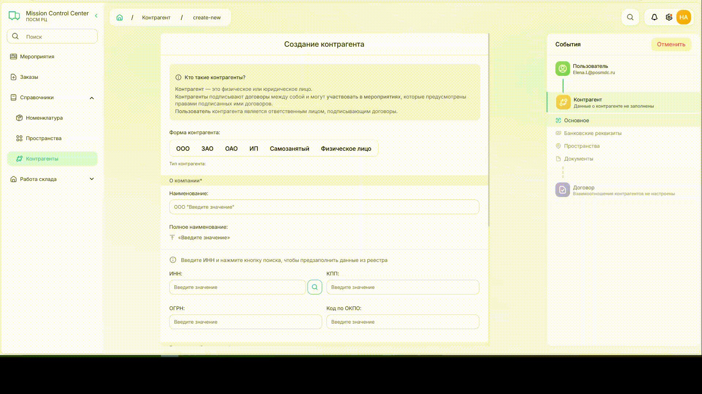
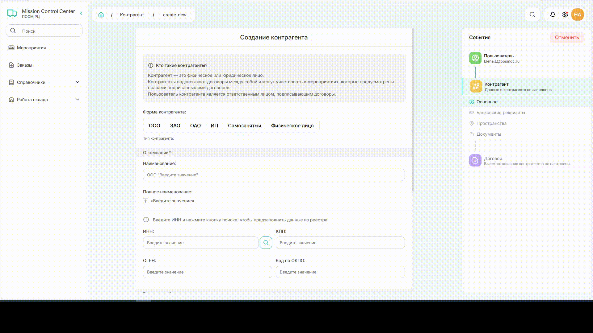
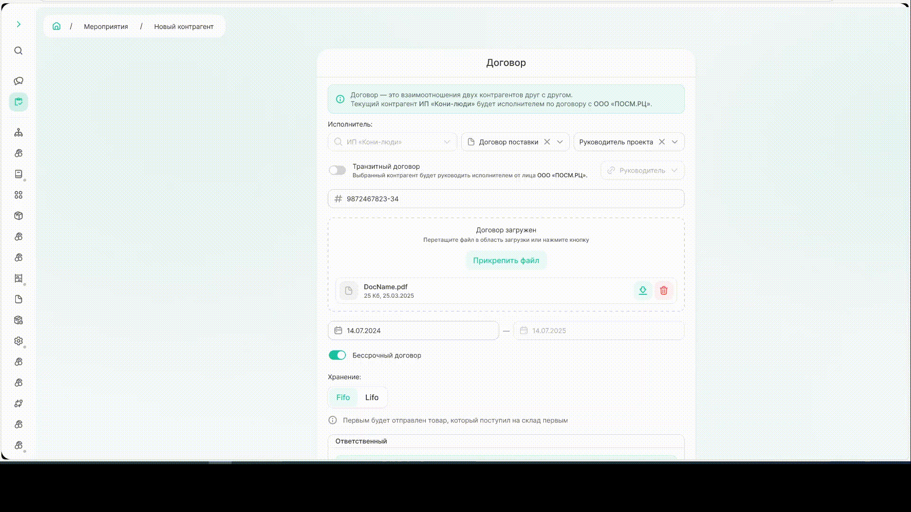

# Как создать контрагента

## 1. Создание пользователя для контрагента

**Контрагент** — это юридическое или физическое лицо, которое заключает договоры и участвует в мероприятиях согласно условиям этих договоров.

**Пользователь контрагента** — это ответственное лицо, которое подписывает договоры от имени контрагента.



Для контрагента **всегда должен быть пользователь**, поэтому перед созданием контрагента нужно добавить для него пользователя или найти существующего в системе.



### Шаг 1. Создание пользователя
Создать контрагента можно из раздела «Справочники» → «Контрагенты» → команда «Создать контрагента» или из раздела «Мероприятия» → команда «Создать мероприятия» → «Новый контрагент».

{width=1200}
*Создание пользователя из раздела «Справочники»*



Почта может быть с любым [доменом](*key_domen). 
**Важно**, если контрагент уже зарегистрирован с другим адресом, система создаст нового пользователя.



### Шаг 2. Внесение информации о пользователе

После ввода e-mail возможно два варианта:

**Пользователь новый**
Откроется форма для заполнения данных. Заполните все поля и нажмите «Создать пользователя».

{width=800}

**Пользователь уже есть в системе**
Появится форма с предложением связать существующую запись с создаваемым контрагентом. Нажмите «Продолжить».

{width=800}

## 2. Заполнение информации о контрагенте

### Шаг 3. Основная информация

Заполнение основной информации отличается для разных типов контрагентов.



- Физ лицо/самозанятый

  Все поля заполняются вручную:

  {width=1200}

- ИП

  Данные можно заполнить автоматически. 
  Введите ИНН и нажмите на значок лупы. Паспортные данные вносите вручную.
  
   {width=1200}

- Юридическое лицо

  Данные можно заполнить автоматически. 
  Введите ИНН и нажмите на значок лупы. Система подгрузит актуальные данные из ЕГРЮЛ. Часть полей заполняется вручную.

  {width=1200}

  

  **Только при автоматическом заполнении** полей по ИНН в карточку контрагента добавятся данные о видах деятельности.
  
  



### Шаг 4. Банковские реквизиты 

Добавьте банковские реквизиты контрагента:
   * Выберите банк из списка
   * Нажмите «Добавить»
   * Заполните данные о расчетном счете, БИК и корреспондентском счете

{width=1000}

У контрагента может быть несколько счетов.
Вы можете редактировать реквизиты счета: расчетный счёт, БИК и корреспондентский счет. Счет также можно деактивировать или удалить.



**При удалении счета все связанные финансовые операции будут удалены.** Рекомендуется сохранять историю финансовых операций и деактивировать счета. 



### Шаг 5. Пространства

Добавьте пространства для контрагента.

{width=1000}

Количество пространств не ограничено.

{width=600}

### Шаг 6. Документы

Загрузите документы. Файлы должны быть в формате PDF.

{width=1200}

## 3. Регистрация на портале

### Шаг 7. Договор 

На последнем шаге прикрепите договор, который регулирует отношения между контрагентом и ПОСМ РЦ.

Для этого:
* Прикрепите скан договора
* Назначьте ответственных
* Добавьте пространства, относящиеся к договору
* Укажите банковские реквизиты контрагента

{.center width=1200}

После этого система создаст контрагента и отправит на его почту логин и пароль.



**Прикрепление договора можно пропустить**, однако в этом случае **система не отправит логин и пароль**, при этом контрагент в системе будет создан. 
Договор можно прикрепить позже в карточке контрагента, после этого на email-адрес пользователя придет логин и пароль.
При добавлении новых договоров к существующему контрагенту логин и пароль не меняются.



Чтобы открыть карточку созданного контрагента, нажмите «Перейти к контрагенту».

{.center width=1200}

## 4. Карточка контрагента

Карточка контрагента содержит всю информацию, хранимую по контрагенту. 

{.center width=1200}

Экран можно условно разделить на четыре блока:

**Блок 1. Фото и основная информация**
Прикрепите фото контрагента и измените основную информацию при необходимости. 

Если работа с контрагентом была прекращена, нажмите «Деактивировать». Таким образом сохранятся все документы и операции с данным контрагентом, однако в новых мероприятиях его нельзя будет выбрать.   

**Блок 2. Договоры**
Содержит договоры, где контрагент указан как заказчик или исполнитель. 
Договор можно просмотреть по команде «Открыть» и при необходимости отредактировать. Есть возможность скачать все прикрепленные файлы.

{.center width=400}

На вкладке «Поручения» можно добавить новое поручение по выбранному договору или открыть и отредактировать уже имеющиеся. Работа с поручениями описана в руководстве пользователя [«Создание поручения»](how_to_assignment.md "Создание поручения").

{.center width=400}

**Блок 3. Банковские реквизиты**
Отображаются все банковские реквизиты, относящиеся к выбранному контрагенту.
Если счетов много, информацию о них можно отфильтровать по статусу счета (активный/неактивный) и банку, где хранится счет. 

Существующие счета можно активировать или деактивировать. 
Активные счета — те, которые использует контрагент, неактивные — те, которые когда-то использовались при расчетах. Неактивный счет нельзя использовать в банковских операциях, но можно просмотреть историю операций, которая была по нему.  

Также если вы знаете номер счета, то можно искать банковские реквизиты по нему.    

Если у контрагента появился новый счет, добавить информацию о нем можно по команде «Добавить». 

**Блок 4. Пространства**

Здесь находится информация о всех пространтсвах контрагента. 
Если пространств много, информацию о них можно отфильтровать по типу пространства (юридический адрес/офис/склад/торговая точка) и статусу (активное/неактивное). 

Существующие пространства можно активировать или деактивировать. 
Активные пространства — те, которые использует контрагент, неактивные — те, которые использовались ранее.  

Если вы знаете адрес объекта, можно найти пространство через поисковую строку.     

Если у контрагента появилось новое пространство, добавить информацию о нем можно по команде «Добавить».

[*key_domen]: Домен почты — часть электронного адреса после знака «@». Например: @yandex.ru, @gmail.com, @posmdc.ru, @mail.ru или любой другой.