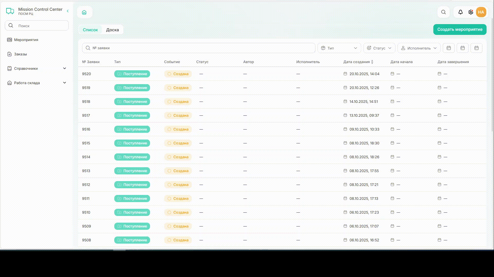
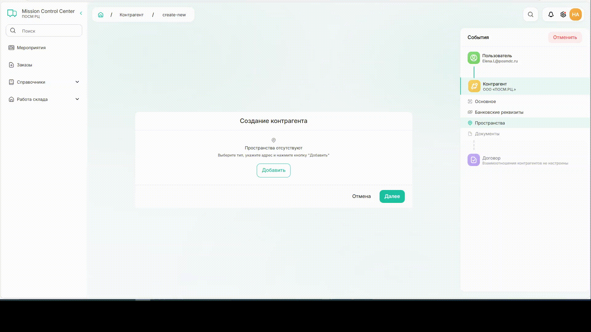
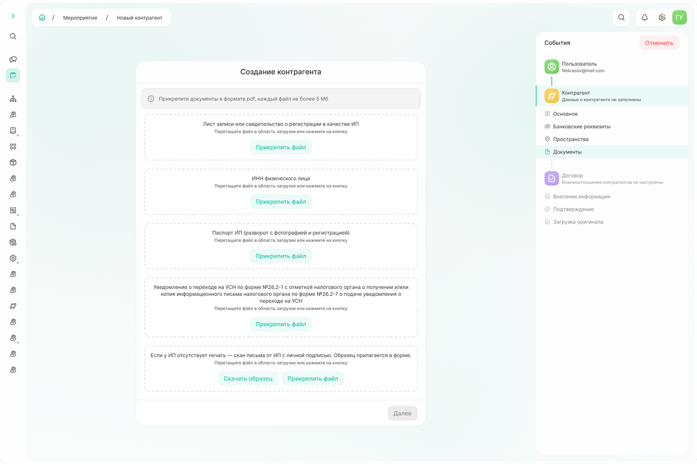
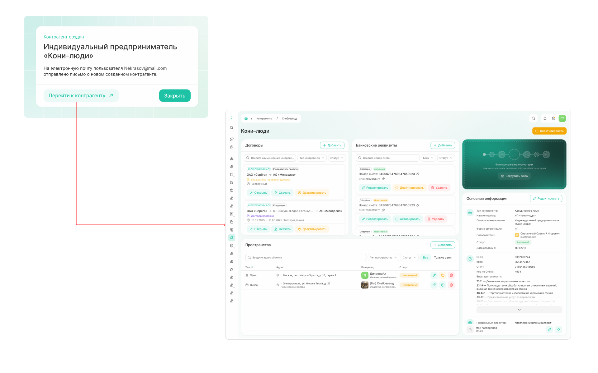

# Как создать контрагента

### Шаг 1. Создание пользователя для контрагента

**Контрагент** — это юридическое или физическое лицо, которое заключает договоры и участвует в мероприятиях согласно условиям этих договоров.

**Пользователь контрагента** — это ответственное лицо, которое подписывает договоры от имени контрагента.



Для контрагента всегда должен быть пользователь. Сначала нужно создать нового пользователя или найти существующего в системе.



1. Откройте раздел «Справочники» → «Контрагенты» и нажмите **«Создать контрагента»** в правом верхнем углу.

{.center width=800}

2. Введите электронную почту и нажмите «Продолжить».

{.center width=600}



Почта может быть с любым [доменом](*key_domen). Если контрагент уже зарегистрирован в системе с другим адресом, добавить дополнительную почту не получится — система создаст нового пользователя.



3. Возможно два варианта:



- **Новый пользователь** — откроется форма для заполнения данных. Заполните все поля и нажмите «Создать пользователя».

{.center width=600}

- **Существующий пользователь** — появится форма с предложением связать существующую запись с создаваемым контрагентом. Нажмите «Продолжить».

{.center width=600}



### Шаг 2. Заполнение информации о контрагенте

Основная информация отличается для разных типов контрагентов.



- **Юридическое лицо**

  Данные можно заполнить автоматически. Введите ИНН и нажмите на значок лупы. Система подгрузит актуальные данные из ЕГРЮЛ.

  {.center width=600}

  **Только при автоматическом заполнении полей по ИНН** в карточку контрагента добавятся данные о видах деятельности.

  {.center width=400}

- **ИП**

  Данные также можно заполнить автоматически по ИНН. Паспортные данные вносите вручную.

  {.center width=600}

- **Физ лицо/самозанятый**

  Все поля заполняются вручную:

  {.center width=600}



Добавьте банковские реквизиты контрагента:
   * Выберите банк из списка
   * Нажмите «Добавить»
   * Заполните данные о расчетном счете, БИК и корреспондентском счете

{.center width=600}


Данные о счете можно редактировать. Счет можно деактивировать или удалить.
При удалении счета удаляются все связанные финансовые операции. Чтобы сохранить историю, счет лучше деактивировать.
У контрагента может быть несколько счетов.


3. Добавьте пространства для контрагента.

{.center width=600}


Количество пространств не ограничено.
{.center width=600}


4. Загрузите документы. Файлы должны быть в формате PDF.

{.center width=600}

### Шаг 3. Договор и регистрация на портале

На последнем шаге прикрепите договор, который регулирует отношения между контрагентом и ПОСМ РЦ.

Для этого:
* Прикрепите скан договора
* Назначьте ответственных
* Добавьте пространства, относящиеся к договору
* Укажите банковские реквизиты контрагента

Заполните поля по данным договора.

{.center width=600}

После этого система создаст контрагента и отправит на его почту логин и пароль.


Прикрепление договора можно пропустить и добавить его позже в карточке контрагента. В этом случае система создаст контрагента, но не отправит логин и пароль. Они придут после того, как вы прикрепите договор.
При добавлении новых договоров к существующему контрагенту логин и пароль не меняются.


Чтобы открыть карточку созданного контрагента, нажмите «Перейти к контрагенту».

{.center width=600}

[*key_domen]: Домен почты — часть электронного адреса после знака «@». Например: @yandex.ru, @gmail.com, @posmdc.ru, @mail.ru или любой другой.
