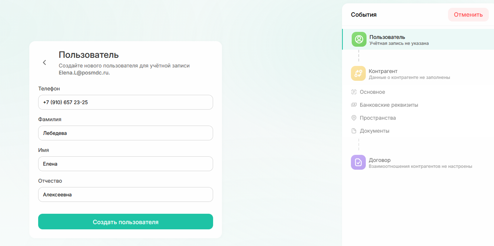
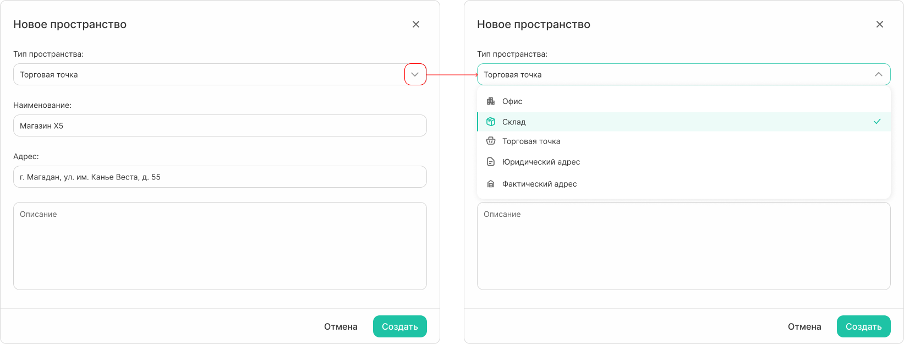

# Как создать контрагента

1. Откройте раздел «Справочники» → «Контрагенты» и нажмите **«Создать контрагента»** в правом верхнем углу

{.center width=800}

2. В форме «Пользователь» введите электронную почту и нажмите «Продолжить»

{.center width=800}



Почта может быть с любым [доменом](*key_domen). Однако, если контрагент уже зарегистрирован в системе с другим адресом электронной почты, добавить дополнительную почту для него не получится — в системе будет создан новый пользователь.



3. Далее возможно 2 варианта:
    * Если пользователь новый, откроется форма для заполнения данных. Заполните все поля и нажмите «Создать пользователя»
    
    {.center width=800}
    
    * Если пользователь уже есть в системе, появится форма с предложением связать существующую запись и создаваемого контрагента. Нажмите «Продолжить»
    
    {.center width=800}

Информация вносимая в систему по контрагенту отличается для юридического лица, ИП и самозанятого/физического лица.

4. Для **юридического лица** данные можно заполнить автоматически. Введите ИНН и нажмите на значок лупы. Система подгрузит все актуальные данные из ЕГРЮЛ.

{.center width=800}



**Только при автоматическом заполнении полей по ИНН** в карточку контрагента подтянутся данные о видах деятельности.  

{.center width=800}



5. Для **ИП** данные также можно заполнить автоматически по ИНН:

{.center width=800}

6. Для **физического лица и самозанятого** поля заполняются вручную:

{.center width=800}

7. Для контрагента можно добавить пространства.
   Тип пространства определен заранее и выбирается из выпадающего списка.
   
{.center width=800}

Количество пространств на одного контрагента не ограничено.

{.center width=800}

8. Добавьте документы. Загружать файлы можно только в формате .pdf.

{.center width=800}

9. На последнем шаге прикрепите договор, который определяет взаимоотношения между контрагентом и ПОСМ РЦ.
Для этого необходимо:
    * прикрепить скан договора;
    * назначить ответственных;
    * добавить пространства, относящиеся к договору;
    * указать банковские реквизиты контрагента.
Подробнее о работе с договорами читайте в разделе [«Заполнение договора»](how_to_doc_deal.md#anchor).

После успешного создания контрагента система отправит на его почту логин и пароль. 


Прикрепление договора можно пропустить. В этом случае, контрагент будет создан в системе, однако логин и пароль не придут на почту. Они будут отправлены, когда вы прикрепите договор позже.   
При прикреплении новых (дополнительных) договоров к существующему контрагенту логин и пароль не меняются.  


Чтобы открыть карточку созданного контрагента, нажмите «Перейти к контрагенту». 

{.center width=800}

[*key_domen]: Домен почты — часть электронного адреса, которая находится после знака «@». 
Может быть @yandex.ru, @gmail.com, @posmdc.ru, @mail.ru или любой другой.   
 

