# Как создать заказ



**Заказ** — это документ, описывающий конкретный объем работ и услуг, подлежащих исполнению.



Создать заказ можно двумя способами:
* из подсистемы «Создание заказа» — начинайте с шага 1 «выбор заказчика»;
* из карточки поручения по договору — информация о заказчике, договоре и поручении предзаполняется: в этом случае начинайте с шага 2 «конфигуратор заказа». 

## 1. Заполнение первичной информации

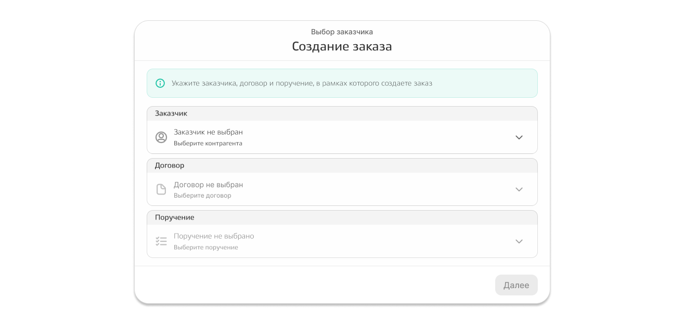{.center width=600}

### Шаг 1. Выбор заказчика

Укажите заказчика, договор и поручение.
Без этих данных создать заказ не получится. 

### Шаг 2. Конфигуратор заказа

Информацию об оборудовании, предоставляемых услугах и адресной программе можно загрузить двумя способами: либо с использованием excel-шаблона (вкладка «загрузка файла»), либо вручную (вкладка «мануальный режим»).



- Загрузка файла

  
        
  Шаблон рекомендуется использовать, если в адресной программе больше 10 пространств. 
  Для небольших заказов используйте мануальный режим.  
        
  

  **Заполнение и загрузка шаблона**
    1. По команде «Шаблон» скачайте excel-файл. 
    2. Заполните информацию, следуя текстовым подсказкам в файле. Обязательные поля помечены желтым цветом. 
    3. Если требуются дополнительные поля, добавьте нужное количество столбцов до разделителя. **Наименование столбца обязательно**, иначе файл не будет прочитан.
    4. Загрузите заполненный шаблон по команде «Прикрепить файл» или перетащите в область загрузки. **Можно загрузить только один файл**. 
    {.center width=1200}

  **Проверка загруженной информации и конкретизация**
    После загрузки проверьте правильность сопоставления данных из шаблона с данными из системы.

    - **Пространство списания** 
    Несопоставленное пространство будет окрашено в красный, а вверху страницы появится уведомление.
    Строка сопоставленного пространства будет выделена зеленым и отмечена галочкой, если сопоставился не тот адрес, то его можно поменять.
    
    

    Пространство считается сопоставленным, если системе удалось подобрать и системное, и пользовательское пространство.
    *Подробнее о разнице между системным и пользовательском пространствах можно прочитать в разделе [«Пространства»](./how_to_space.md)*

     

    Для несопоставленного пространства необходимо создать или подобрать уже существующее системное пространство, затем — пользовательское.
 
    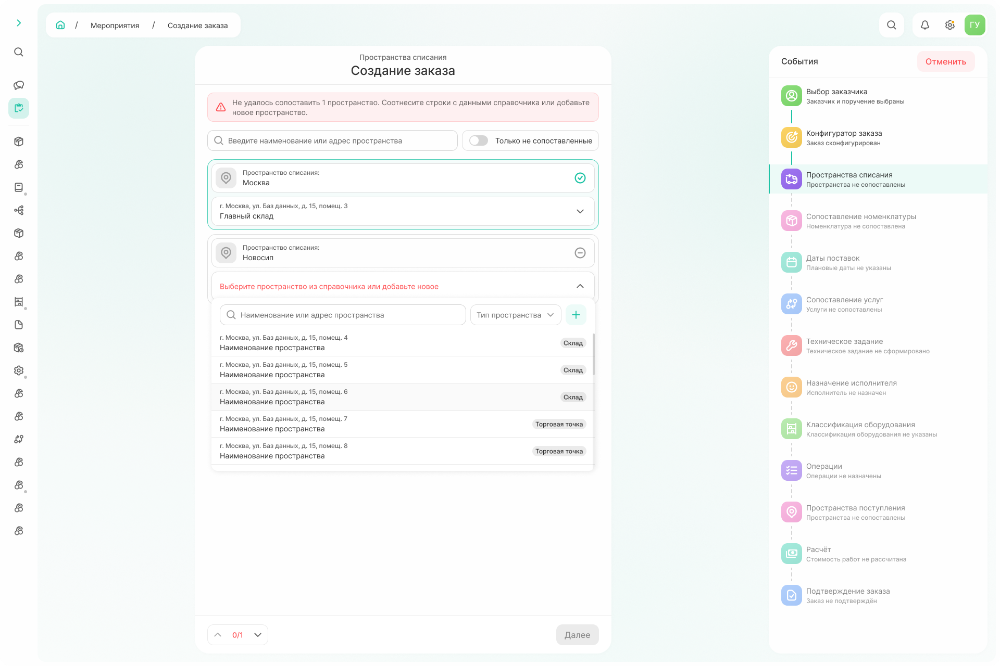{.center width=1200}  

    - **Сопоставление номенклатуры**
    По наименованию номенклатуры из справочника в системе подбирается номенклатура, из которой оборудование состоит, и требуемое количество для комплектации одного оборудования. 
    
    Если сопоставление не удалось, замените или добавьте новую номенклатуру в выпадающем списке. 

    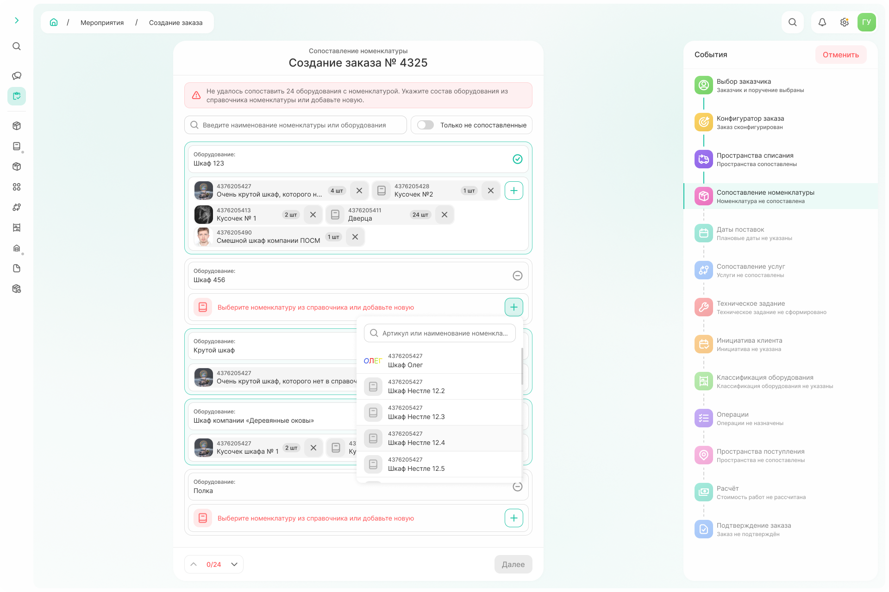{.center width=1200}

    

    Если кликнуть по наименованию номенклатуры, откроется карточка номенклатуры. Можно увидеть основную информацию, габариты и фото выбранной номенклатуры. 

    {.center width=800}

    

  - **Даты поставок**
    Укажите плановые даты поступления номенклатуры. 
    
    Можно указать несколько дат поставок, если номенклатура поставляется партиями. 
    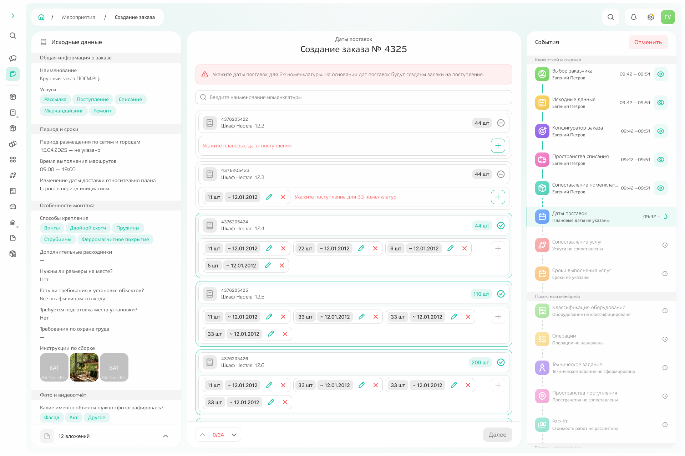{.center width=1200}

  - **Сопоставление услуг**
    На данном шаге сопоставляются услуги. 

    Можно выбрать услугу из предопределенного выпадающего списка, если услуги не были автоматически сопоставлены. 
    **Добавить новую услугу нельзя**. 

    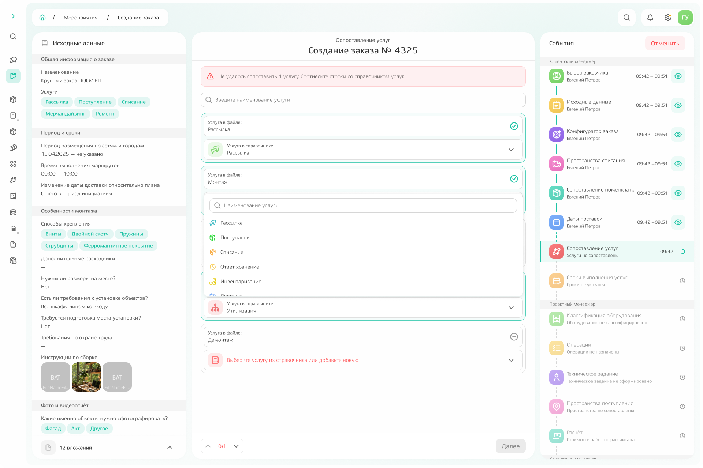{.center width=1200}

- Мануальный режим

  **Настройка шаблона**
  Первый шаг — настройка полей для задачи. 

  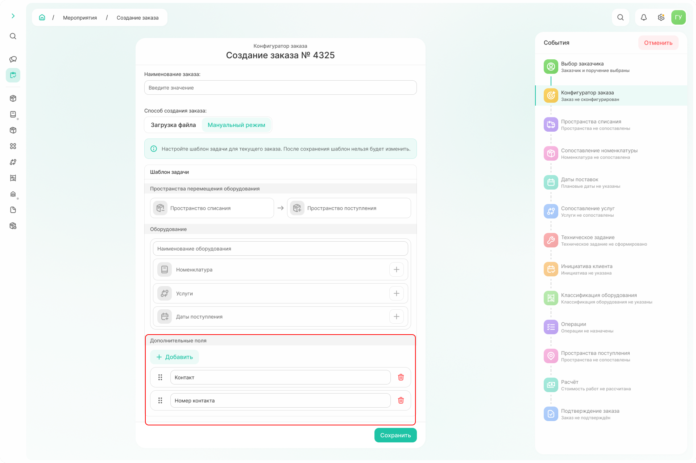{.center width=1200}

  * Добавьте необходимые поля в разделе «Дополнительные поля». В карточке задачи поля будут отображаться в том порядке, в котором они добавлены. Порядок можно изменить, перетащив мышкой требуемое поле на нужное порядковое место.
  * Если изменения не требуются или все поля уже добавлены, нажмите команду «Сохранить». После сохранения шаблон изменить нельзя.
  
  **Добавление задач по заказу**
  Начните создание заказа с внесения задач по команде «Добавить». 
  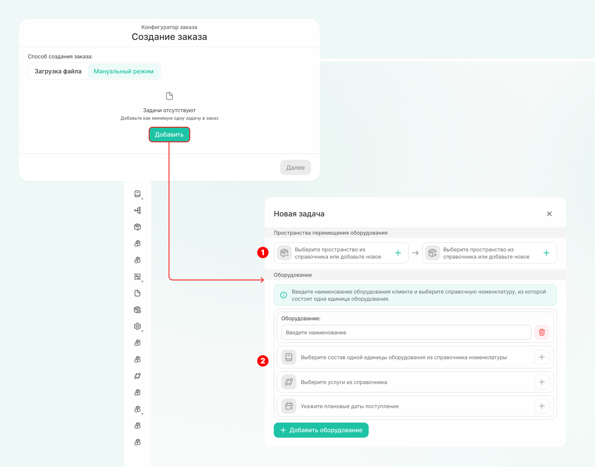{.center width=1200}

  1. Укажите пространства списания и поступления оборудования по команде «+». 
  Сначала выбирается системное пространство из уже внесенных в справочник или создается новое, далее аналогично добавляется пользовательское пространство.
  При создании пространства из заявки топология не задается пользователем. Система по умолчанию создает зону погрузки, внести изменения и добавить описание всей иерархии можно позже, найдя созданное пространство в справочнике.
  *Подробнее о разнице между системным и пользовательском пространствах, а также топологии можно прочитать в разделе [«Пространства»](./how_to_space.md).*
  
  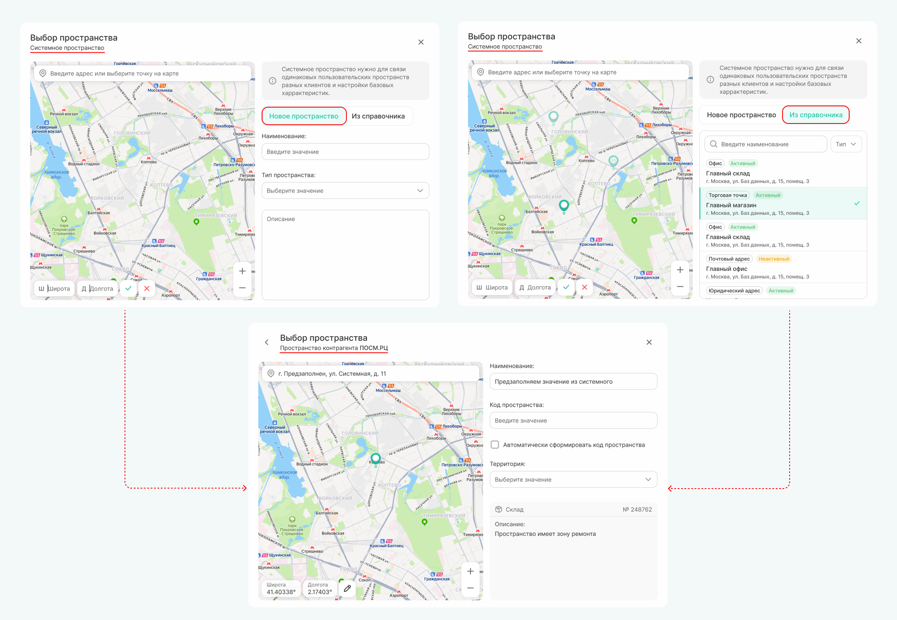{.center width=1200}

  2. Введите наименование оборудования клиента и выберите справочную номенклатуру, из которой состоит единица оборудования, а также добавьте услуги, которые оказываются по одному оборудованию, их количество и плановые даты поступления.

  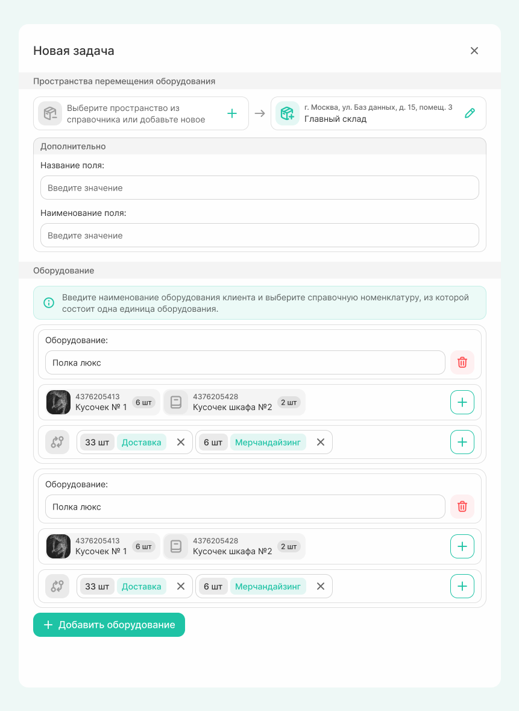{.center width=300}

  Когда вся информация по задаче внесена, воспользуйтесь командой «Добавить».
  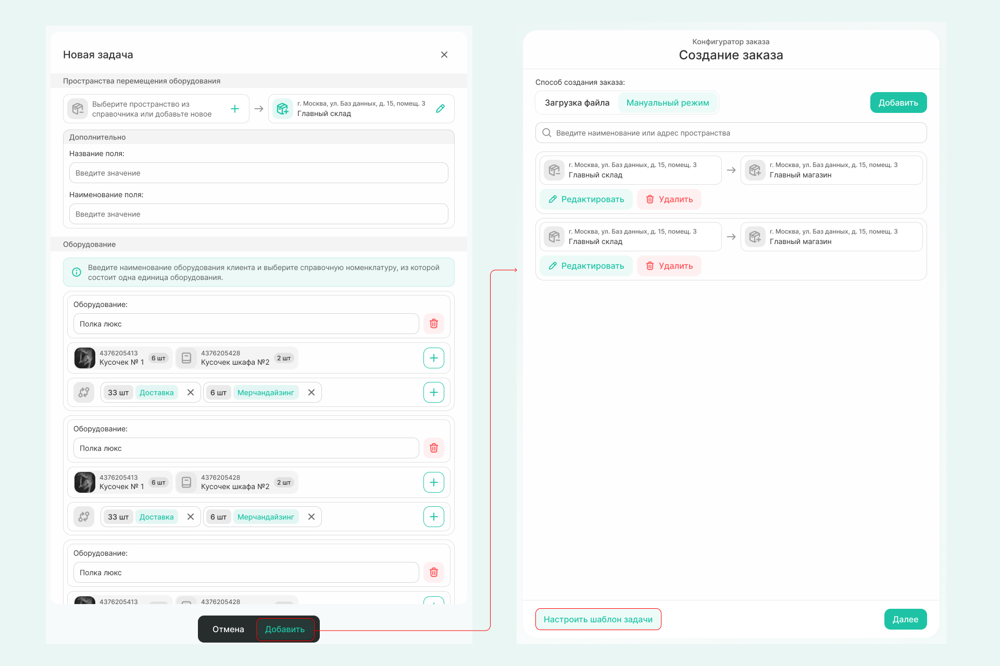{.center width=1200}



### Шаг 3. Техническое задание

Опишите все требования, необходимые для выполнения работ по заказу.
Можно прикрепить до 21 файла до 5 МБ для конкретизации ТЗ.

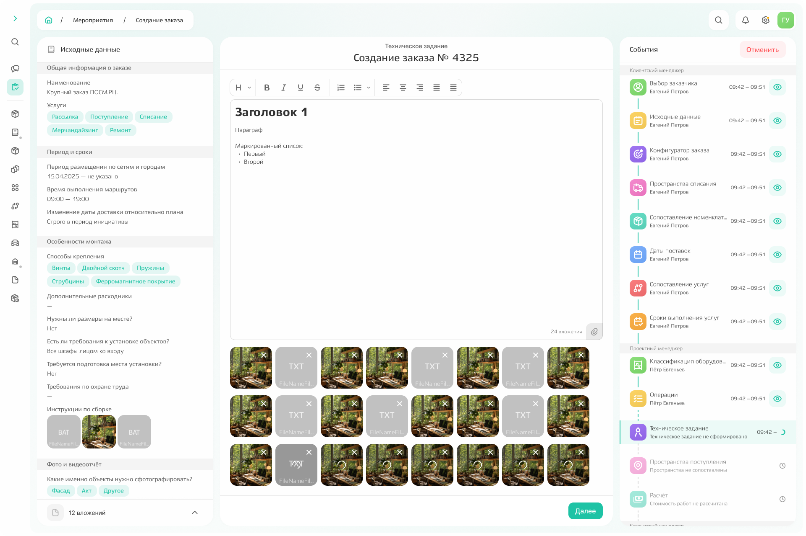{.center width=1200}

### Шаг 4. Инициатива клиента

На этогм шаге необходимо указать планируемые даты начала и завершения для заказа, а также назначить ответственного.

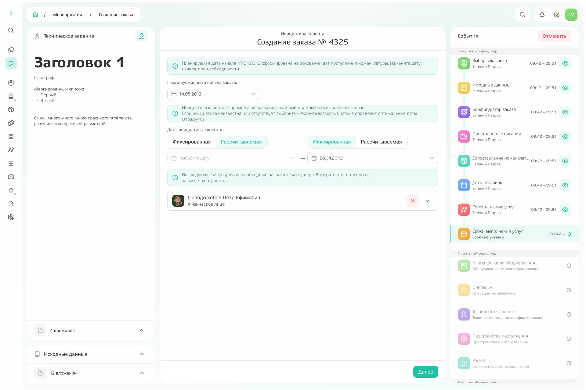{.center width=1200}

Для заказа **указывается планируемая дата начала.** Она формируется на основании даты поставки номенклатуры. При необходимости дату можно изменить, однако, выбрать число ранее текущего дня нельзя. 

**Инициатива клиента** — промежуток времени, за который все задачи по заказу должны быть выполнены.  
- если инициатива известна, выберете тип «фиксированная» и укажите дату вручную;
- если инициатива неизвестна или отсутствует, выберите тип «рассчитываемая» и система сама определит оптимальную дату.

Для заказа указывается **ответственный менеджер** — контрагент, который будет отвечать за расчёт.

Ответственным за расчет можно назначить другого человека или самого себя.
**Если ответственным выбран другой человек**, то выводится окно с информацией по заказу. 
Менеджер, назначенный ответственным, увидит новую задачу в списке мероприятий, откуда он сможет перейти к классификации оборудования, операциям и расчету по заказу. 
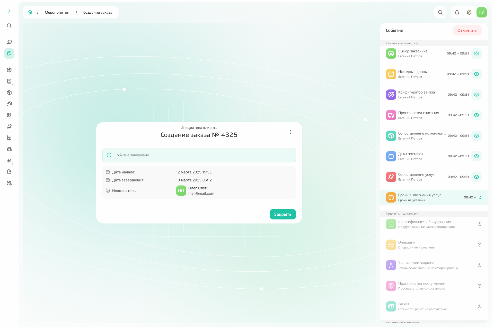{.center width=1200}

**Если ответственным вы назначили себя**, то окно с информацией о заказе не выводится, а сразу происходит переход к следующему шагу. 

## 2. Детализация заказа и подготовка к расчету

### Шаг 5. Классификация оборудования

К уже полученным связкам «оборудование — номенклатура» необходимо добавить вид для корректного расчета стоимости работ. 

Если на шаге 2 «Конфигуратор заказа» был выбран мануальный режим, то вид оборудования заполняется вручную.
При загрузке excel-шаблона вид оборудования подбирается автоматически, если сопоставление не удалось — также вручную.

Вид оборудования определяется типом оборудования: сначала выбирается тип, после — связанный с ним вид. И у типа, и у вида оборудования есть описание, которое можно открыть по подсказке 🛈. 

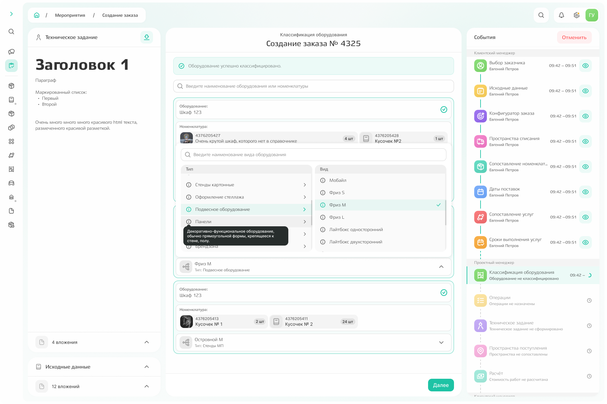{.center width=1200}

### Шаг 6. Операции

На текущем шаге указываются операции для связки «оборудование — услуга». 
У каждой услуги свой список операций. **Для каждой услуги в заказе нужно указать хотя бы одну операцию.**

В блоке обеспечение деятельности добавьте общие операции для всего оборудования.
Далее переходите к карточкам, где необходимо указать операции по услугам, которые будут относиться к конкретной связке «оборудование - номенклатура».   

  

  Если в рамках одного заказа для разных адресов встречается одно и то же оборудование с одинаковым набором номенклатуры и набором услуг, то отображается одна общая карточка. 

  

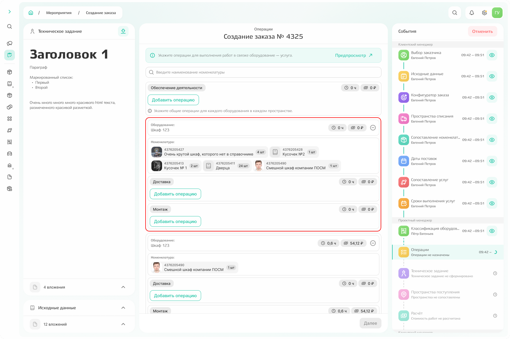{.center width=1200}

### Шаг 7. Пространства поступления

Аналогично классификации оборудования, если на шаге 2 «Конфигуратор заказа» был выбран мануальный режим, то соответствие адресов для пространства поступления заполняется вручную.
При загрузке excel-шаблона адрес сопоставляется автоматически, если сопоставление не удалось — вручную.

Пространство считается сопоставленным если есть системное и зависимое пользовательское пространство и у заказчика, и у исполнителя. В ином случае, пользователь должен либо:
- создать системное пространство, а после — два пользовательских пространства: одно с информацией от исполнителя и одно с информацией от заказчика;
- создать пользовательские пространства для исполнителя и заказчика для найденного системного;
- создать пользовательское пространство для одной из сторон.

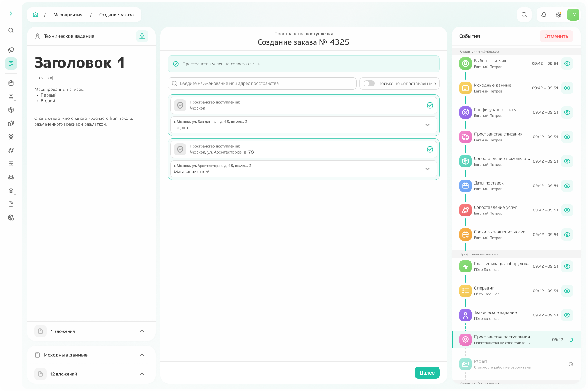{.center width=1200}

## 3. Расчет стоимости и подтверждение заказа

### Шаг 8. Расчет

