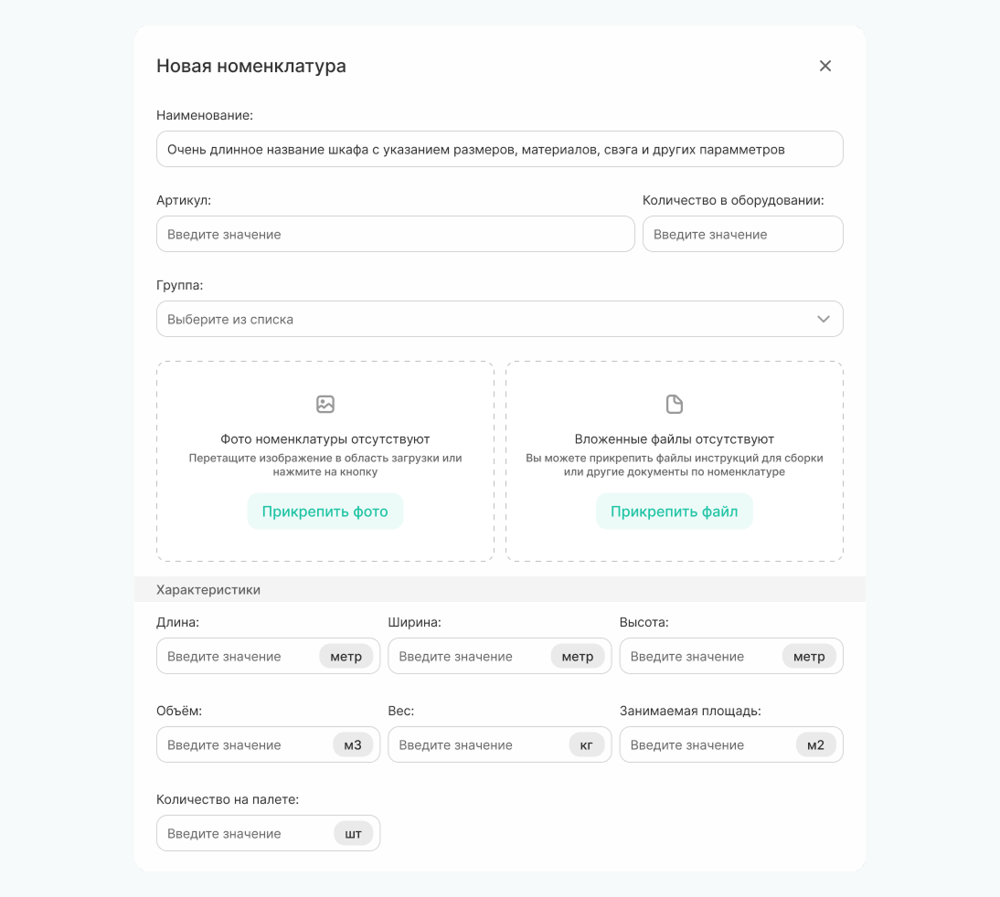
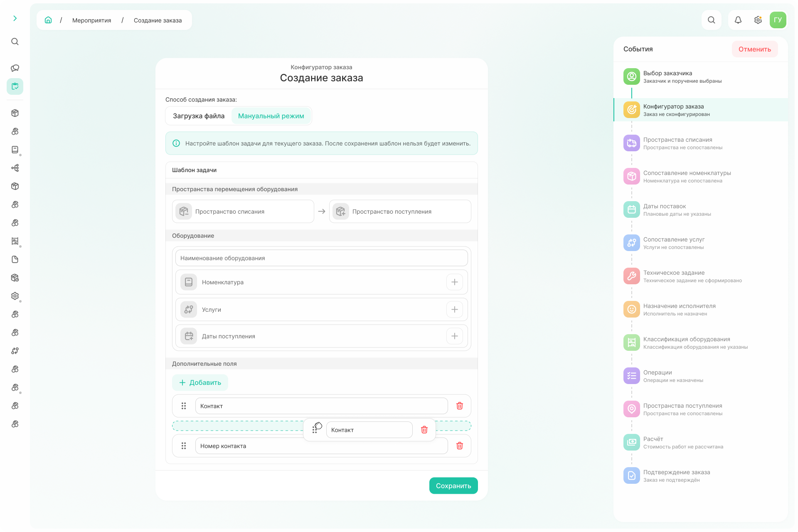

# Как создать заказ



**Заказ** — это формализованный документ в системе, описывающий конкретный объем работ и услуг, подлежащих исполнению.



### 1. Заполнение первичной информации

{.center width=1200}

**Шаг 1. Выбор заказчика.**

Для создания заказа необходимо указать заказчика, договор и поручение, относящееся к указанному договору.

**Шаг 2. Конфигуратор заказа.**

Загрузить информацию об адресной программе, номенклатуре и услугах в заказе можно с использованием excel-шаблона (режим «загрузка файла») или вручную («мануальный режим»).



- Загрузка файла

   **Добавление инфо по заказу**
    1. По команде «Шаблон» скачайте excel-файл. 
    2. Заполните информацию, следуя подсказкам из шаблона. Обязательные поля помечены желтым цветом. 
       
        

        В файле указывается
        - город старта работ,
        - город проведения работ,
        - сеть,
        - адрес торговой точки,
        - номер торговой точки,
        - контакт по заказу и его телефонный номер, 
        - услуги (выбираются из заранее определенного выпадающего списка),
        - наименование оборудования,
        - количество оборудования на адрес.
        
        Если требуются дополнительные поля, то в шаблоне можно добавить столбцы и заполнить информацию, которая необходима конкретному клиенту. 

        

    3. Загрузите заполненный файл по команде «Прикрепить файл» или перетащите файл в область загрузки. 

        {.center width=1200}
        
        
        
        Рекомендуется использовать шаблон, если в адресной программе более 10 пространств. 
        Для небольших заказов используйте ручной (мануальный) режим.  
        
        

    **Проверка загруженной информации и конкретизация**
      На последующих шагах необходимо проверить правильность сопоставления данных из шаблона с данными из системы и при необходимости внести коррективы.

    - **Пространство списания** 
    Если сопоставление не удастся, то для такого адреса пространство будет окрашено в красный, а вверху страницы появится уведомление. 
    {.center width=1200}
    
    Пространство из базы можно выбрать из выпадающего списка или добавить новое по команде «+».

    

    Чтобы добавить новое пространство необходимо указать:
    - адрес (можно ввести вручную или выбрать точку на карте),
    - наименование,
    - тип пространства - склад, торговая точка и etc.(выбирается из выпадающего списка),
    - город РЦ (проставляется системой в соответсвии с выбранным на карте адресом),
    - владелец (владельцем является заказчик, указанный на 1 шаге).

    {.center width=800}

    

    - **Сопоставление номенклатуры**
    Для оборудования по наименованию подбирается номенклатура, из которой состоит это оборудование.  

      {.center width=1200}

      Если сопоставление не удалось, то необходимо вручную добавить номенклатуру из справочника или создать новую из выпадающего списка по команде «+». 

  

   Чтобы добавить номенклатуру необходимо указать:
    - наименование,
    - артикул,
    - количество в оборудовании (сколько единиц номенклатуры входит в состав оборудования),
    - группа (выбирается из тех, что указаны в договоре),
    - фото номенклатуры,
    - инструкции по сборке или любые другие документы по номенклатуре,
    - характеристики (длина, ширина, высота, объем, вес, занимаемая площадь, количество на палете).
    
   {.center width=800}

  

  - **Сопоставление услуг**
    На данном шаге сопоставляются услуги. 

    Если сопоставление не удалось, то можно выбрать услугу из предопределенного выпадающего списка. **Добавить новую услугу нельзя**. 

    {.center width=1200}

- Мануальный режим

  **Добавление задач по заказу**
  1. Начните создание заказа с внесения задач по команде «Добавить». 
  {.center width=1200}

  2. Укажите пространства списания и поступления оборудования по команде «+». В появившемся окне можно выбрать пространство из уже внесенных в справочник или создать новое. 
  {.center width=1200}

  3. Добавьте все оборудование, с которым будут работать в заказе, указав:
  - наименование оборудования;
  - наименования номенклатуры и то количество, которое необходимо для сборки 1 оборудования; 
  - услуги, которые оказываются по 1 оборудованию, и их количество.

  Когда вся информация по 1 задаче внесена воспользуйтесь командой «Добавить».
  {.center width=1200}

  В заказе может быть несколько задач, которые можно удалить или отредактировать при необходимости. 
  Также **доступна настройка шаблона задачи**. Она необходима, если для конкретного клиента требуются дополнительные поля.

  

  1. В разделе «Дополнительные поля» по команде «Добавить» вносится наименование требуемого поля.
  2. Можно поменять очередность полей перетащив мышкой выше или ниже требуемое поле.   
  3. Когда внесение изменений завершено, воспользуйтесь командой «Сохранить». 

  {.center width=1200}

  
        
  После сохранения шаблон изменить нельзя. Если потребуются новые изменения, необходимо вернуться к шагу выбора заказчика и создать новый заказ.  
        
  

    



**Шаг 3. Техническое задание**

Прописываются все требования, необходимые для выполнения работ по заказу.
Есть возможность прикрепить до 21 файла до 5 МБ для конкретизации ТЗ и добавить текстовое описание.

{.center width=1200}

**Шаг 4. Даты начала и завершения заказа и назначение исполнителя**

Для заказа указывается:
- планируемая дата начала — выставляется автоматически на основании первой даты поступления номенклатуры, при необходимости можно изменить вручную; 
- планируемая дата завершения — может быть фиксированной (выбирается вручную) или плавающей (формируется автоматически на основании выбранных операций и расчета);
- ответственный менеджер — контрагент, который будет отвечать за расчёт.

{.center width=1200}

Далее, выводится окно со всей информацией, внесенной по заказу.
После команды «Закрыть» менеджер, назначенный ответственным по данному заказу, увидит новую задачу в списке мероприятий.

{.center width=1200}
