# Как создать заказ



**[Заказ][1]** — элемент управления, являющийся по сути документом, где описан конкретный объем работ и услуг, подлежащих исполнению.



Создать заказ можно двумя способами:
* из [подсистемы][2] «Создание заказа» — начинайте с события «Выбор заказчика»;
* из [карточки поручения][3] по [договору][4] — информация о заказчике, договоре и [поручении][5] предзаполняется: в этом случае начинайте с [события][6] «Исходные данные». 

## Заполнение исходной информации

Под **исходной информацией** в рамках данной инструкции по созданию заказа понимается информация о:
- заказчике, договоре и поручении;
- периодах и сроках;
- особенностях монтажа, фото и видеоотчетов, документации;
- контакты;
- дополнительные комментарии и прикрепленные файлы к заказу. 

### Событие 1. Выбор заказчика

Укажите **заказчика**, **договор** и **поручение**.
Без этих данных не получится создать заказ. 

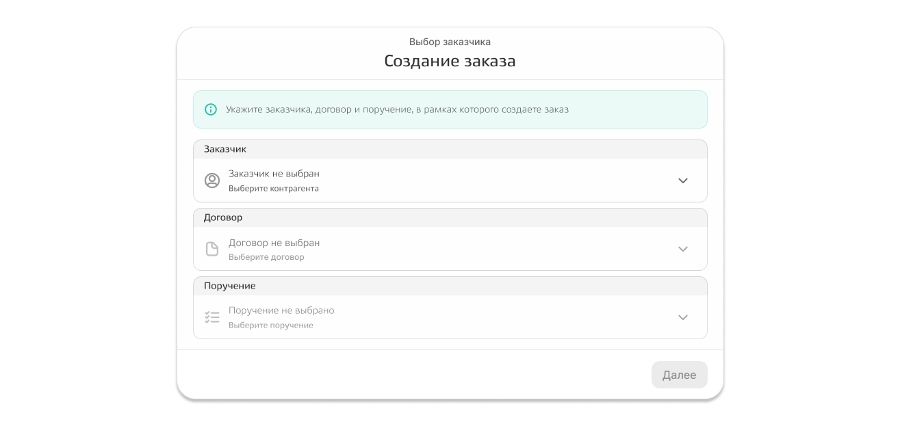{.center width=1200}

### Событие 2. Исходные данные

На данном событии необходимо ответить на вопросы, чтобы уточнить детали заказа. Например, требуется ли согласование фото с клиентом или подготовка места установки. 

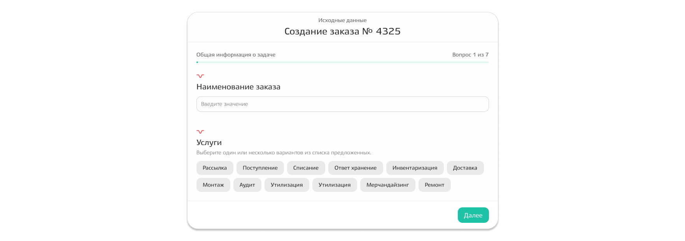{.center width=1200}

Всего будет 7 форм с вопросами. Если не получается перейти к следующей форме по команде «Далее», значит что-то из обязательной информации не заполнено. Такие поля будут подсвечены красным.

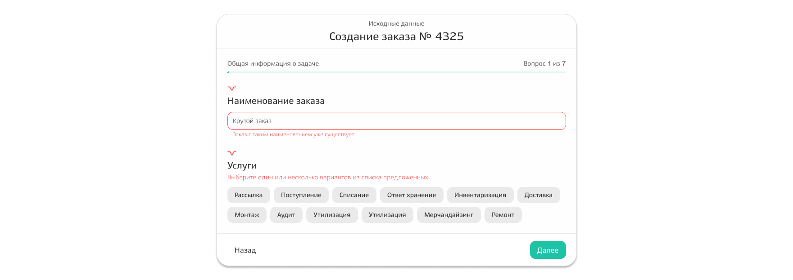{.center width=1200}



Данные, которые были собраны из опроса, будут отражены в левой части экрана для всех последующих событий(1).

Также по каждому событию в [мероприятии][7] замеряется время, потраченное на заполнение информации, и сохраняется внесенная информация, которую можно посмотреть по [иконке][8] соответсвующего события(2).  

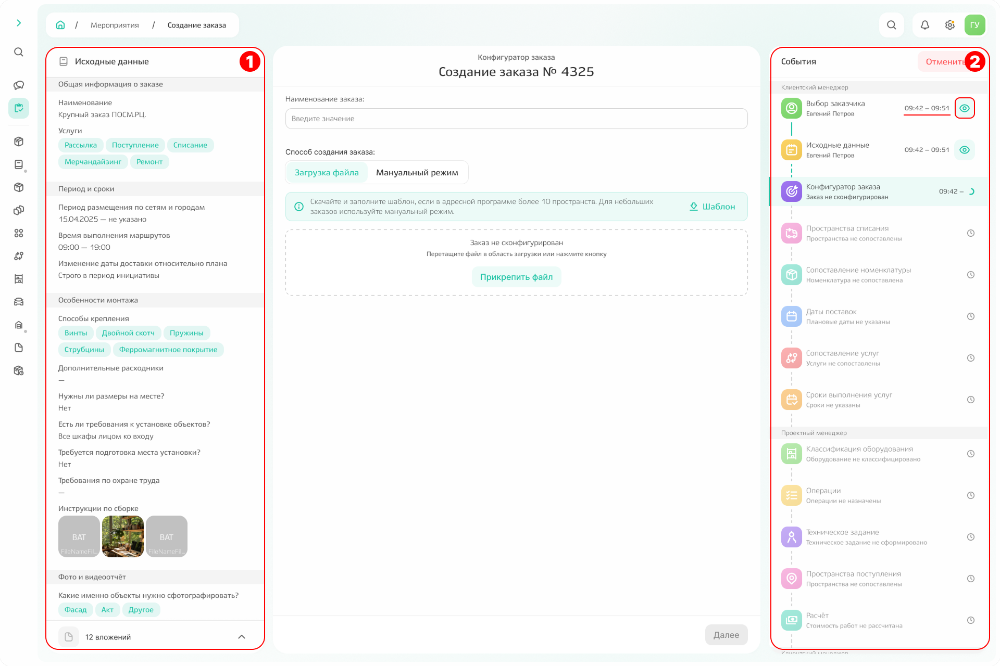{.center width=1200}



## Заполнение первичной информации

Под **первичной информацией** в рамках данной инструкции по созданию заказа понимается информация о:
- пространствах списания и поступления;
- оборудовании;
- датах поставки;
- услугах. 

**Состав последующих событий зависит от того, какой способ заполнения информации вы выберете на событии 3 «Конфигуратор заказа».** Следуйте тем инструкциям, которые соответствуют вашему способу загрузки информации: если это загрузка информации, следуйте сценарию 3.1; если мануальный режим — сценарию 3.2.   

### Событие 3.1.1. Конфигуратор заказа


        
Шаблон рекомендуется использовать, если в адресной программе больше 10 пространств. 
Для небольших заказов используйте мануальный режим (Событие 3.2. Конфигуратор заказа).  
        


**Заполнение и загрузка шаблона**
  1. По команде «Шаблон» скачайте excel-файл. 
  2. Заполните информацию, следуя текстовым подсказкам в файле. Обязательные [поля][9] помечены желтым цветом. 
  3. Если требуются дополнительные поля, добавьте нужное количество столбцов до разделителя. **Наименование столбца обязательно**, иначе файл не будет прочитан.
  4. Загрузите заполненный шаблон по команде «Прикрепить файл» или перетащите в область загрузки. **Можно загрузить только один файл**. 
  
  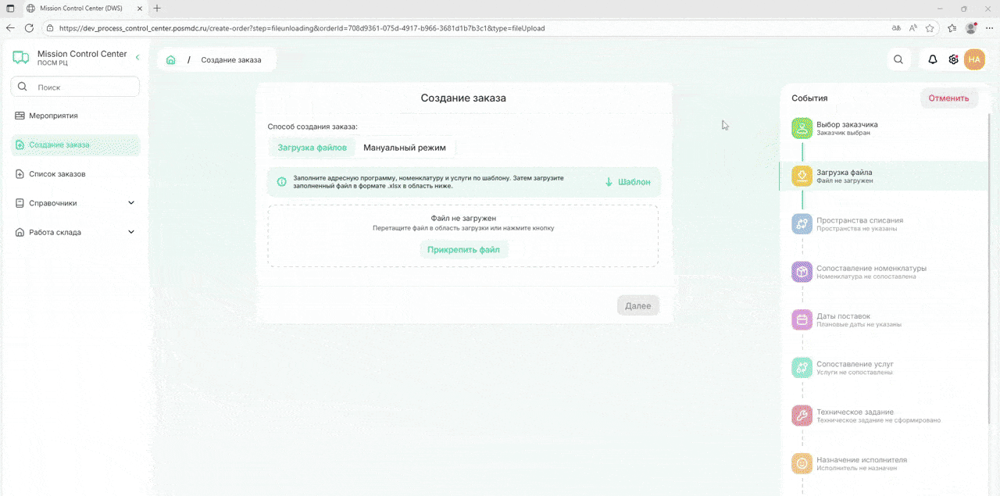{.center width=1200}



Последующие события, связанные с загрузкой файла, направлены на проверку правильности сопоставления данных из шаблона с данными из системы.



### Событие 3.1.2. Пространства списания
    
Несопоставленное [пространство][10] будет окрашено в красный, а вверху страницы появится уведомление.
Строка сопоставленного пространства будет выделена зеленым и отмечена галочкой, если сопоставился не тот адрес, то его можно поменять.
    


Пространство считается сопоставленным, если системе удалось подобрать и [системное][11], и [пользовательское пространство][12].
*Подробнее о разнице между системным и пользовательском пространствах можно прочитать в разделе [«Пространства»](./how_to_space.md)*

 

Для несопоставленного пространства необходимо создать или подобрать уже существующее системное пространство, затем — пользовательское.
 
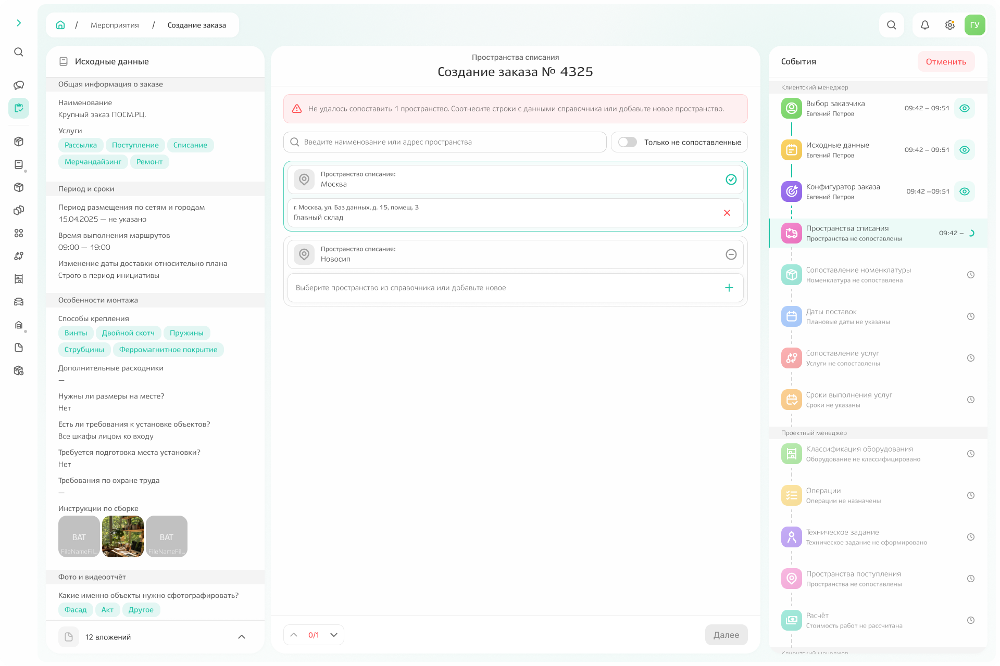{.center width=1200}  

### Событие 3.1.3. Сопоставление номенклатуры

По наименованию [номенклатуры][13] из [справочника][14] в системе подбирается номенклатура, из которой оборудование состоит, и требуемое количество для комплектации одного оборудования. 
    


**На текущий момент в системе оборудование может состоять только из одной номенклатуры.** Функционал, позволяющий подобрать больше одной номенклатуры к одному оборудованию, находится в разработке.



Если сопоставление не удалось, замените или добавьте новую номенклатуру в [выпадающем списке][15]. 

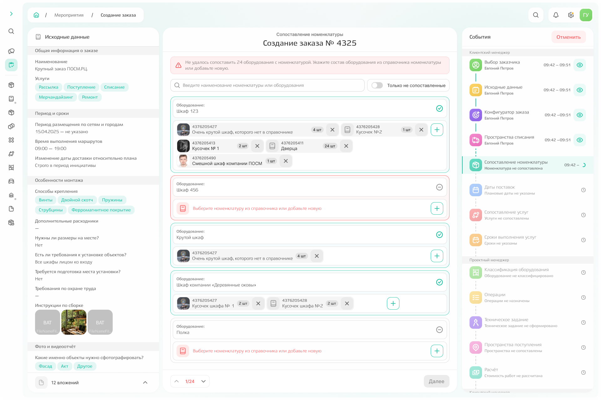{.center width=1200}



Если кликнуть по наименованию номенклатуры, откроется карточка номенклатуры. Можно увидеть основную информацию, габариты и фото выбранной номенклатуры. 

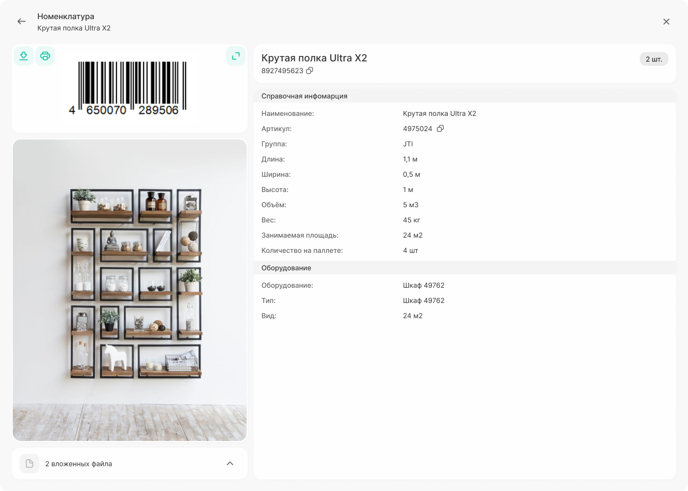{.center width=800}



### Событие 3.1.4. Даты поставок

Укажите плановые даты поступления номенклатуры. 
    
Можно указать несколько дат поставок, если номенклатура поставляется партиями. 
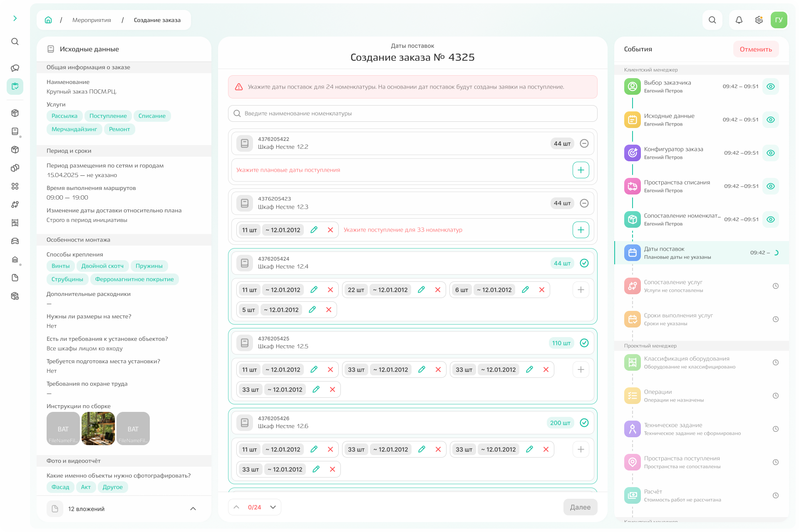{.center width=1200}

### Событие 3.1.5. Сопоставление услуг

На данном шаге сопоставляются услуги. 

Можно выбрать услугу из предопределенного выпадающего списка, если услуги не были автоматически сопоставлены. 
**Добавить новую услугу нельзя**. 

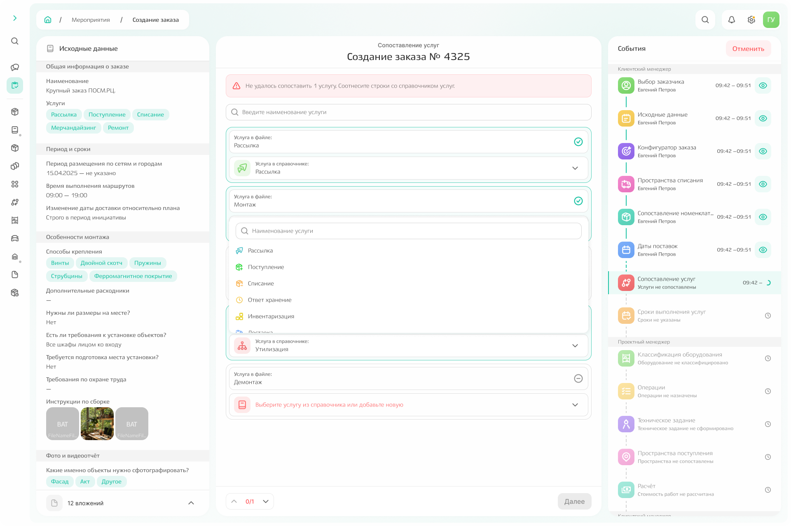{.center width=1200}

### Событие 3.2. Конфигуратор заказа  

**Настройка шаблона**
Первое, что необходимо сделать, — настроить поля для задачи. 

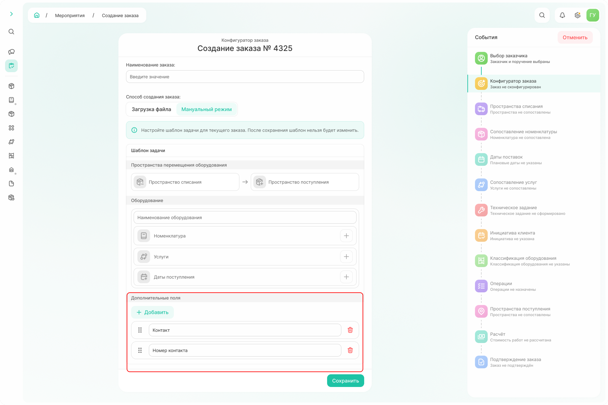{.center width=1200}

* Добавьте необходимые поля в разделе «Дополнительные поля». В карточке задачи поля будут отображаться в том порядке, в котором они добавлены. Порядок можно изменить, перетащив мышкой требуемое поле на нужное порядковое место.
* Если изменения не требуются или все поля уже добавлены, нажмите команду «Сохранить». После сохранения шаблон изменить нельзя.
  
**Добавление задач по заказу**
Начните создание заказа с внесения задач по команде «Добавить». 
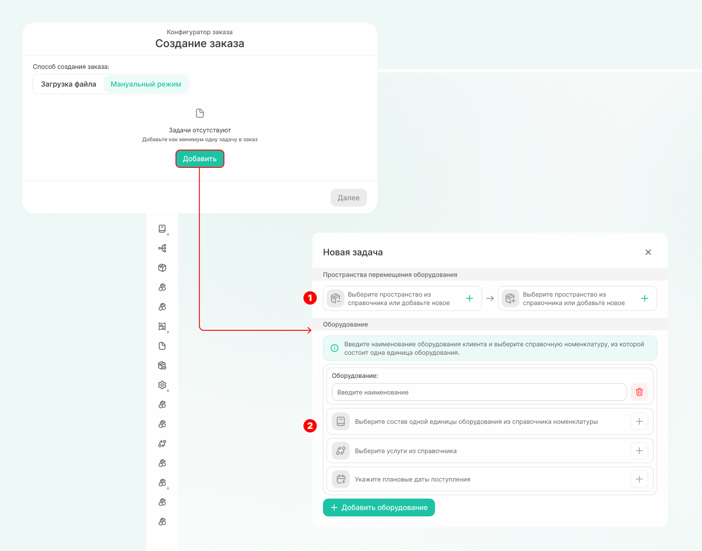{.center width=1200}

1. **Укажите пространства списания и поступления оборудования по команде «+».** 
Сначала выбирается системное пространство из уже внесенных в справочник или создается новое, далее аналогично добавляется пользовательское пространство.
При создании пространства из заявки [топология][16] не задается пользователем. Система по умолчанию создает зону погрузки, внести изменения и добавить описание всей иерархии можно позже, найдя созданное пространство в справочнике.
*Подробнее о разнице между системным и пользовательском пространствах, а также топологии можно прочитать в разделе [«Пространства»](./how_to_space.md).*
  
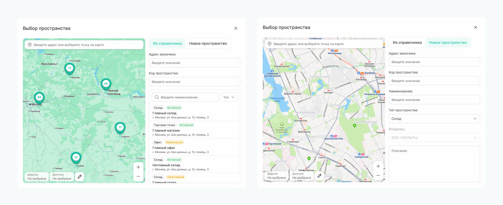{.center width=1200}

2. **Введите наименование оборудования клиента и выберите справочную номенклатуру,** из которой состоит единица оборудования, **а также добавьте услуги,** которые оказываются по одному оборудованию, **их количество и плановые даты поступления.**

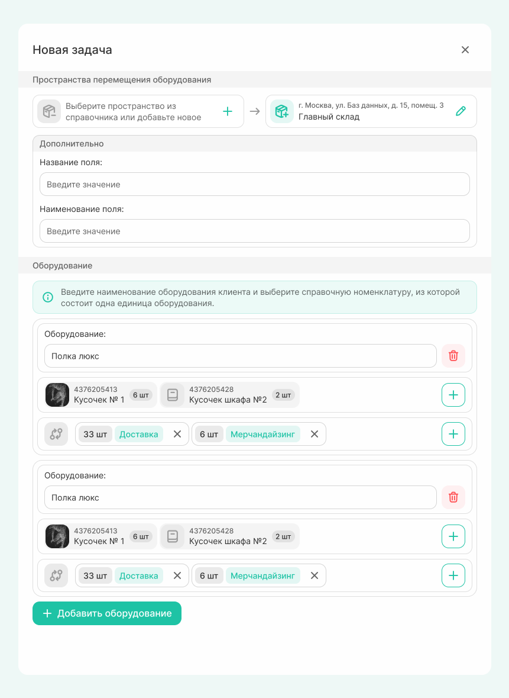{.center width=300}

Когда вся информация по задаче внесена, воспользуйтесь командой «Добавить».
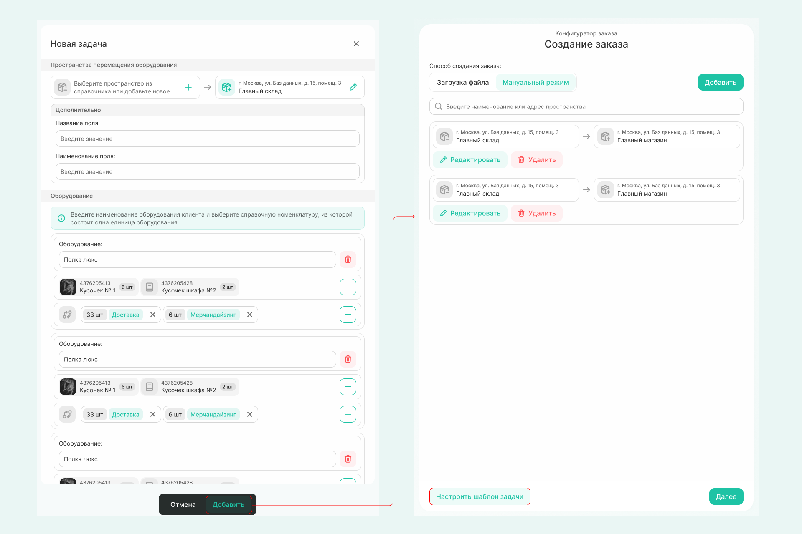{.center width=1200}



### Событие 4. Сроки выполнения услуг

На этогм шаге необходимо указать планируемые даты начала и завершения для заказа, а также назначить ответственного.

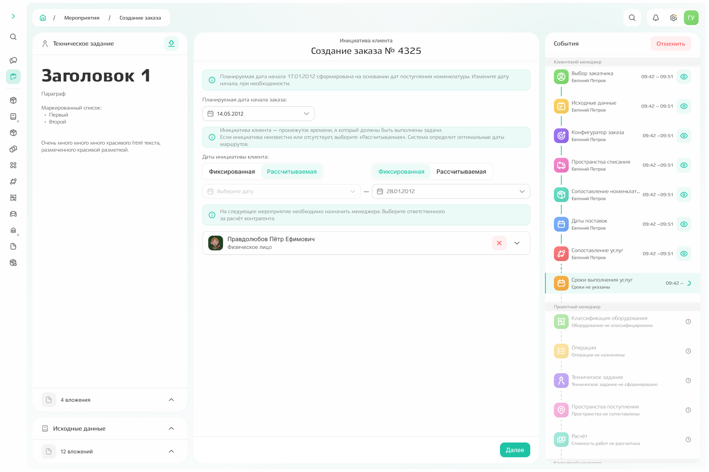{.center width=1200}

Для заказа **указывается планируемая дата начала.** Она формируется на основании даты поставки номенклатуры. При необходимости дату можно изменить, однако, выбрать число ранее текущего дня нельзя. 

**[Инициатива клиента][17]** — промежуток времени, за который все задачи по заказу должны быть выполнены.  
- если инициатива известна, выберете тип «фиксированная» и укажите дату вручную;
- если инициатива неизвестна или отсутствует, выберите тип «рассчитываемая» и система сама определит оптимальную дату.

Для заказа указывается **ответственный менеджер** — [контрагент][18], который будет отвечать за расчёт.

Ответственным за расчет можно назначить другого человека или самого себя.
**Если ответственным выбран другой человек**, то выводится окно с информацией по заказу. 
Менеджер, назначенный ответственным, увидит новую задачу в списке мероприятий, откуда он сможет перейти к классификации оборудования, операциям и расчету по заказу. 
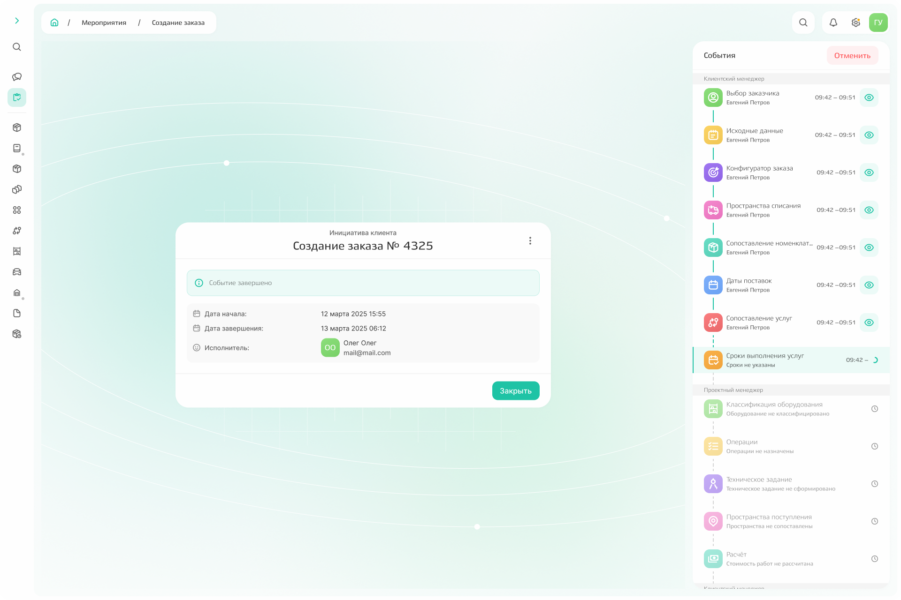{.center width=1200}

**Если ответственным вы назначили себя**, то окно с информацией о заказе не выводится, а сразу происходит переход к следующему событию. 

## Детализация информации и расчет

### Событие 5. Классификация оборудования

К уже полученным связкам «оборудование — номенклатура» необходимо добавить вид для корректного расчета стоимости работ. 

Если в событии 3 «Конфигуратор заказа» был выбран мануальный режим, то вид оборудования заполняется вручную.
При загрузке excel-шаблона вид оборудования подбирается автоматически, если сопоставление не удалось — также вручную.

Вид оборудования определяется типом оборудования: сначала выбирается тип, после — связанный с ним вид. И у типа, и у вида оборудования есть описание, которое можно открыть по подсказке 🛈. 

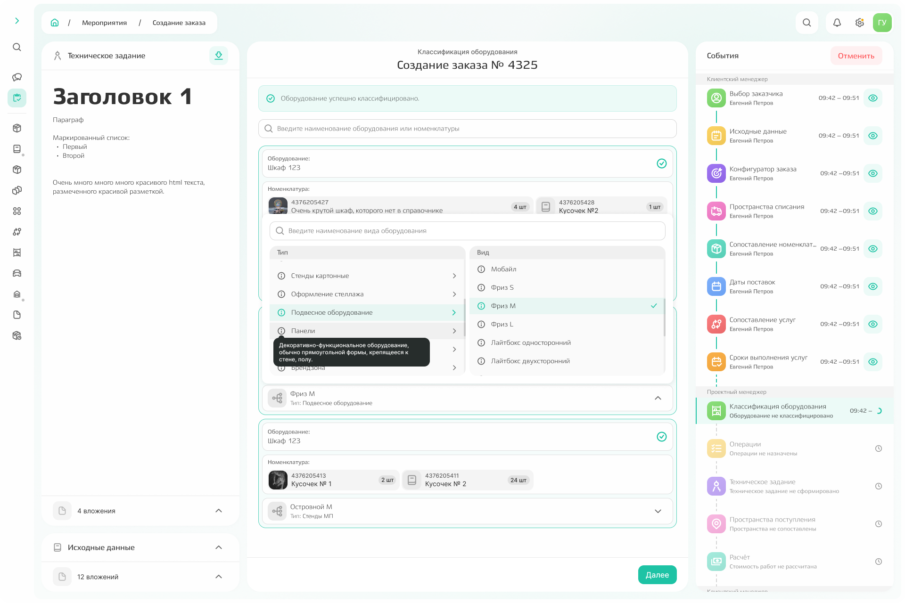{.center width=1200}

### Событие 6. Операции

В рамках текущего события указываются [операции][19] для связки «оборудование — услуга». 
У каждой услуги свой список операций. **Для каждой услуги в заказе нужно указать хотя бы одну операцию.**

В блоке обеспечение деятельности добавьте общие операции для всего оборудования.
Далее переходите к карточкам, где необходимо указать операции по услугам, которые будут относиться к конкретной связке «оборудование - номенклатура».   



Если в рамках одного заказа для разных адресов встречается одно и то же оборудование с одинаковым набором номенклатуры и набором услуг, то отображается одна общая карточка. 



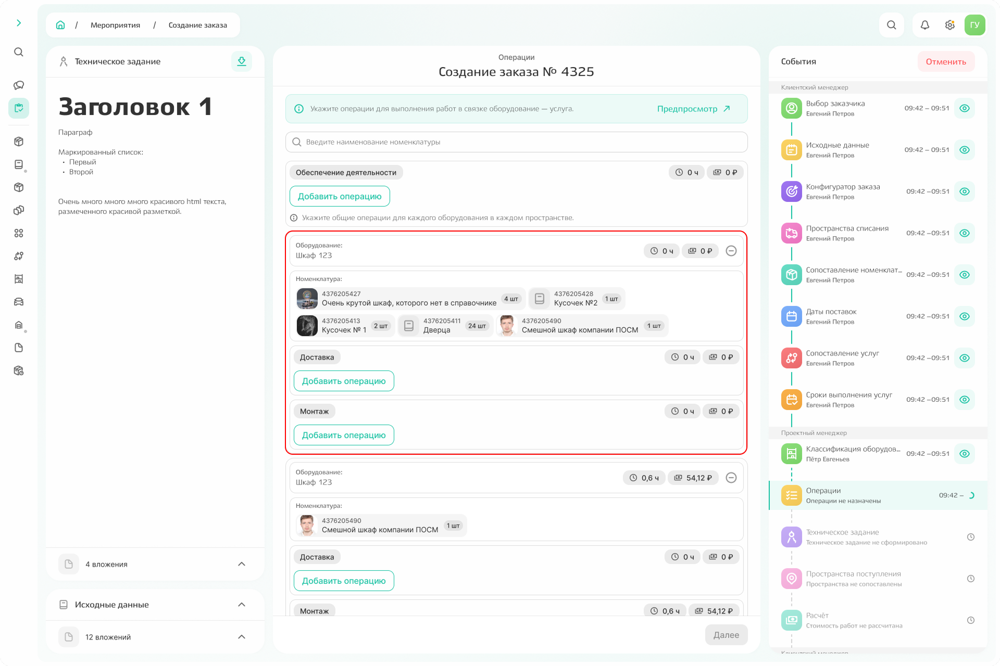{.center width=1200}

### Событие 7. Техническое задание

Опишите все требования, необходимые для выполнения работ по заказу.
Можно прикрепить до 24 файлов до 5 МБ для конкретизации ТЗ.

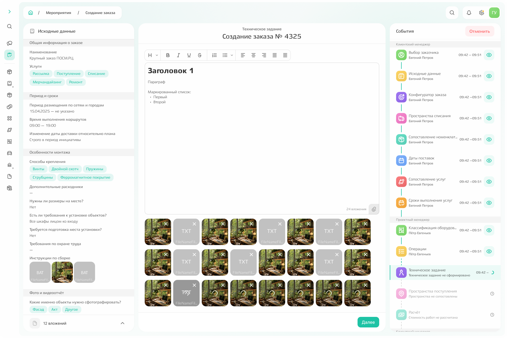{.center width=1200}

### Событие 8. Пространства поступления

Аналогично классификации оборудования, если на событии 3 «Конфигуратор заказа» был выбран мануальный режим, то соответствие адресов для пространства поступления заполняется вручную.
При загрузке excel-шаблона адрес сопоставляется автоматически, если сопоставление не удалось — вручную.

[Пространство][20] считается сопоставленным если есть системное и зависимое пользовательское пространство и у заказчика, и у исполнителя. В ином случае, пользователь должен либо:
- создать системное пространство, а после — два пользовательских пространства: одно с информацией от исполнителя и одно с информацией от заказчика;
- создать пользовательские пространства для исполнителя и заказчика для найденного системного;
- создать пользовательское пространство для одной из сторон.

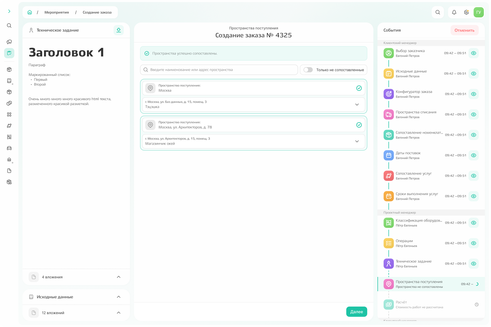{.center width=1200}

### Событие 9. Расчет

В расчете ответсвенный менеджер указывает:
- процент рисков услуг, 
- транспортные риски, 
- маржу, 
- время выполнения маршрутов, 
- клиентские риски, 
- требуется ли возврат транспортных документов и обрешётка. 

В зависимости от указанных параметров и в соответсвии с ранее внесенными данными по всем событиям по команде «Пересчитать» происходит расчет стоимости заказа. 

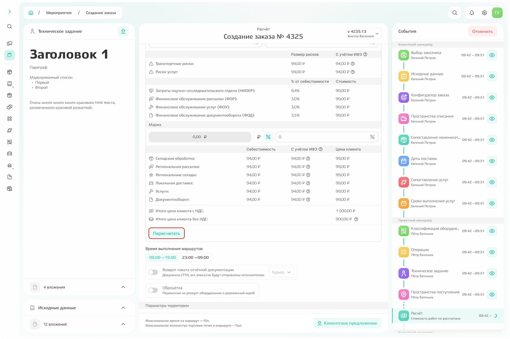{.center width=1200}

Когда система произведет расчёт, будет построена [диаграмма Ганта][21]. 

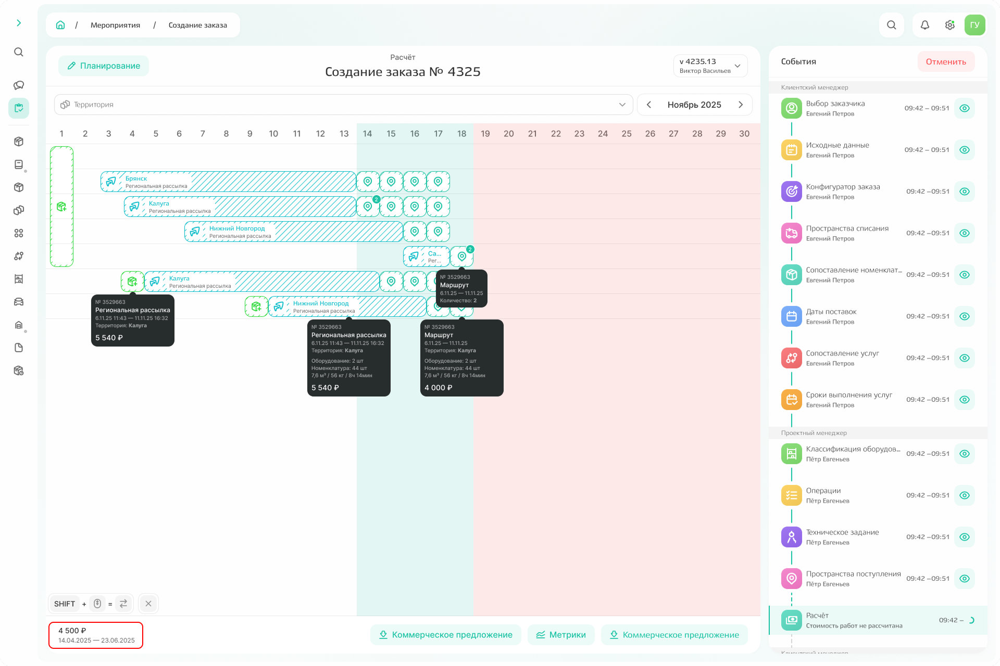{.center width=1200}

Зеленый цвет показывает инициативу клиента — даты, указанные в событии «Сроки выполнения услуг». 
Красный цвет подсвечивает даты маршрутов, выполняющиеся до и после указанной инициативы клиента. 

Внизу диаграммы указывается общая стоимость и даты. При клике по одному из элементов диаграммы отображается стоимость и детали конкретной части заказа.

Команда «Метрики» приведет к открытию [сайд-бара][22] с некоторыми суммарными характеристиками по всему заказу. 

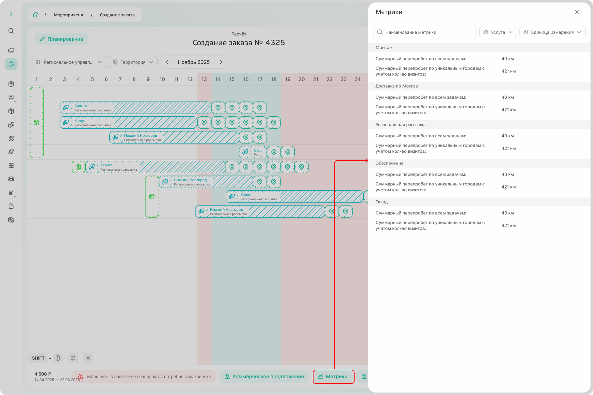{.center width=1200}

Команда «Коммерческое предложение» необходима для генерации pdf-файла с предложением для клиента. 

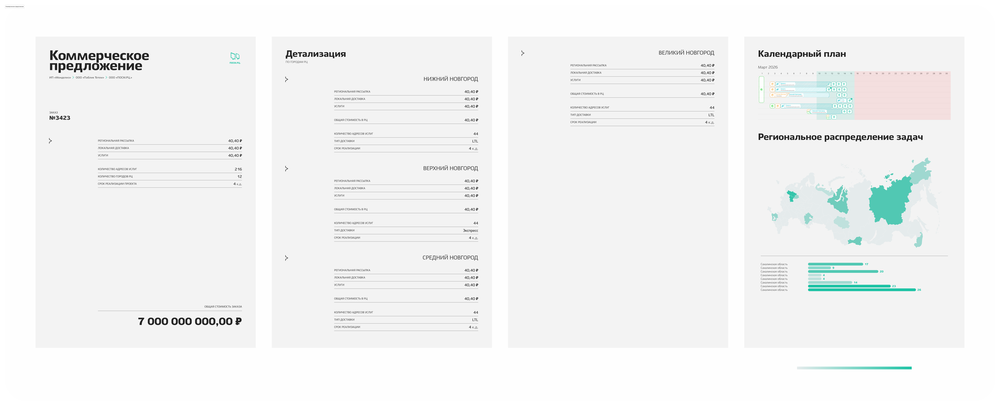{.center width=1200}

Кроме того, можно ввести другие параметры и перерассчитать стоимость заказа. Для этого необходимо кликнуть по команде «Планирование» и в открывшейся форме ввести новые характеристики, далее — команда «Пересчитать». 

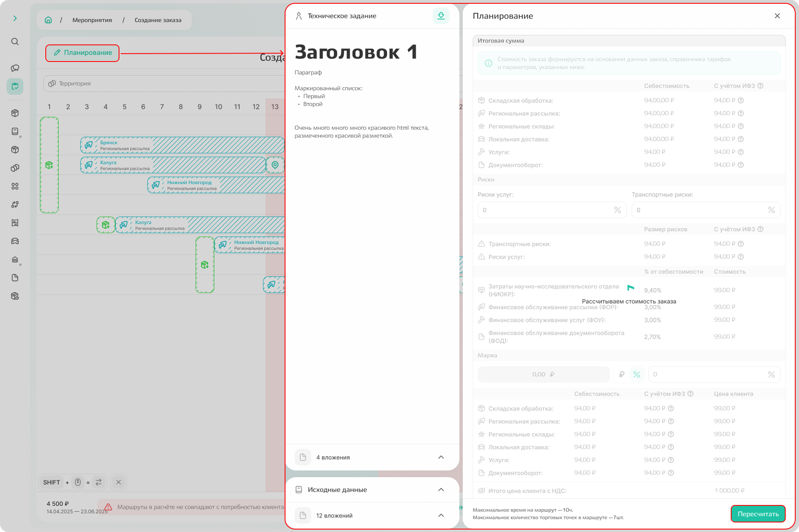{.center width=1200}

Все рассчитанные версии можно будет просмотреть в специальном выпадающем списке.   

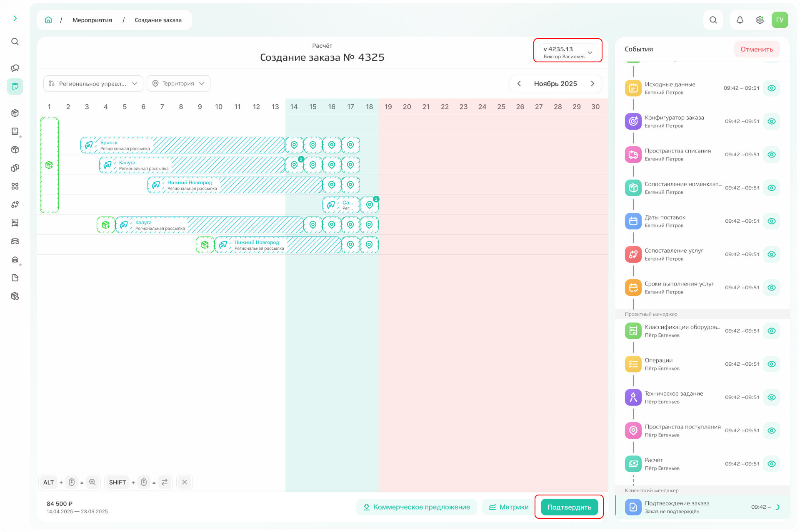{.center width=1200}

При клике по команде «Подтвердить» выбранная версия в выпадающем списке будет считаться основной и именно по ней будет выводиться финальный экран.

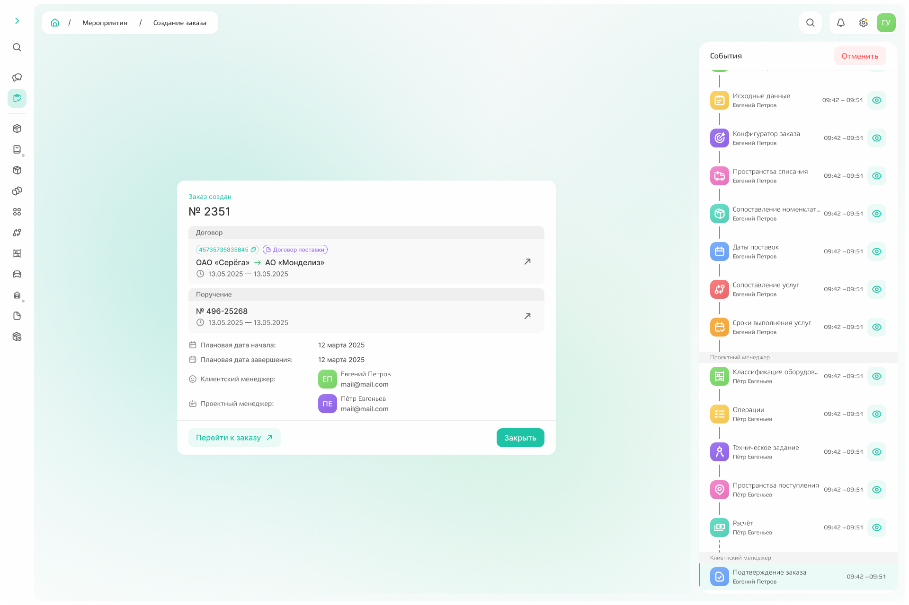{.center width=1200}

[1]: https://lebelena.github.io/diplodoc-example/ru/glossary.html#lcp:~:text=%D1%8F%D0%B2%D0%BB%D1%8F%D0%B5%D1%82%D1%81%D1%8F%20%D1%87%D0%B0%D1%81%D1%82%D1%8C%D1%8E%20%D0%B7%D0%B0%D0%BA%D0%B0%D0%B7%D0%B0-,%D0%97%D0%B0%D0%BA%D0%B0%D0%B7%20(LCP),-%E2%80%93%20%D1%8D%D0%BB%D0%B5%D0%BC%D0%B5%D0%BD%D1%82%20%D1%83%D0%BF%D1%80%D0%B0%D0%B2%D0%BB%D0%B5%D0%BD%D0%B8%D1%8F%2C%20%D1%8F%D0%B2%D0%BB%D1%8F%D1%8E%D1%89%D0%B8%D0%B9%D1%81%D1%8F

[2]: https://lebelena.github.io/diplodoc-example/ru/glossary.html#lcp:~:text=%D0%BE%D1%81%D0%BD%D0%BE%D0%B2%D0%BD%D0%BE%D0%B3%D0%BE%20%D0%BF%D1%83%D0%BD%D0%BA%D1%82%D0%B0%20%D0%BC%D0%B5%D0%BD%D1%8E-,%D0%9F%D0%BE%D0%B4%D1%81%D0%B8%D1%81%D1%82%D0%B5%D0%BC%D0%B0,-%E2%80%93%20%D0%BA%D1%80%D1%83%D0%BF%D0%BD%D1%8B%D0%B9%20%D1%84%D1%83%D0%BD%D0%BA%D1%86%D0%B8%D0%BE%D0%BD%D0%B0%D0%BB%D1%8C%D0%BD%D1%8B%D0%B9%20%D0%B1%D0%BB%D0%BE%D0%BA

[3]:https://lebelena.github.io/diplodoc-example/ru/glossary.html#lcp:~:text=%D0%9A%D0%B0%D1%80%D1%82%D0%BE%D1%87%D0%BA%D0%B0%20%D0%B7%D0%B0%D0%B4%D0%B0%D1%87%D0%B8/%D0%BA%D0%BE%D0%BD%D1%82%D1%80%D0%B0%D0%B3%D0%B5%D0%BD%D1%82%D0%B0/%D0%BF%D0%BE%D1%80%D1%83%D1%87%D0%B5%D0%BD%D0%B8%D1%8F%20%D0%BF%D0%BE%20%D0%B4%D0%BE%D0%B3%D0%BE%D0%B2%D0%BE%D1%80%D1%83

[4]: https://lebelena.github.io/diplodoc-example/ru/glossary.html#lcp:~:text=%D0%A0%D0%B0%D0%B1%D0%BE%D1%82%D0%B0%20%D1%81%20%D0%B7%D0%B0%D0%BA%D0%B0%D0%B7%D0%BE%D0%BC-,%D0%94%D0%BE%D0%B3%D0%BE%D0%B2%D0%BE%D1%80%20(LCP),-%E2%80%93%20%D1%81%D1%83%D1%89%D0%BD%D0%BE%D1%81%D1%82%D1%8C%2C%20%D0%BF%D0%BE%D0%B4%D1%82%D0%B2%D0%B5%D1%80%D0%B6%D0%B4%D0%B0%D1%8E%D1%89%D0%B0%D1%8F%20%D1%81%D0%BE%D0%B3%D0%BB%D0%B0%D1%88%D0%B5%D0%BD%D0%B8%D0%B5

[5]: https://lebelena.github.io/diplodoc-example/ru/glossary.html#lcp:~:text=%D0%A0%D0%B0%D0%B1%D0%BE%D1%82%D0%B0%20%D1%81%20%D0%B7%D0%B0%D0%BA%D0%B0%D0%B7%D0%BE%D0%BC-,%D0%9F%D0%BE%D1%80%D1%83%D1%87%D0%B5%D0%BD%D0%B8%D0%B5,-%E2%80%93%20%D1%8D%D0%BB%D0%B5%D0%BC%D0%B5%D0%BD%D1%82%20%D1%83%D0%BF%D1%80%D0%B0%D0%B2%D0%BB%D0%B5%D0%BD%D0%B8%D1%8F%20%D0%B2

[6]: https://lebelena.github.io/diplodoc-example/ru/glossary.html#lcp:~:text=%D0%A0%D0%B0%D0%B1%D0%BE%D1%82%D0%B0%20%D1%81%20%D0%B7%D0%B0%D0%BA%D0%B0%D0%B7%D0%BE%D0%BC-,%D0%A1%D0%BE%D0%B1%D1%8B%D1%82%D0%B8%D0%B5%20(LCP),-%E2%80%93%20%D0%BF%D0%BE%D1%81%D0%BB%D0%B5%D0%B4%D0%BE%D0%B2%D0%B0%D1%82%D0%B5%D0%BB%D1%8C%D0%BD%D0%BE%D1%81%D1%82%D1%8C%20%D0%B7%D0%B0%D1%84%D0%B8%D0%BA%D1%81%D0%B8%D1%80%D0%BE%D0%B2%D0%B0%D0%BD%D0%BD%D1%8B%D1%85%20%D0%B4%D0%B5%D0%B9%D1%81%D1%82%D0%B2%D0%B8%D0%B9

[7]: https://lebelena.github.io/diplodoc-example/ru/glossary.html#lcp:~:text=%D0%9C-,%D0%9C%D0%B5%D1%80%D0%BE%D0%BF%D1%80%D0%B8%D1%8F%D1%82%D0%B8%D0%B5,-%E2%80%93%20%D1%8D%D1%82%D0%BE%20%D0%B4%D0%BE%D1%81%D1%82%D1%83%D0%BF%D0%BD%D0%BE%D0%B5%20%D0%B4%D0%BB%D1%8F

[8]: https://lebelena.github.io/diplodoc-example/ru/glossary.html#lcp:~:text=%D0%98-,%D0%98%D0%BA%D0%BE%D0%BD%D0%BA%D0%B0%20(%D0%B0%D0%BD%D0%B3.%20icon),-%E2%80%93%20%D0%BC%D0%B0%D0%BB%D0%B5%D0%BD%D1%8C%D0%BA%D0%B8%D0%B9%20%D0%B3%D1%80%D0%B0%D1%84%D0%B8%D1%87%D0%B5%D1%81%D0%BA%D0%B8%D0%B9%20%D0%B7%D0%BD%D0%B0%D1%87%D0%BE%D0%BA

[9]: https://lebelena.github.io/diplodoc-example/ru/glossary.html#lcp:~:text=%D0%A0%D0%B0%D0%B1%D0%BE%D1%82%D0%B0%20%D1%81%20%D0%B7%D0%B0%D0%BA%D0%B0%D0%B7%D0%BE%D0%BC-,%D0%9F%D0%BE%D0%BB%D0%B5%20%D0%B2%D0%B2%D0%BE%D0%B4%D0%B0,-%E2%80%93%20%D1%8D%D0%BB%D0%B5%D0%BC%D0%B5%D0%BD%D1%82%20%D0%B8%D0%BD%D1%82%D0%B5%D1%80%D1%84%D0%B5%D0%B9%D1%81%D0%B0%20%D0%B4%D0%BB%D1%8F

[10]: https://lebelena.github.io/diplodoc-example/ru/glossary.html#lcp:~:text=%D0%9F%D1%80%D0%BE%D1%81%D1%82%D1%80%D0%B0%D0%BD%D1%81%D1%82%D0%B2%D0%BE%20%D1%81%D0%BF%D0%B8%D1%81%D0%B0%D0%BD%D0%B8%D1%8F

[11]: https://lebelena.github.io/diplodoc-example/ru/glossary.html#lcp:~:text=%D0%A1%D0%B8%D1%81%D1%82%D0%B5%D0%BC%D0%BD%D0%BE%D0%B5%20%D0%BF%D1%80%D0%BE%D1%81%D1%82%D1%80%D0%B0%D0%BD%D1%81%D1%82%D0%B2%D0%BE

[12]: https://lebelena.github.io/diplodoc-example/ru/glossary.html#lcp:~:text=%D0%BE%D1%82%20%D0%B8%D0%BC%D0%B5%D0%BD%D0%B8%20%D0%BA%D0%BE%D0%BD%D1%82%D1%80%D0%B0%D0%B3%D0%B5%D0%BD%D1%82%D0%B0-,%D0%9F%D0%BE%D0%BB%D1%8C%D0%B7%D0%BE%D0%B2%D0%B0%D1%82%D0%B5%D0%BB%D1%8C%D1%81%D0%BA%D0%BE%D0%B5%20%D0%BF%D1%80%D0%BE%D1%81%D1%82%D1%80%D0%B0%D0%BD%D1%81%D1%82%D0%B2%D0%BE,-%E2%80%93%20%D1%84%D0%B8%D0%B7%D0%B8%D1%87%D0%B5%D1%81%D0%BA%D0%B8%20%D1%81%D1%83%D1%89%D0%B5%D1%81%D1%82%D0%B2%D1%83%D1%8E%D1%89%D0%B5%D0%B5%20%D0%BF%D1%80%D0%BE%D1%81%D1%82%D1%80%D0%B0%D0%BD%D1%81%D1%82%D0%B2%D0%BE

[13]: https://lebelena.github.io/diplodoc-example/ru/glossary.html#lcp:~:text=%D0%9D-,%D0%9D%D0%BE%D0%BC%D0%B5%D0%BD%D0%BA%D0%BB%D0%B0%D1%82%D1%83%D1%80%D0%B0%20(LCP),-%E2%80%93%20%D1%81%D0%B2%D0%BE%D0%B4%D0%BD%D1%8B%D0%B9%20%D0%BF%D0%B5%D1%80%D0%B5%D1%87%D0%B5%D0%BD%D1%8C%20%D0%BE%D0%B1%D1%89%D0%B8%D1%85

[14]: https://lebelena.github.io/diplodoc-example/ru/glossary.html#lcp:~:text=%D0%A0%D0%B0%D0%B1%D0%BE%D1%82%D0%B0%20%D1%81%20%D0%B7%D0%B0%D0%BA%D0%B0%D0%B7%D0%BE%D0%BC-,%D0%A1%D0%BF%D1%80%D0%B0%D0%B2%D0%BE%D1%87%D0%BD%D0%B8%D0%BA,-%E2%80%93%20%D1%81%D1%82%D1%80%D1%83%D0%BA%D1%82%D1%83%D1%80%D0%B8%D1%80%D0%BE%D0%B2%D0%B0%D0%BD%D0%BD%D1%8B%D0%B9%20%D0%BF%D0%B5%D1%80%D0%B5%D1%87%D0%B5%D0%BD%D1%8C%20%D0%B4%D0%B0%D0%BD%D0%BD%D1%8B%D1%85

[15]: https://lebelena.github.io/diplodoc-example/ru/glossary.html#lcp:~:text=%D0%A1%D0%BF%D1%80%D0%B0%D0%B2%D0%BE%D1%87%D0%BD%D0%B8%D0%BA%20%D1%82%D0%B8%D0%BF%D0%BE%D0%B2%20%D0%BE%D0%B1%D0%BE%D1%80%D1%83%D0%B4%D0%BE%D0%B2%D0%B0%D0%BD%D0%B8%D1%8F-,%D0%92%D1%8B%D0%BF%D0%B0%D0%B4%D0%B0%D1%8E%D1%89%D0%B8%D0%B9%20%D1%81%D0%BF%D0%B8%D1%81%D0%BE%D0%BA,-%E2%80%93%20%D1%8D%D0%BB%D0%B5%D0%BC%D0%B5%D0%BD%D1%82%20%D0%B2%D0%B2%D0%BE%D0%B4%D0%B0%2C%20%D0%BF%D0%BE%D0%B7%D0%B2%D0%BE%D0%BB%D1%8F%D1%8E%D1%89%D0%B8%D0%B9

[16]: https://lebelena.github.io/diplodoc-example/ru/glossary.html#lcp:~:text=%D0%A2%D0%BE%D0%BF%D0%BE%D0%BB%D0%BE%D0%B3%D0%B8%D1%8F%20%D0%BF%D1%80%D0%BE%D1%81%D1%82%D1%80%D0%B0%D0%BD%D1%81%D1%82%D0%B2%D0%B0

[17]: https://lebelena.github.io/diplodoc-example/ru/glossary.html#lcp:~:text=%D1%81%20%5B%D0%B7%D0%B0%D0%BA%D0%B0%D0%B7%D0%BE%D0%BC%5D%5B31%5D-,%D0%98%D0%BD%D0%B8%D1%86%D0%B8%D0%B0%D1%82%D0%B8%D0%B2%D0%B0%20%D0%BA%D0%BB%D0%B8%D0%B5%D0%BD%D1%82%D0%B0,-%E2%80%94%20%D0%BF%D1%80%D0%BE%D0%BC%D0%B5%D0%B6%D1%83%D1%82%D0%BE%D0%BA%20%D0%B2%D1%80%D0%B5%D0%BC%D0%B5%D0%BD%D0%B8%2C%20%D0%B7%D0%B0

[18]: https://lebelena.github.io/diplodoc-example/ru/glossary.html#lcp:~:text=%D0%BF%D0%BE%D1%81%D0%BB%D0%B5%D0%B4%D1%83%D1%8E%D1%89%D0%B5%D0%B3%D0%BE%20%D0%BA%D0%BE%D1%80%D1%80%D0%B5%D0%BA%D1%82%D0%BD%D0%BE%D0%B3%D0%BE%20%D1%80%D0%B0%D1%81%D1%87%D0%B5%D1%82%D0%B0-,%D0%9A%D0%BE%D0%BD%D1%82%D1%80%D0%B0%D0%B3%D0%B5%D0%BD%D1%82%20(LCP),-%E2%80%93%20%D1%8D%D1%82%D0%BE%20%D0%BB%D1%8E%D0%B1%D0%BE%D0%B5%20%D1%8E%D1%80%D0%B8%D0%B4%D0%B8%D1%87%D0%B5%D1%81%D0%BA%D0%BE%D0%B5

[19]: https://lebelena.github.io/diplodoc-example/ru/glossary.html#lcp:~:text=%D0%9E-,%D0%9E%D0%BF%D0%B5%D1%80%D0%B0%D1%86%D0%B8%D1%8F%20(LCP),-%E2%80%93%20%D0%B5%D0%B4%D0%B8%D0%BD%D0%B8%D1%86%D0%B0%20%D1%80%D0%B0%D0%B1%D0%BE%D1%82%D1%8B%20%D0%B8%D0%BB%D0%B8

[20]: https://lebelena.github.io/diplodoc-example/ru/glossary.html#lcp:~:text=%D0%9F%D1%80%D0%BE%D1%81%D1%82%D1%80%D0%B0%D0%BD%D1%81%D1%82%D0%B2%D0%BE%20%D0%BF%D0%BE%D1%81%D1%82%D1%83%D0%BF%D0%BB%D0%B5%D0%BD%D0%B8%D1%8F

[21]: https://lebelena.github.io/diplodoc-example/ru/glossary.html#lcp:~:text=%D0%94-,%D0%94%D0%B8%D0%B0%D0%B3%D1%80%D0%B0%D0%BC%D0%BC%D0%B0%20%D0%93%D0%B0%D0%BD%D1%82%D0%B0,-%E2%80%93%20%D0%B8%D0%BD%D1%81%D1%82%D1%80%D1%83%D0%BC%D0%B5%D0%BD%D1%82%20%D0%B2%D0%B8%D0%B7%D1%83%D0%B0%D0%BB%D0%B8%D0%B7%D0%B0%D1%86%D0%B8%D0%B8%20%D0%B8

[22]: https://lebelena.github.io/diplodoc-example/ru/glossary.html#:~:text=%D0%A1-,%D0%A1%D0%B0%D0%B9%D0%B4%2D%D0%B1%D0%B0%D1%80,-%E2%80%94%20%D1%8D%D0%BB%D0%B5%D0%BC%D0%B5%D0%BD%D1%82%20%D0%B8%D0%BD%D1%82%D0%B5%D1%80%D1%84%D0%B5%D0%B9%D1%81%D0%B0%20%D0%B4%D0%BB%D1%8F