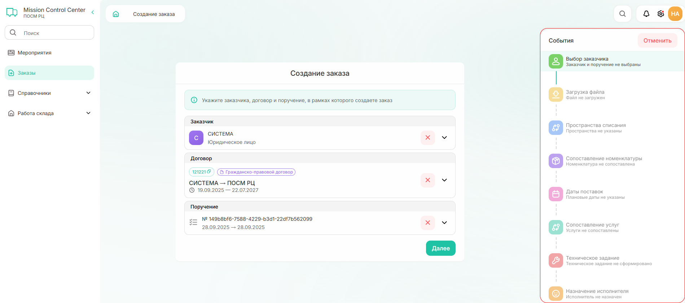

# Как создать заказ

**Заказ** - это формализованный документ в системе, описывающий конкретный объем работ и услуг, подлежащих исполнению. 

Чтобы создать заказ **перейдите на вкладку «Заказы»**. 

{.center width=1200}

В правой части экрана есть блок, по которому можно отслеживать шаги или события, которые уже пройдены и которые только предстоит пройти, чтобы создать заказ.

Для создания заказа требуется пройти некоторое количество шагов

**Шаг 1.** Перейдите на вкладку «Заказы» и укажите заказчика, договор, поручение, в рамках которого создается заказ. 



В правой части экрана есть блок, по которому можно отслеживать шаги или события, которые уже пройдены и которые только предстоит пройти, чтобы создать заказ.



Между шагами можно переключаться и перескакивать на несколько шагов назад, двигаться вперед, пропуская шаги нельзя.  

Важно! Заказчика можно выбрать только из тех, с кем 
у вас заключен договор
договор заключен с кем-то другим, но по вы по этому договору назначены ответственным.  

Договор определяет те поручения, которые могут быть выбраны



Заказ является частью поручения, поэтому если договора и поручения нет, заказ создать не получится.



Заказ является частью поручения, поэтому **если договора и поручения нет, заказ создать не получится**.