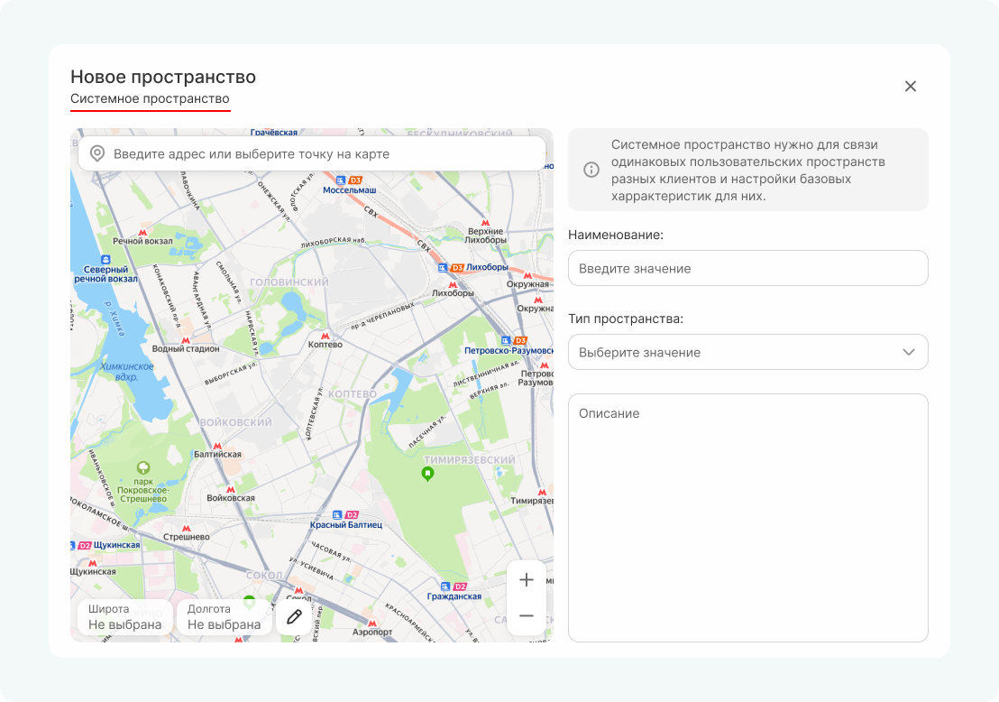
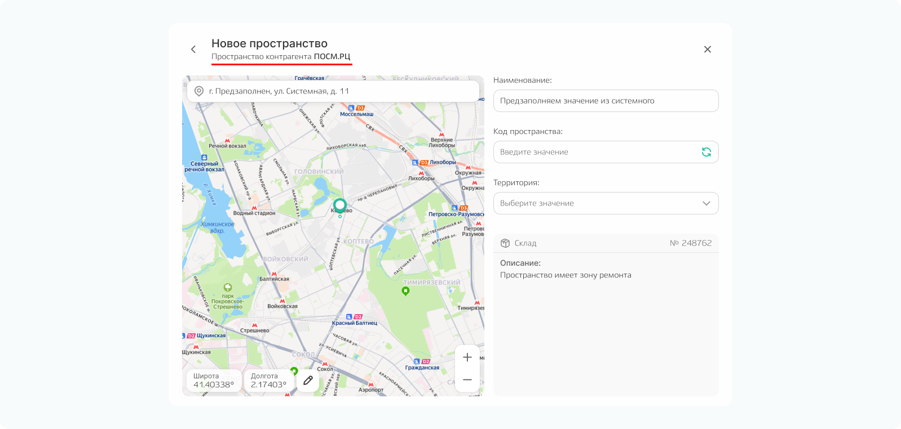
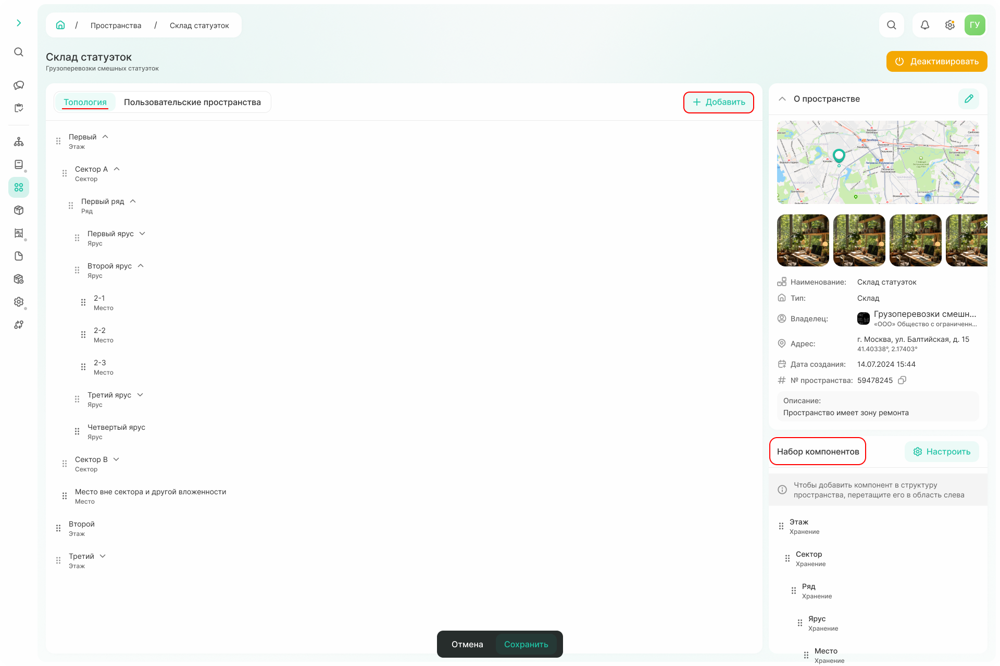

# Пространства

Пространство — закреплённая за контрагентом точка в системе, которая определяет конкретное место (склад, магазин, офис etc.) для хранения, погрузки или разгрузки номенклатуры. 

Существует 2 вида пространств: системное и пользовательское. 

**Пользовательское пространство(ПП)** - фактически существующее пространство. 
**Cистемное пространство(СП)** объединяющее: оно нужно для группировки нескольких пользовательских пространств. 
Объединение необходимо из-за ситуаций, когда у нескольких клиентов адрес одного и того же пользовательского пространства написан по-разному, но при этом координаты одинаковы.  



Так как системное пространство логически собирает вместе несколько пространств, то **добавление всегда происходит по иерархии**: сначала создается или выбирается существующее системное пространство, далее —  пользовательское.

{width=400}



Пространство может быть создано:
1. из справочника «Пространства»;
2. при создании контрагента;
3. из карточки контрагента;
4. при создании заказа.

Алгоритм практически одинаков, но имеет небольшие отличия для разных точек входа. Особенности при создании [контрагента](./how_to_counterparty.md) и [заказов](./how_to_request.md) описаны на соответствующих страницах руководства. 
На текущей странице описан алгоритм создания пространства из справочника. 

## Шаг 1. Создание системного пространства  



Системное пространство служит для группировки пользовательских пространств (фактически существующих объектов).
Это позволяет объединять пространства, которые имеют одинаковые географические координаты, но могут быть записаны в системе с разными вариантами адресов. 



Укажите наименование, выберите тип пространства (офис, склад, торговая точка, юридический адрес, адрес для корреспонденции) и при необходимости добавьте описание.

{width=600}

Адрес можно задать несколькими способами:
- ввести известный адрес в поисковой строке в верхней части карты — система найдет адрес и поставит метку автоматически;
- установить метку вручную, найдя нужное место на карте с помощью мыши;
- ввести географические координаты (широту и долготу) в соответствующие поля в левом нижнем углу карты — система установит метку по координатам.

После заполнения данных о системном пространстве нажмите кнопку «Далее», чтобы перейти к созданию пользовательского пространства.

## Шаг 2. Создание пользовательского пространcтва

**Пользовательское пространство** — это фактически существующее пространство. 

{width=600}

Данные о наименовании, адресе и типе пространстве переносится из выбранного системного. При необходимости данная информация может быть изменена. 

Также укажите:
- код пространства — введите вручную или сгенерируйте по команде ↻; 
- территорию, к которой относится пользовательское пространство. 

Количество пространств не ограничено.

## Шаг 3. Топология

После создания пользовательского пространства попадаем в карточку **системного пространства**. 
Для дальнейшей работы необходимо создать топологию — иерархию компонентов, из которых состоит склад. Топология важна для того, чтобы четко указывать место хранения и быстрее выполнять складские операции.

Есть 2 варианта:
1. Если пространство состоит из стандартных компонентов, перетащите необходимый из набора компонентов справа на вкладку «Топология».
2. Если среди стандартных компонентов нет необходимых, то можно создать свой компонент по команде «Добавить». 

{width=1200}



**Пользовательские пространства, подчиненные системному, также наследуют созданную топологию.** 
Например, если для системного пространства была создана топология: этаж состоит из секторов, сектор из рядов, ряд из ярусов, а ярус из мест хранения, то у подчиненных пользоватьельских пространств будет такая же структура.

