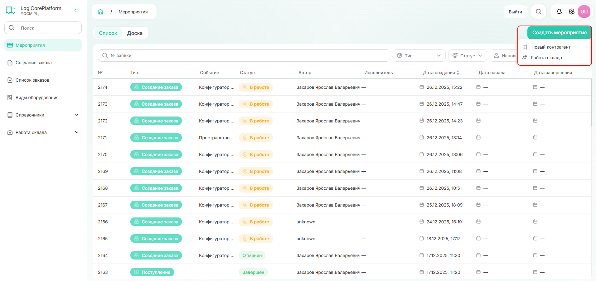

# С чего начать?

Первое, что отображается при входе в личный кабинет — страница мероприятий. 
Ознакомьтесь с доступными для вас мероприятиями или создайте новое.

{.center width=1200}

Чтобы познакомиться с системой, рекомендуем:
* добавить [нового контрагента](./how_to_counterparty.md);
* проверить наполненность справочников: номенклатура, пространства, контрагенты — и добавить новые элементы;
* [создать заказ](./how_to_request.md) и изучить цепочку событий.   

Если требуется сделать что-то конкретное, обратитесь к соответствующему разделу руководства пользователя.  
