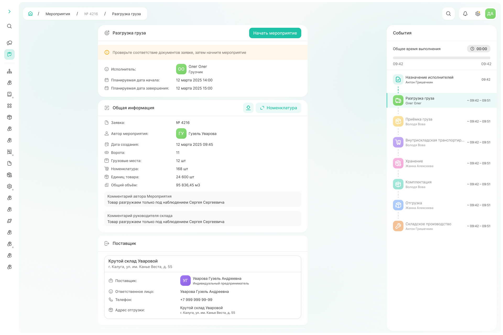
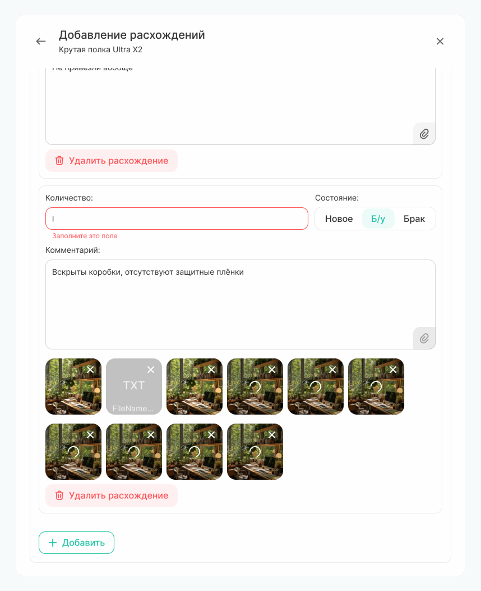
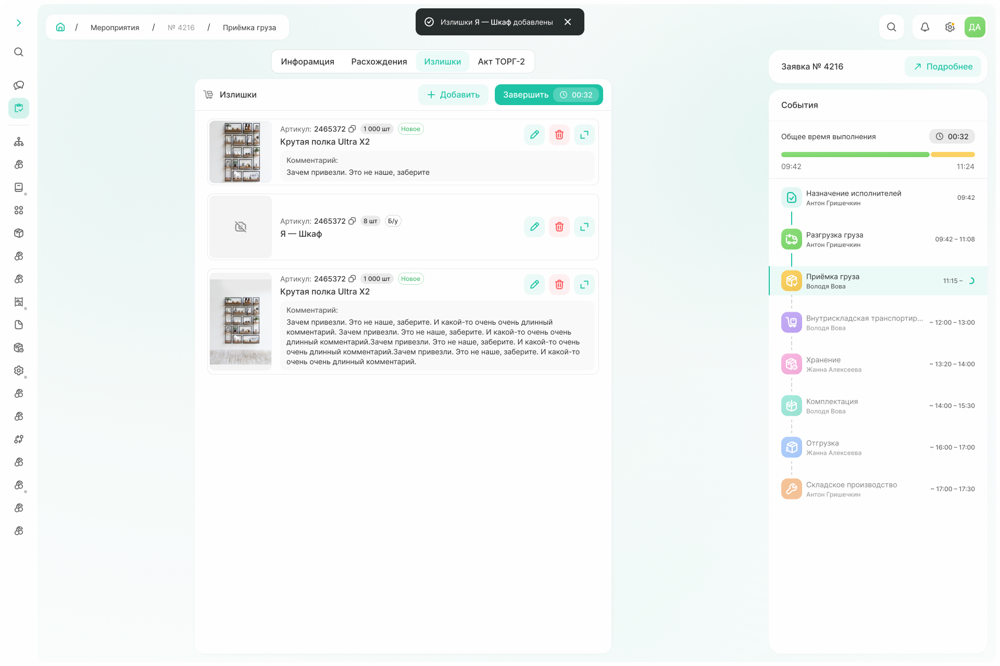
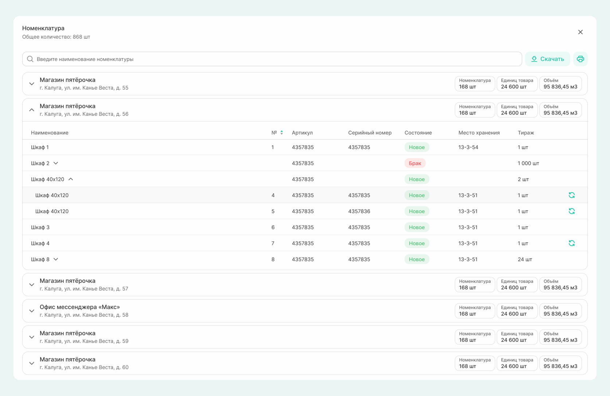

# Как создать заявку

Заявка — это документ, который необходим для работы с номенклатурой внутри компании. 

У заявки есть:
- автор — тот, кто создает заявку и заполняет основную информацию, таким правом обладает только менеджер или руководитель склада;
- ответственный — руководитель склада, назначается автоматически в соответсвии с указанным пространством в договоре;
- исполнитель — назначается руководителем склада.

Также у заявки есть тип. 
Выберите тот тип, который хотите создать: поступление, списание или  инвентаризация и заполните данные на вкладках «Основное» и «Номенклатура». 
  


Вкладка с номенклатурой будет недоступна, пока не будет заполнена основная информация.



## 1. Заполнение информации по заявке

Выполняет либо руководитель склада, либо автор заявки.



- Поступление
  
  **На вкладке «Основное» указываются**
    - планируемые даты начала и завершения всех работ по заявке,
    - хранение для номенклатуры: отсутствует, длительное, [кросс-докинг](*key_storage),
    - комментарий: виден для исполнителей, при необходимости можно прикрепить файлы для конкретизации, 
    - контрагент, который выполняет работу по заявке,
    - договор, в рамках которого выполняется работа на складе.

    {.center width=1200}

    После выбора договора появляются и предзаполняются поля «Поставщик» и «Получатель». Вручную можно указать пространство, откуда товар будет отгружен (для поля поставщика) и указать пространство, куда товар будет выгружен (поле получателя). 

    При наличии информации также заполняется поле «Перевозчик». 
    Можно выполнить двумя способами:
    1. Выбирается контрагент, ответственный за перевозку. После чего становятся доступными для заполнения поля, где указывается марка, страна и номер машины, а также серия и номер паспорта.
    2. По команде «Добавить» можно создать пользовательский контакт: в этом случае для перевозчика указывается ФИО, марка и номера машины, однако, данные по этому перевозчику сохранятся только для этой заявки, в следующих раз надо будет вводить информацию заново.        

    {.center width=1200}

    

    Если по заявке нет информации о перевозчике, пространствах поставщика и получателя, то данные поля можно не заполнять. 

    

  **На вкладке «Номенклатура»** введите в поиске наименование, артикул или SAP-код необходимой номенклатуры и по команде «Добавить» откройте карточку номенклатуры. Заполните все поля и по команде «Сохранить» добавьте номенклатуру в заявку.  
   
    {.center width=1200}

    Когда вся номенклатура добавлена, нажмите команду «Создать».

    {.center width=600}

    В появившемся окне проверьте указанную информацию и по команде «Подтвердить» отправьте заявку в работу на склад. 

    {.center width=1200}

- Списание

    **На вкладке «Основное» указываются**
    - планируемые даты начала и завершения,
    - причина списания номенклатуры,
    - комментарии: виден для исполнителей, при необходимости можно прикрепить файлы для конкретизации, 
    - контрагент, который выполняет работу по заявке,
    - договор, в рамках которого выполняется работа на складе.

    {.center width=1200}

    После выбора договора появляются и предзаполняются поля «Поставщик» и «Получатель». Вручную можно указать пространство, откуда товар будет отгружен (для поля поставщика) и указать пространство, куда товар будет выгружен (поле получателя). 

    При наличии информации заполняется поле «Перевозчик». 
    Есть два способа:
    1. Выбирается контрагент, ответственный за перевозку. После чего становятся доступными для заполнения поля, где указывается марка, страна и номер машины, а также серия и номер паспорта.
    2. По команде «Добавить» можно создать пользовательский контакт: в этом случае для перевозчика указывается ФИО, марка и номера машины, однако, данные по этому перевозчику сохранятся только для этой заявки, в следующих раз надо будет вводить информацию заново.        

    {.center width=1200}

    

    Если по заявке нет информации о перевозчике, пространствах поставщика и получателя, то данные поля можно не заполнять.  

    

    **На вкладке «Номенклатура»** введите в поиске наименование, артикул или SAP-код необходимой номенклатуры и по команде «Добавить» откройте карточку номенклатуры. Заполните все поля и по команде «Сохранить» добавьте номенклатуру в заявку.  
   
    {.center width=1200}

    Когда вся номенклатура добавлена, нажмите команду «Создать».

    {.center width=600}

    В появившемся окне проверьте указанную информацию и по команде «Подтвердить» отправьте заявку в работу на склад. 

    {.center width=1200}

- Инвентаризация

    

    Функционал в разработке.  

    



## 2. Назначение исполнителей

Следующий шаг — назначение исполнителей по заявке. 

Если автором заявки был менеджер, то назначить исполнителей он не может. Однако,может отменить или отредактировать ранее внесенные данные. 

{.center width=600}



**Редактирование заявки доступно не всегда**. 
Только в случае, если:
* мероприятия по заявке не начались;
* заявка запущена в работу, часть мероприятий завершена, но следующее мероприятие по заявке из незавершенных не запущено.

**Если мероприятие не активно**, но не все мероприятия по заявке завершены, для редактирования **есть ограничение**: недоступно изменение типа заявки и направления.

**Заявку отредактировать нельзя**, если заявка завершена или любое мероприятие по заявке находится в работе. 



Если автором заявки был руководитель склада, после заполнения основной информации он сразу переходит к назначению исполнителей.

{.center width=1200}

Набор карточек, по которым необходимо назначить исполнителей, зависит от количества мероприятий в заявке. Для каждого мероприятия — свой ответственный. 

Время выставляется, исходя из дат, указанных автором заявки (планируемая дата начали и дата окончания), и по умолчанию распределяется равномерно на все мероприятия. Как руководитель склада вы можете выставить свое время независимо от даты, указанной автором заявки. 

После того как вся информация заполнена, сохраните данные по команде «Подтвердить». После сохранения по всей цепочке событий для каждого мероприятия отобразится исполнитель и планируемые даты выполнения работ.  

{.center width=1200}



Руководитель склада может запускать и останавливать любые мероприятия, даже если он на них не назначен как исполнитель.

 

## 3. Выполнение работ по заявке

Разные исполнители работают по заявке в соответствии со своим назначением. Работы по заявкам поступления, списания и инвентаризации отличаются, но всегда выполняется последовательно. Это значит, что каждый исполнитель может начать выполнение работ по заявке только после завершения предыдущего этапа работ по заявке. 

Чтобы начать выполнение работ по заявке, воспользуйтесь командой «Начать мероприятие». После этого включится таймер, который будет фиксировать фактическое время выполнения. 



- Поступление

  **3.1. Разгрузка груза**
  Поступление начинается с события «разгрузка груза». 
  Перед тем как начать мероприятие, проверьте соответствие документов и заявки.  

  {.center width=1200}
 
  После начала мероприятия исполнитель указывает зону погрузки. Без этой информации завершить мероприятие будет нельзя. 

  Также пока выполняется разгрузка в системе отображается информация о грузе и таймер по мероприятию. При необходимости информацию о грузе можно скачать в формате excel-файла. 
  
  Можно прикрепить файлы для дополнения информации о грузе, а также зафиксировать расхождения при наличии.  

  

  В качестве расхождений указывается любое несоответствие документов и факта. Информация о расхождении будет отображаться для всех последующих мероприятий по заявке.   

   

  {.center width=600}

  Мероприятие разгрузки завершается после клика по команде «Завершить». Таймер останавливается, фиксируя фактическое время выполнения, текущий исполнитель переходит к списку мероприятий, а следующий назначенный контрагент может приступать к выполнению своей части работы по заявке. 

  **3.2. Приемка груза**

  Мероприятие «Приемка груза» также стартуется по команде «Начать мероприятие». 

  В этом мероприятии можно просмотреть всю номенклатуру в заявке. 
  Всю информацию по единице номенклатуры можно просмотреть в карточке, кликнув по необходимой строчке, а сам список можно распечатать или скачать в виде excel-файла.    

  {.center width=1200}

  При обнаружении расхождений необходимо сформировать акт о расхождениях по команде «Зафиксировать расхождения». 
  В появившейся форме будет несколько вкладок:
  - **«Информация»** — содерждит детали по заявке.
  - **«Расхождения»** — на этой вкладке фиксируются все несоответствия между фактической поставкой и документами.
   
  

  Если по факту номенклатуры пришло количественно больше, чем ожидалось, или пришла номенклатура, которая не указана в заявке, такая информация указывается на вкладке «Излишки».

  

  По команде «Добавить» из списка выбираем номенклатуру, по которой есть расхождения, и заполняем поля с фактическими данными по поставке. 

  {.center width=600}

  Когда вся информация по расхождениям внесена, переходите на вкладку «Излишки» при наличии, или на вкладку «Акт ТОРГ-2», если все расхождения внесены. 

  {.center width=1200}

  - **«Излишки»**
  
  Вносится информация по номенклатуре
    - которая пришла в большем количестве, чем ожидалось;
    - которой быть не должно. 
  
  На основании внесенных данных создается заявка, по которой излишки будут отгружены обратно.  

  Номенклатура выбирается из той, что внесена в систему. Часть полей предзаполняется, часть — заполняется вручную. Также обязательным для заполнения является поле «Комментарий», где описывается несоответсвие поставок.

  Внесенные расхождения можно просмотреть в виде списка и внести изменения по ним. Если все излишки отражены, то переходите на вкладку «Акт ТОРГ-2».

  {.center width=1200}

  - **«Акт ТОРГ - 2»**

  После фиксации расхождений и излишков, скачайте шаблон акта, заполните и подпишите его, затем прикрепите скан документа в область загрузки.
 
  {.center width=1200}

  После загрузки мероприятие «Приемка груза» необходимо завершить по команде «Завершить». 

  **3.3. Внутрискладская транспортировка**

  

  Данное мероприятие, а также все последующие по заявке поступления (3.4. хранение, 3.5. комплектация, 3.6. отгрузка, 3.7. складское производство) находятся в разработке.

  
  
- Списание
  
  Начинается с мероприятия «Отгрузки».
  
  Перед стартом проверьте общую информацию и информацию о поставщике, перевозчике, получателе — это необходимо, чтобы удостовериться какую заявку вы взяли в работу. 
  Далее начните выполнение работ по команде «Начать мероприятие».

  {.center width=1200}

  Для мероприятия «Отгрузка» информация по номенклатуре отображается в виде таблицы в разбивке по точкам.  
  
  

  В таблицах может быть разбивка по партиям. Она отображается если списываемая номенклатура поступила на склад из разных заявок на поступление.

  

  Номенклатура с одинаковыми названиями и артикулами, но с разными серийными номерами объединяется в общий элемент таблицы, который можно развернуть по клику. 

  {.center width=800}

  Номенклатуру можно заменить, если на складе есть номенклатура, не используемая в других заявках, с таким же артикулом, наименованием и состоянием. Для этого необходимо кликнуть на &#10226; в соответствующей строке. Из открывшейся карточки заменяемой номенклатуры по команде «Заменить товар» откройте карточку той номенклатуры, которая будет использоваться в заявке, и укажите место хранения. 

  {.center width=800}

  
  
    

- Инвентаризация

    

    Функционал в разработке.  

    



После того как все мероприятия по заявке выполнены, новый документ появится в подсистеме «Работа склада» → «Документы».    

[*key_storage]: Кросс-докинг — логистическая схема, по которой грузы принимаются на складе и тут же, без размещения в зоне длительного хранения, перегружаются для дальнейшей отправки конечному получателю.

Заявка по поступлению состоит из таких событий как:
 - разгрузка груза
 - приемка груза
 - внутрискладская транспортировка
 - хранение
 - комплектация
 - отгрузка
 - складское производство