# Как создать заявку



**[Заявка][1]** — элемент управления, необходимый для работы с номенклатурой в пространстве. Отражает намерение клиента на перемещение [товарно-материальных ценностей (ТМЦ)][2]. По сути — это драфт документа списания оборудования со склада или поступления оборудования на склад. Заявка формирует перечень [событий][3] в [мероприятии][4], которые выполняются последовательно разными [контрагентами][5].



**С заявкой работают разные контрагенты:**
— *автор заявки* — создает и заполняет основную информацию.
Таким правом обладает руководитель склада или менеджер;
— *ответственный по заявке* — назначает исполнителей по заявке. 
Таким правом обладает только руководитель склада, назначаемый автоматически в соответствии с указанным в договоре пространством;
— *исполнитель* — выполняет работы в рамках события внутри заявки и делает отметки о результате выполнения задач, может быть несколько исполнителей по одной заявке.

**Также у заявки есть тип:** поступление или списание. 
В зависимости от этого типа отличается список событий и информация, указываемая при создании заявки.

## Заполнение основной информации

*Под основной информацией в рамках текущей инструкции по созданию заявки понимаются те данные, без которых создание заявки невозможно. К таким данным относятся тип заявки, планируемая дата начала, тип хранения, контрагент, выполняющий работы по заявке, [договор][6], а также информация об используемой [номенклатуре][7].*

**Создать заявку** из подсистемы «Мероприятия» по команде «Создать мероприятие» → «Работа склада» **может только руководитель склада или менеджер.** В открывшейся форме необходимо определить тип заявки и заполнить информацию в соответствии с типом заявки.   



- Поступление
  
  **На вкладке «Основное» указываются**
    - тип заявки: поступление,
    - планируемая дата начала работ по заявке,
    - хранение для номенклатуры: отсутствует, длительное, [кросс-докинг](*key_storage),
    - комментарий: виден для исполнителей, при необходимости можно прикрепить файлы для конкретизации, 
    - контрагент, который выполняет работу по заявке,
    - договор, в рамках которого выполняется работа по заявке.

    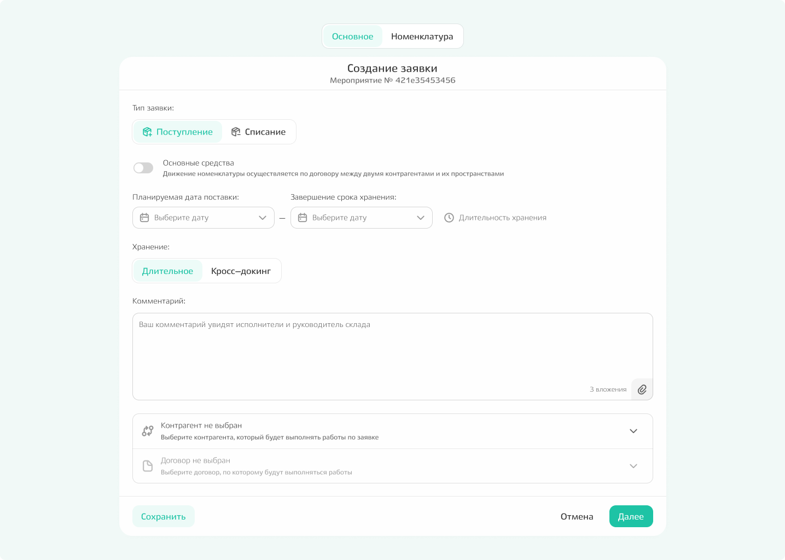{.center width=1200}

    **После выбора договора появляются и предзаполняются поля «Поставщик» и «Получатель».** 
    Можно указать пространство, откуда товар будет отгружен (для поля поставщика) и указать пространство, куда товар будет выгружен (поле получателя). 

    **При наличии информации также заполняется поле «Перевозчик».** 
    **Можно выполнить двумя способами:**
    1. Выбирается контрагент, ответственный за перевозку. После чего становятся доступными для заполнения поля, где указывается марка, страна и номер машины, а также серия и номер паспорта.
    2. По команде «Добавить» можно создать пользовательский контакт: в этом случае для перевозчика указывается ФИО, марка и номера машины, однако, данные по этому перевозчику сохранятся только для этой заявки, в следующих раз надо будет вводить информацию заново.        

    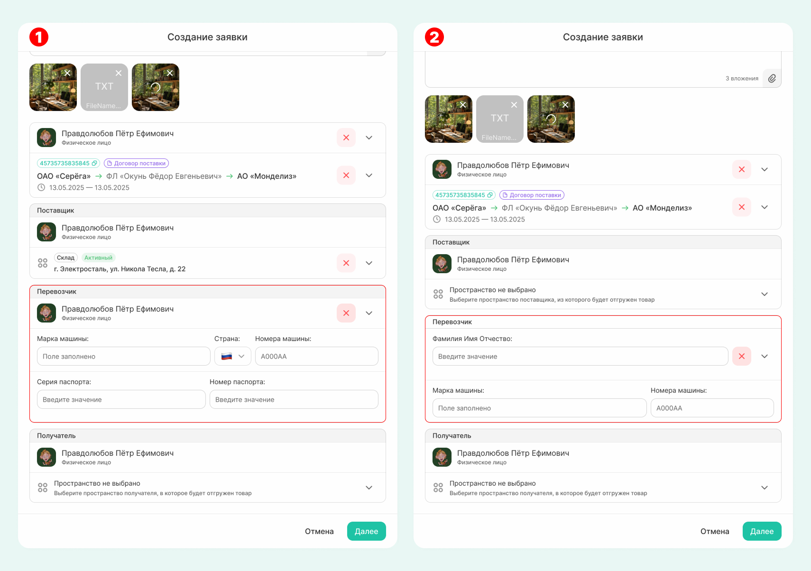{.center width=1200}

    

    При помощи заявки **можно фиксировать поступление основных средств.** 
    Для этого необходимо переключить свитчер «Основные средства» в значение TRUE (свитчер будет зеленым), а после указать 
    - тип заявки: поступление,
    - планируемую дату начала и завершения работ по заявке, 
    - тип хранения, 
    - оставить комментарии при необходимости,
    - выбрать контрагента и закрепленное за ним пространство, куда основные средства будут зачислены. 
    **Договор выбирать не нужно.**

    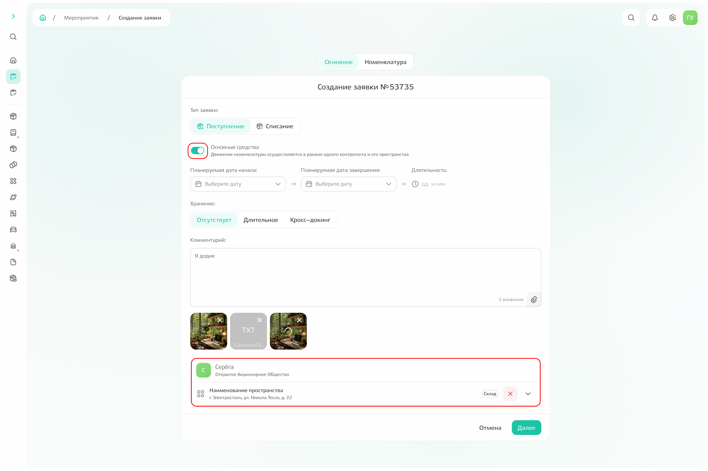{.center width=1200}

    

    **На вкладке «Номенклатура»** введите в поиске наименование, артикул или SAP-код необходимой номенклатуры. Если номенклатура была обнаружена, то кликнете по значению в выпадающем списке, а в открывшемся модальном окне укажите тираж (количество поступающей номенклатуры), состояние, инициатор ПО, владелец склада, инициатор поставки и бренд. 
    *Если номенклатура не нашлась, то по команде «Добавить» можно создать новую номенклатуру, заполнив данные в открывшемся модальном окне. Номенклатура будет добавлена не только в заявку, но и в справочник «Номенклатуры».*

    После внесения всей информации добавьте номенклатуру в заявку по команде «Сохранить».  
   
    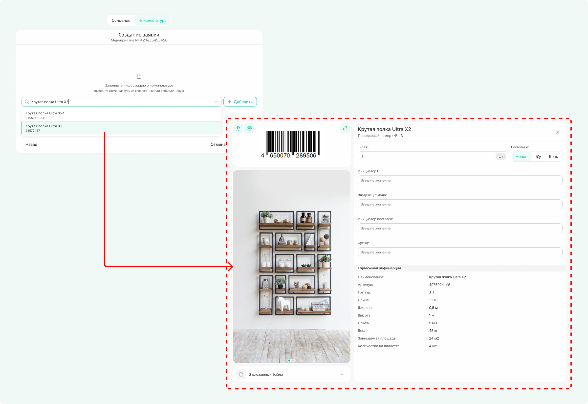{.center width=1200}

    Когда вся номенклатура добавлена, нажмите команду «Создать».

    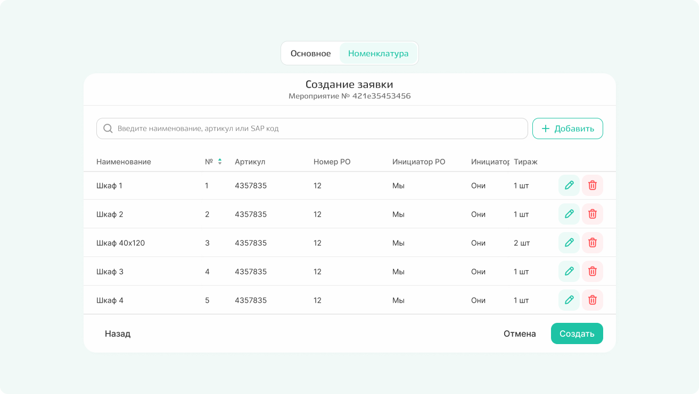{.center width=1200}

    

    **В момент создания заявки включается таймер.** Таймер фиксирует как общее время выполнения, так и время выполнения по каждому из этапов, а [прогресс-бар][8] над списком событий графически отражает как этапы соотносятся друг с другом по длительности. И таймер, и прогресс-бар будут отображены после клика по команде «Создать».  

    

    В появившемся окне проверьте указанную информацию и по команде «Подтвердить» отправьте заявку в работу на склад. 

    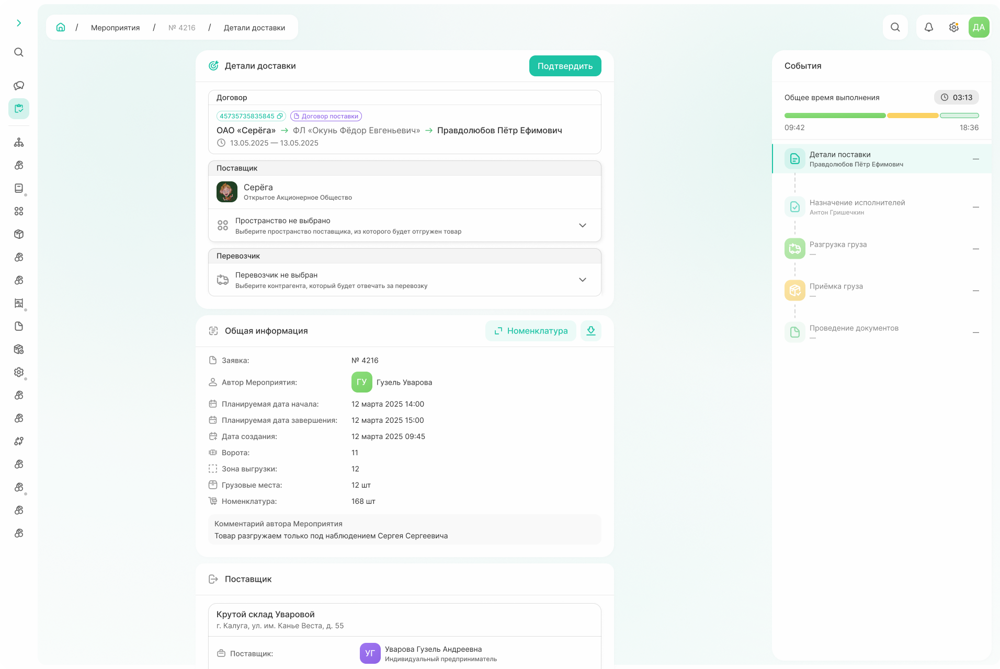{.center width=1200}

- Списание

    **На вкладке «Основное» указываются**
    - тип заявки: списание,
    - планируемая дата начала работ по заявке,
    - причина списания: поставка, брак, бой, истечение срока годности,
    - комментарий: виден для исполнителей, при необходимости можно прикрепить файлы для конкретизации, 
    - контрагент, который выполняет работу по заявке,
    - договор, в рамках которого выполняется работа по заявке.

    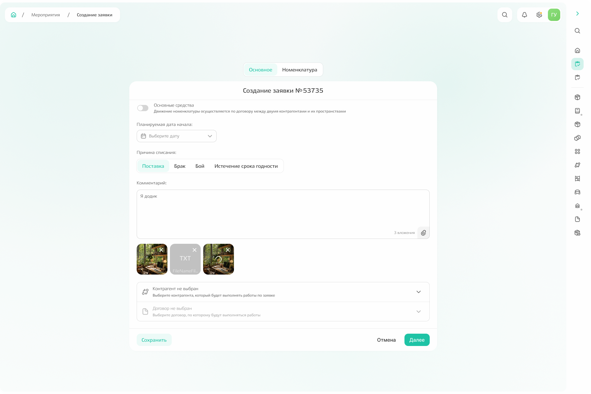{.center width=1200}

    **После выбора договора появляются и предзаполняются поля «Поставщик» и «Получатель».** Вручную можно указать пространство, откуда товар будет отгружен (для поля поставщика) и указать пространство, куда товар будет выгружен (поле получателя). 

    **При наличии информации заполняется поле «Перевозчик».**
    Есть два способа:
    1. Выбирается контрагент, ответственный за перевозку. После чего становятся доступными для заполнения поля, где указывается марка, страна и номер машины, а также серия и номер паспорта.
    2. По команде «Добавить» можно создать пользовательский контакт: в этом случае для перевозчика указывается ФИО, марка и номера машины, однако, данные по этому перевозчику сохранятся только для этой заявки, в следующих раз надо будет вводить информацию заново.        

    {.center width=1200}

    

    При помощи заявки **можно фиксировать поступление основных средств.** 
    Для этого необходимо переключить свитчер «Основные средства» в значение TRUE (свитчер будет зеленым), а после указать 
    - тип заявки: списание,
    - планируемую дату начала и завершения работ по заявке, 
    - причину списания, 
    - оставить комментарии при необходимости,
    - выбрать контрагента и закрепленное за ним пространство, откуда основные средства будут списаны. 
    **Договор выбирать не нужно.**

    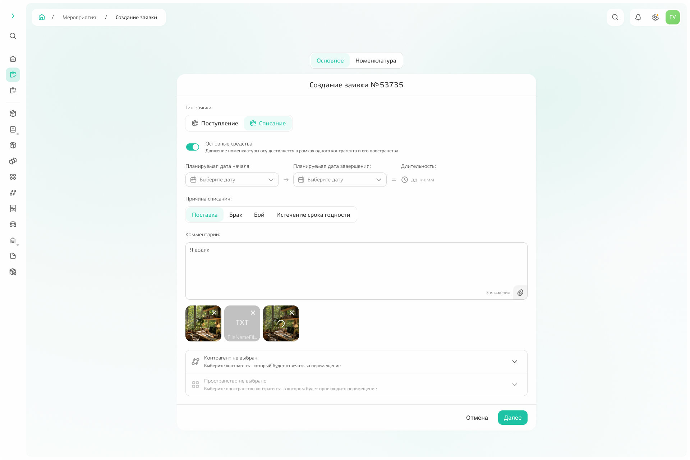{.center width=1200}

    

    **На вкладке «Номенклатура»** введите в поиске наименование, артикул или SAP-код необходимой номенклатуры. Если номенклатура была обнаружена, то кликнете по значению в выпадающем списке, а в открывшемся модальном окне укажите количество номенклатуры, которое будет списано. После заполнения добавьте номенклатуру в заявку по команде «Сохранить».  
   
    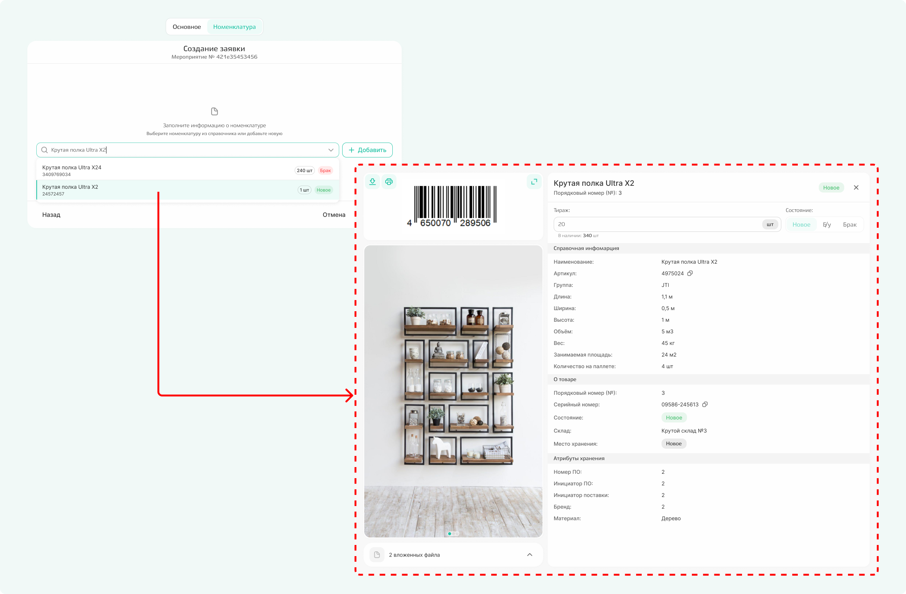{.center width=1200}

    Когда вся номенклатура добавлена, нажмите команду «Создать».

    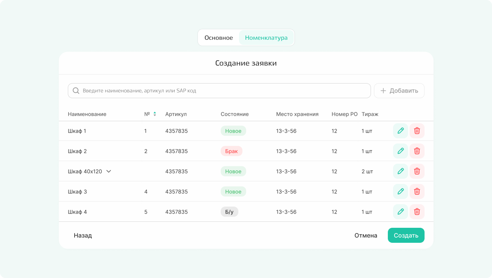{.center width=1200}

    

    **В момент создания заявки включается таймер.** Таймер фиксирует как общее время выполнения, так и время выполнения по каждому из этапов, а [прогресс-бар][8] над списком событий графически отражает как этапы соотносятся друг с другом по длительности. И таймер, и прогресс-бар будут отображены после клика по команде «Создать».  

    

    В появившемся окне проверьте указанную информацию и по команде «Подтвердить» отправьте заявку в работу на склад. 

    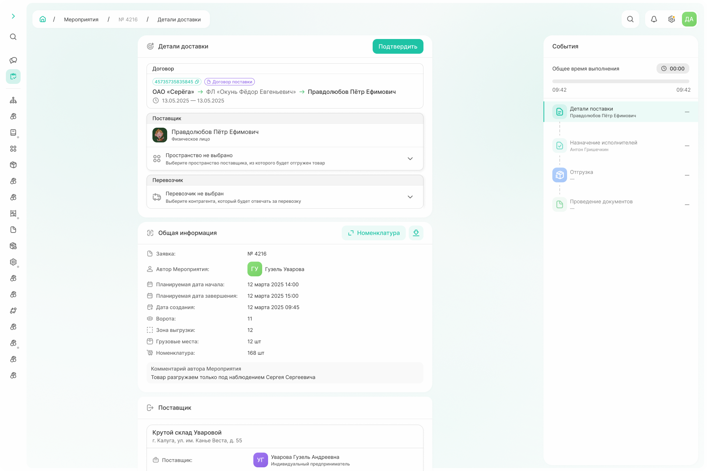{.center width=1200}



## Событие. Назначение исполнителей

**Если автором заявки был менеджер,** то это и последующие описанные события для него недоступны.

**Если автором заявки был руководитель склада,** после заполнения основной информации он сразу переходит к назначению исполнителей.

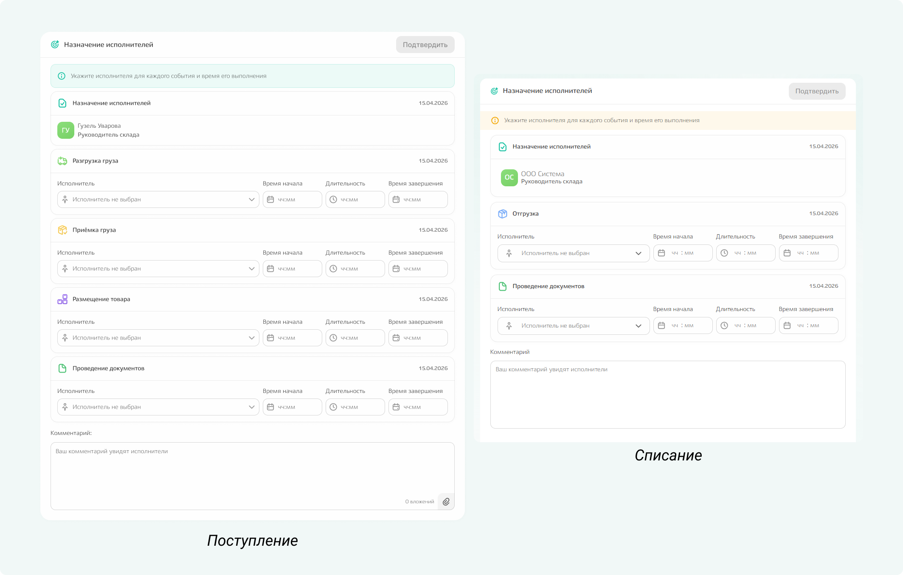{.center width=1200}

Набор [карточек][9], которые отражают последующие события мероприятия, зависит от типа заявки. Для каждой карточки необходимо назначить своего ответственного. 

Время выставляется, исходя из дат, указанных автором заявки (планируемая дата начала), и по умолчанию распределяется в соответствии с нормативным временем выполнения каждого события. Как руководитель склада вы можете выставить свое время независимо от даты, указанной автором заявки. 

После того как вся информация заполнена, сохраните данные по команде «Подтвердить». После сохранения по всей цепочке событий для каждого мероприятия отобразится исполнитель и планируемые даты выполнения работ, а также будет зафиксировано количество времени, потраченное на назначение исполнителя.  

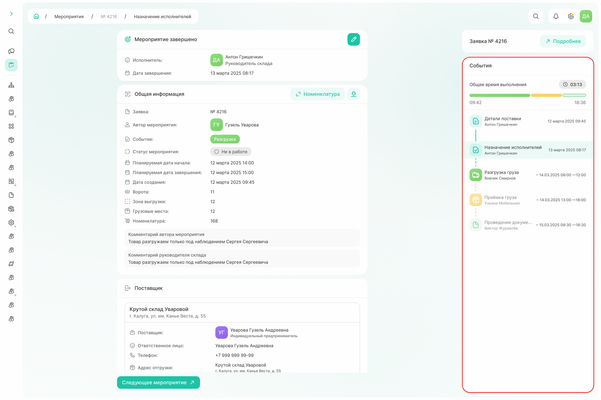{.center width=1200}



**Руководитель склада** может запускать и останавливать любые мероприятия, даже если он на них не назначен как исполнитель.
**Исполнители** же работают по заявке в соответствии со своим назначением. Работы по заявкам поступления и списания отличаются, но всегда выполняется последовательно. Это значит, что каждый исполнитель может начать выполнение работ по заявке только после завершения предыдущего этапа работ по заявке.

 

## События для заявки на поступление

Для заявки с типом «Поступление» мероприятие будет складываться из событий:
- разгрузка груза;
- приёмка груза;
- места хранения; 
- проведение документов.  

Для заявки на списание события будут другими, их описание находится в разделе «События для заявки на списание». 

### Разгрузка груза

Событие «Разгрузка груза» доступно для руководителя склада и исполнителя, назначенного на данное событие.

**При открытии мероприятия до начала события отображается общая информация по заявке, информация о поставщике, перевозчике и получателе,** также можно просмотреть список ожидаемой к поступлению номенклатуры и планируемое время начала. 

Если указанная информация верна, **кликните по команде «Начать событие»,** чтобы начать событие разгрузки и перейти к следующему [модальному окну][10].

Укажите зону погрузки — без этой информации завершить мероприятие будет нельзя. Кроме того, включится таймер, который будет фиксировать фактическое время выполнения. 

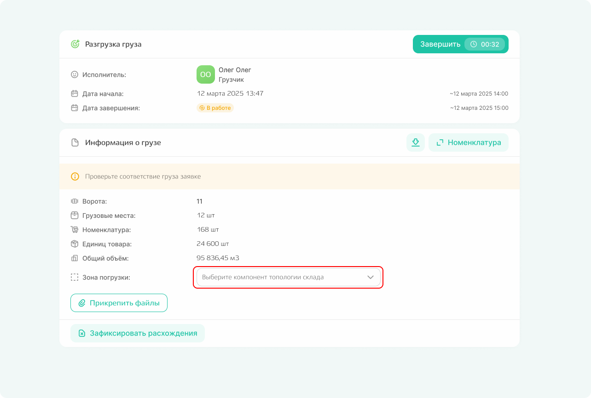{.center width=1200}
  
Команда «Зафиксировать расхождения» открывает область для ввода текста, чтобы описать наручшения, связанные с грузом. Для конкретизации расхождений также можно прикрепить файлы.  

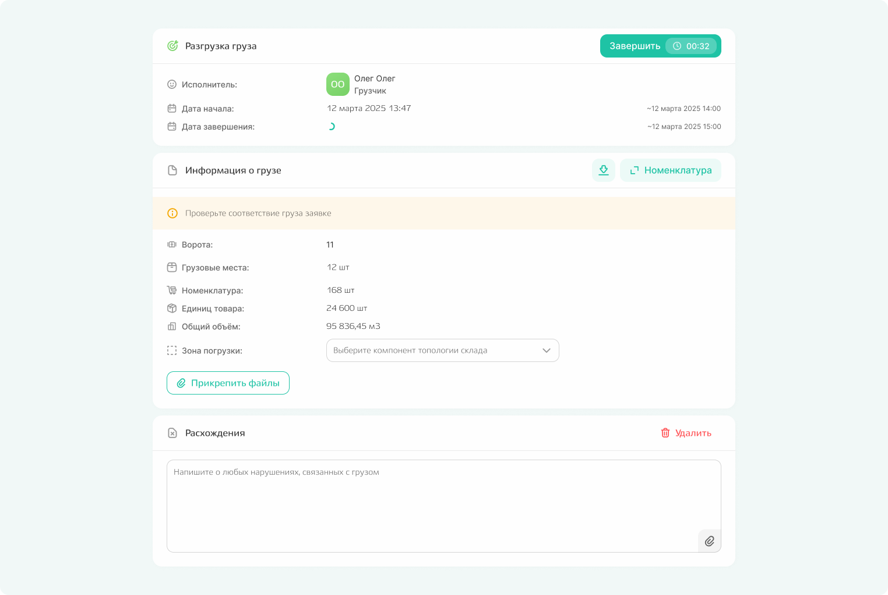{.center width=1200}



В качестве расхождений указывается любое несоответствие документов и фактически поступивших товаров. Информация о расхождении будет отображаться для всех последующих событий мероприятия.   

 

Мероприятие разгрузки завершается после клика по команде «Завершить». Таймер останавливается, фиксируя фактическое время выполнения, текущий исполнитель переходит к списку мероприятий, а следующий назначенный контрагент может приступать к выполнению своей части работы. 

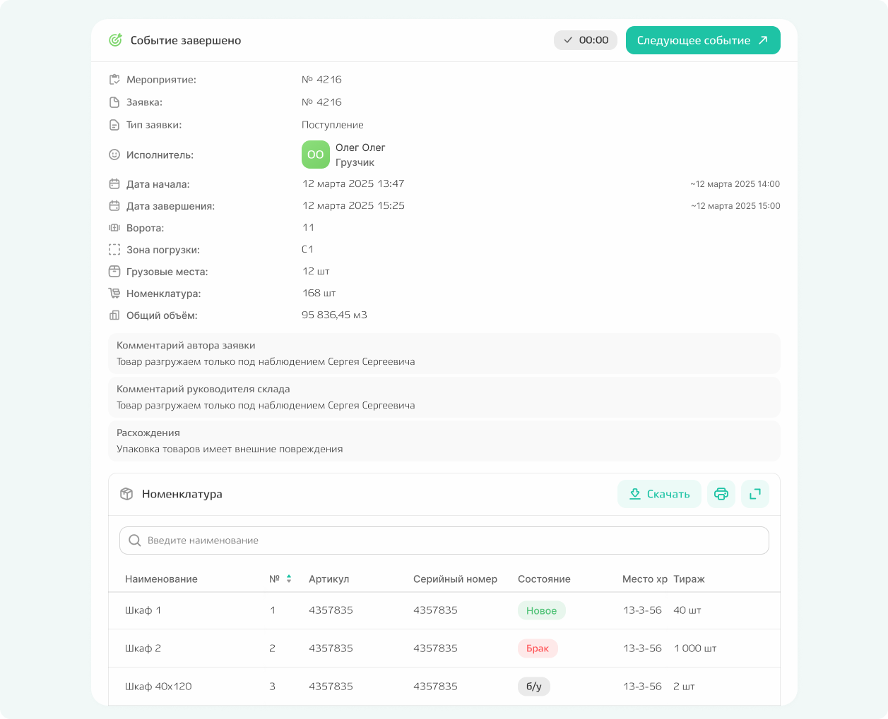{.center width=1200}

[*key_storage]: Кросс-докинг — логистическая схема, по которой грузы принимаются на складе и тут же, без размещения в зоне длительного хранения, перегружаются для дальнейшей отправки конечному получателю.

[1]: https://lebelena.github.io/diplodoc-example/ru/glossary.html#lcp:~:text=%D0%A0%D0%B0%D0%B1%D0%BE%D1%82%D0%B0%20%D1%81%20%D0%B7%D0%B0%D0%BA%D0%B0%D0%B7%D0%BE%D0%BC-,%D0%97%D0%B0%D1%8F%D0%B2%D0%BA%D0%B0%20(LCP),-%E2%80%93%20%D1%8D%D0%BB%D0%B5%D0%BC%D0%B5%D0%BD%D1%82%20%D1%83%D0%BF%D1%80%D0%B0%D0%B2%D0%BB%D0%B5%D0%BD%D0%B8%D1%8F%2C%20%D0%BD%D0%B5%D0%BE%D0%B1%D1%85%D0%BE%D0%B4%D0%B8%D0%BC%D1%8B%D0%B9

[2]: https://lebelena.github.io/diplodoc-example/ru/glossary.html#:~:text=%D0%A2%D0%BE%D0%B2%D0%B0%D1%80%D0%BD%D0%BE%2D%D0%BC%D0%B0%D1%82%D0%B5%D1%80%D0%B8%D0%B0%D0%BB%D1%8C%D0%BD%D1%8B%D0%B5%20%D1%86%D0%B5%D0%BD%D0%BD%D0%BE%D1%81%D1%82%D0%B8%20(%D0%A2%D0%9C%D0%A6)

[3]: https://lebelena.github.io/diplodoc-example/ru/glossary.html#:~:text=%D0%A0%D0%B0%D0%B1%D0%BE%D1%82%D0%B0%20%D1%81%20%D0%B7%D0%B0%D0%BA%D0%B0%D0%B7%D0%BE%D0%BC-,%D0%A1%D0%BE%D0%B1%D1%8B%D1%82%D0%B8%D0%B5%20(LCP,-)%20%E2%80%93%20%D0%BF%D0%BE%D1%81%D0%BB%D0%B5%D0%B4%D0%BE%D0%B2%D0%B0%D1%82%D0%B5%D0%BB%D1%8C%D0%BD%D0%BE%D1%81%D1%82%D1%8C%20%D0%B7%D0%B0%D1%84%D0%B8%D0%BA%D1%81%D0%B8%D1%80%D0%BE%D0%B2%D0%B0%D0%BD%D0%BD%D1%8B%D1%85

[4]: https://lebelena.github.io/diplodoc-example/ru/glossary.html#:~:text=%D0%9C-,%D0%9C%D0%B5%D1%80%D0%BE%D0%BF%D1%80%D0%B8%D1%8F%D1%82%D0%B8%D0%B5,-%E2%80%93%20%D1%8D%D1%82%D0%BE%20%D0%B4%D0%BE%D1%81%D1%82%D1%83%D0%BF%D0%BD%D0%BE%D0%B5%20%D0%B4%D0%BB%D1%8F

[5]: https://lebelena.github.io/diplodoc-example/ru/glossary.html#:~:text=%D0%BF%D0%BE%D1%81%D0%BB%D0%B5%D0%B4%D1%83%D1%8E%D1%89%D0%B5%D0%B3%D0%BE%20%D0%BA%D0%BE%D1%80%D1%80%D0%B5%D0%BA%D1%82%D0%BD%D0%BE%D0%B3%D0%BE%20%D1%80%D0%B0%D1%81%D1%87%D0%B5%D1%82%D0%B0-,%D0%9A%D0%BE%D0%BD%D1%82%D1%80%D0%B0%D0%B3%D0%B5%D0%BD%D1%82%20(LCP),-%E2%80%93%20%D1%8D%D1%82%D0%BE%20%D0%BB%D1%8E%D0%B1%D0%BE%D0%B5%20%D1%8E%D1%80%D0%B8%D0%B4%D0%B8%D1%87%D0%B5%D1%81%D0%BA%D0%BE%D0%B5

[6]: https://lebelena.github.io/diplodoc-example/ru/glossary.html#:~:text=%D0%A0%D0%B0%D0%B1%D0%BE%D1%82%D0%B0%20%D1%81%20%D0%B7%D0%B0%D0%BA%D0%B0%D0%B7%D0%BE%D0%BC-,%D0%94%D0%BE%D0%B3%D0%BE%D0%B2%D0%BE%D1%80%20(LCP),-%E2%80%93%20%D1%81%D1%83%D1%89%D0%BD%D0%BE%D1%81%D1%82%D1%8C%2C%20%D0%BF%D0%BE%D0%B4%D1%82%D0%B2%D0%B5%D1%80%D0%B6%D0%B4%D0%B0%D1%8E%D1%89%D0%B0%D1%8F%20%D1%81%D0%BE%D0%B3%D0%BB%D0%B0%D1%88%D0%B5%D0%BD%D0%B8%D0%B5

[7]:https://lebelena.github.io/diplodoc-example/ru/glossary.html#:~:text=%D0%9D-,%D0%9D%D0%BE%D0%BC%D0%B5%D0%BD%D0%BA%D0%BB%D0%B0%D1%82%D1%83%D1%80%D0%B0%20(LCP),-%E2%80%93%20%D1%81%D0%B2%D0%BE%D0%B4%D0%BD%D1%8B%D0%B9%20%D0%BF%D0%B5%D1%80%D0%B5%D1%87%D0%B5%D0%BD%D1%8C%20%D0%BE%D0%B1%D1%89%D0%B8%D1%85

[8]: https://lebelena.github.io/diplodoc-example/ru/glossary.html#:~:text=%D0%9F%D1%80%D0%BE%D0%B3%D1%80%D0%B5%D1%81%D1%81%2D%D0%B1%D0%B0%D1%80%20(%D0%B8%D0%BD%D0%B4%D0%B8%D0%BA%D0%B0%D1%82%D0%BE%D1%80%20%D0%B2%D1%8B%D0%BF%D0%BE%D0%BB%D0%BD%D0%B5%D0%BD%D0%B8%D1%8F)

[9]: https://lebelena.github.io/diplodoc-example/ru/glossary.html#:~:text=%D0%9A%D0%B0%D1%80%D1%82%D0%BE%D1%87%D0%BA%D0%B0%20%D0%B7%D0%B0%D0%B4%D0%B0%D1%87%D0%B8/%D0%BA%D0%BE%D0%BD%D1%82%D1%80%D0%B0%D0%B3%D0%B5%D0%BD%D1%82%D0%B0/%D0%BF%D0%BE%D1%80%D1%83%D1%87%D0%B5%D0%BD%D0%B8%D1%8F%20%D0%BF%D0%BE%20%D0%B4%D0%BE%D0%B3%D0%BE%D0%B2%D0%BE%D1%80%D1%83/etc.

[10]: https://lebelena.github.io/diplodoc-example/ru/glossary.html#lcp:~:text=%D0%9C%D0%BE%D0%B4%D0%B0%D0%BB%D1%8C%D0%BD%D0%BE%D0%B5%20%D0%BE%D0%BA%D0%BD%D0%BE/%D1%84%D0%BE%D1%80%D0%BC%D0%B0