# Как создать заявку



**[Заявка][1]** — элемент управления, необходимый для работы с номенклатурой в пространстве. Отражает намерение клиента на перемещение [товарно-материальных ценностей (ТМЦ)][2]. По сути — это драфт документа списания оборудования со склада или поступления оборудования на склад. Заявка формирует перечень [событий][3] в [мероприятии][4], которые выполняются последовательно разными [контрагентами][5].



**С заявкой работают разные контрагенты:**



- автор заявки

  создает и заполняет основную информацию — таким правом обладает руководитель склада или менеджер 

- ответственный по заявке

  назначает исполнителей по заявке — таким правом обладает только руководитель склада, назначаемый автоматически в соответствии с указанным в договоре пространством

- исполнитель

  выполняет работы в рамках события внутри заявки и делает отметки о результате выполнения задач, может быть несколько исполнителей по одной заявке



**Также у заявки есть тип:** поступление или списание. 
В зависимости от этого типа отличается список событий и информация, указываемая при создании заявки.

## Заполнение основной информации

*Под основной информацией в рамках текущей инструкции по созданию заявки понимаются те данные, без которых создание заявки невозможно. К таким данным относятся тип заявки, планируемая дата начала, тип хранения, контрагент, выполняющий работы по заявке, договор, а также информация об используемой номенклатуре.*

Создать заявку из подсистемы «Мероприятия» по команде «Создать мероприятие» → «Работа склада» может только руководитель склада или менеджер. В открывшейся форме необходимо определить тип заявки и заполнить информацию в соответствии с типом заявки.   



- Поступление
  
  **На вкладке «Основное» указываются**
    - тип заявки: поступление,
    - планируемая дата начала работ по заявке,
    - хранение для номенклатуры: отсутствует, длительное, [кросс-докинг](*key_storage),
    - комментарий: виден для исполнителей, при необходимости можно прикрепить файлы для конкретизации, 
    - контрагент, который выполняет работу по заявке,
    - договор, в рамках которого выполняется работа по заявке.

    {.center width=1200}

    **После выбора договора появляются и предзаполняются поля «Поставщик» и «Получатель».** 
    Можно указать пространство, откуда товар будет отгружен (для поля поставщика) и указать пространство, куда товар будет выгружен (поле получателя). 

    **При наличии информации также заполняется поле «Перевозчик».** 
    Можно выполнить двумя способами:
    1. Выбирается контрагент, ответственный за перевозку. После чего становятся доступными для заполнения поля, где указывается марка, страна и номер машины, а также серия и номер паспорта.
    2. По команде «Добавить» можно создать пользовательский контакт: в этом случае для перевозчика указывается ФИО, марка и номера машины, однако, данные по этому перевозчику сохранятся только для этой заявки, в следующих раз надо будет вводить информацию заново.        

    {.center width=1200}

    

    При помощи заявки **можно фиксировать поступление основных средств.** 
    Для этого необходимо переключить свитчер «Основные средства» в значение TRUE (свитчер будет зеленым), а после указать 
    - тип заявки: поступление,
    - планируемую дату начала и завершения работ по заявке, 
    - тип хранения, 
    - оставить комментарии при необходимости,
    - выбрать контрагента и закрепленное за ним пространство, куда основные средства будут зачислены. 
    **Договор выбирать не нужно.**

    {.center width=1200}

    

  **На вкладке «Номенклатура»** введите в поиске наименование, артикул или SAP-код необходимой номенклатуры, по команде «Добавить» откройте карточку номенклатуры и заполните поля. После внесения всей информации добавьте номенклатуру в заявку по команде «Сохранить».  
   
    {.center width=1200}

    Когда вся номенклатура добавлена, нажмите команду «Создать».

    {.center width=1200}

    В появившемся окне проверьте указанную информацию и по команде «Подтвердить» отправьте заявку в работу на склад. 

    {.center width=1200}

- Списание

    **На вкладке «Основное» указываются**
    - тип заявки: списание,
    - планируемая дата начала работ по заявке,
    - причина списания,
    - комментарий: виден для исполнителей, при необходимости можно прикрепить файлы для конкретизации, 
    - контрагент, который выполняет работу по заявке,
    - договор, в рамках которого выполняется работа по заявке.

    {.center width=1200}

    **После выбора договора появляются и предзаполняются поля «Поставщик» и «Получатель».** Вручную можно указать пространство, откуда товар будет отгружен (для поля поставщика) и указать пространство, куда товар будет выгружен (поле получателя). 

    **При наличии информации заполняется поле «Перевозчик».**
    Есть два способа:
    1. Выбирается контрагент, ответственный за перевозку. После чего становятся доступными для заполнения поля, где указывается марка, страна и номер машины, а также серия и номер паспорта.
    2. По команде «Добавить» можно создать пользовательский контакт: в этом случае для перевозчика указывается ФИО, марка и номера машины, однако, данные по этому перевозчику сохранятся только для этой заявки, в следующих раз надо будет вводить информацию заново.        

    {.center width=1200}

    

    При помощи заявки **можно фиксировать поступление основных средств.** 
    Для этого необходимо переключить свитчер «Основные средства» в значение TRUE (свитчер будет зеленым), а после указать 
    - тип заявки: списание,
    - планируемую дату начала и завершения работ по заявке, 
    - причину списания, 
    - оставить комментарии при необходимости,
    - выбрать контрагента и закрепленное за ним пространство, откуда основные средства будут списаны. 
    **Договор выбирать не нужно.**

    {.center width=1200}

    

    **На вкладке «Номенклатура»** введите в поиске наименование, артикул или SAP-код необходимой номенклатуры и по команде «Добавить» откройте карточку номенклатуры. Для заявки на списание указывается только количество номенклатуры, которое будет списано. После заполнения добавьте номенклатуру в заявку по команде «Сохранить».  
   
    {.center width=1200}

    Когда вся номенклатура добавлена, нажмите команду «Создать».

    {.center width=600}

    В появившемся окне проверьте указанную информацию и по команде «Подтвердить» отправьте заявку в работу на склад. 

    {.center width=1200}



## 2. Назначение исполнителей

Следующий шаг — назначение исполнителей по заявке. 

Если автором заявки был менеджер, то назначить исполнителей он не может. Однако,может отменить или отредактировать ранее внесенные данные. 

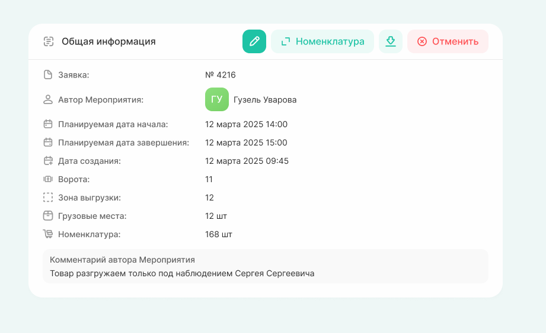{.center width=600}



**Редактирование заявки доступно не всегда**. 
Только в случае, если:
* мероприятия по заявке не начались;
* заявка запущена в работу, часть мероприятий завершена, но следующее мероприятие по заявке из незавершенных не запущено.

**Если мероприятие не активно**, но не все мероприятия по заявке завершены, для редактирования **есть ограничение**: недоступно изменение типа заявки и направления.

**Заявку отредактировать нельзя**, если заявка завершена или любое мероприятие по заявке находится в работе. 



Если автором заявки был руководитель склада, после заполнения основной информации он сразу переходит к назначению исполнителей.

{.center width=1200}

Набор карточек, по которым необходимо назначить исполнителей, зависит от количества мероприятий в заявке. Для каждого мероприятия — свой ответственный. 

Время выставляется, исходя из дат, указанных автором заявки (планируемая дата начали и дата окончания), и по умолчанию распределяется равномерно на все мероприятия. Как руководитель склада вы можете выставить свое время независимо от даты, указанной автором заявки. 

После того как вся информация заполнена, сохраните данные по команде «Подтвердить». После сохранения по всей цепочке событий для каждого мероприятия отобразится исполнитель и планируемые даты выполнения работ.  

{.center width=1200}



Руководитель склада может запускать и останавливать любые мероприятия, даже если он на них не назначен как исполнитель.

 

## 3. Выполнение мероприятий по заявке

Разные исполнители работают по заявке в соответствии со своим назначением. Работы по заявкам поступления, списания и инвентаризации отличаются, но всегда выполняется последовательно. Это значит, что каждый исполнитель может начать выполнение работ по заявке только после завершения предыдущего этапа работ по заявке. 

Чтобы начать выполнение работ по заявке, воспользуйтесь командой «Начать мероприятие». После этого включится таймер, который будет фиксировать фактическое время выполнения. 



- Поступление

  **3.1. Разгрузка груза**
  Поступление начинается с события «разгрузка груза». 
  Перед тем, как начать мероприятие, проверьте соответствие документов и заявки.  

  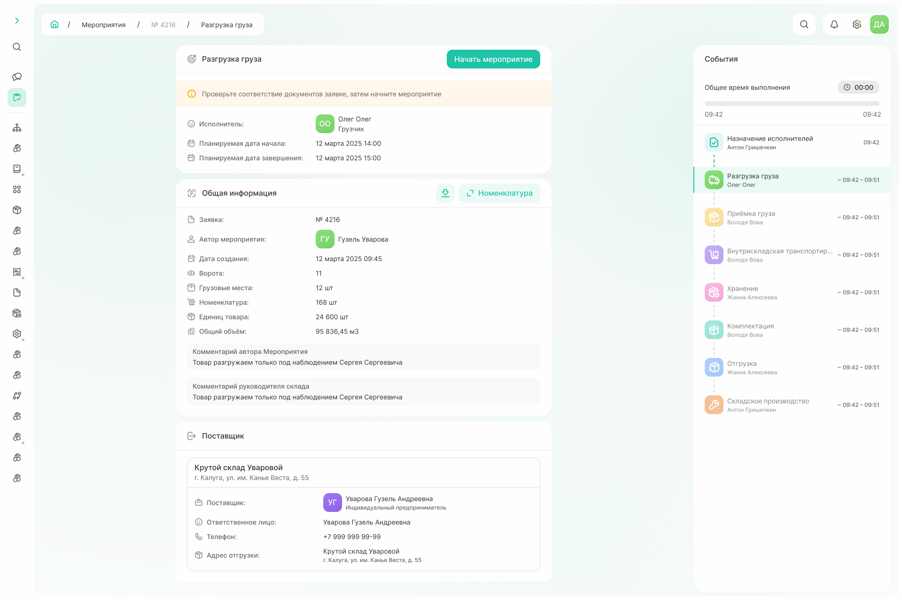{.center width=1200}
 
  После начала мероприятия исполнитель указывает зону погрузки. Без этой информации завершить мероприятие будет нельзя. 

  Также пока выполняется разгрузка в системе отображается информация о грузе и таймер по мероприятию. При необходимости информацию о грузе можно скачать в формате excel-файла. 
  
  Можно прикрепить файлы для дополнения информации о грузе, а также зафиксировать расхождения при наличии.  

  

  В качестве расхождений указывается любое несоответствие документов и факта. Информация о расхождении будет отображаться для всех последующих мероприятий по заявке.   

   

  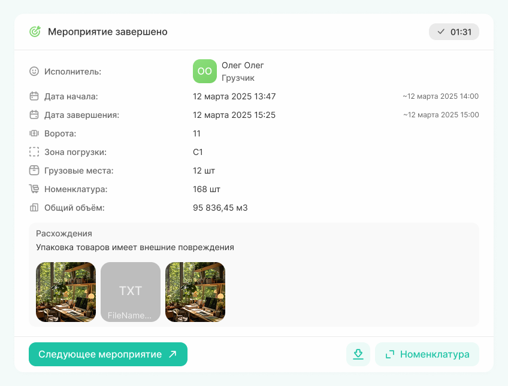{.center width=600}

  Мероприятие разгрузки завершается после клика по команде «Завершить». Таймер останавливается, фиксируя фактическое время выполнения, текущий исполнитель переходит к списку мероприятий, а следующий назначенный контрагент может приступать к выполнению своей части работы по заявке. 

  **3.2. Приемка груза**

  Мероприятие «Приемка груза» также стартуется по команде «Начать мероприятие». 

  В этом мероприятии можно просмотреть номенклатуру в заявке. 
  Всю информацию по единице номенклатуры можно просмотреть в карточке, кликнув по необходимой строчке, а сам список можно распечатать или скачать в виде excel-файла.    

  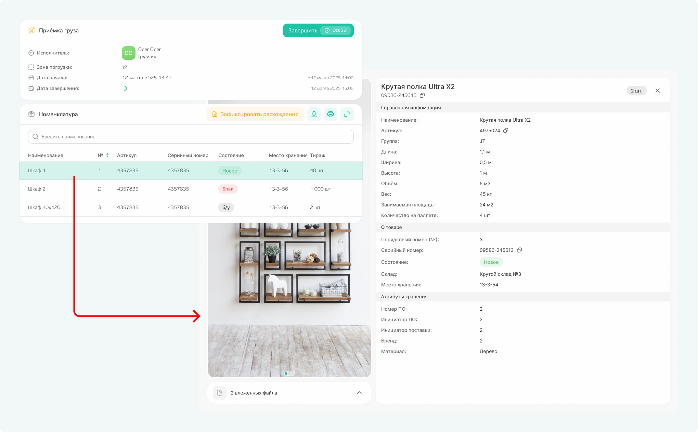{.center width=1200}

  При обнаружении расхождений необходимо сформировать акт о расхождениях по команде «Зафиксировать расхождения». 
  В появившейся форме будет несколько вкладок:
  - **«Информация»** — содержит детали по заявке.
  - **«Расхождения»** — на этой вкладке фиксируются несоответствия между фактической поставкой и документами.
   
  

  Если по факту номенклатуры пришло количественно больше, чем ожидалось, или пришла номенклатура, которая не указана в заявке, такая информация указывается на вкладке «Излишки».

  

  По команде «Добавить» из списка выбираем номенклатуру, по которой есть расхождения, и заполняем поля с фактическими данными по поставке. 

  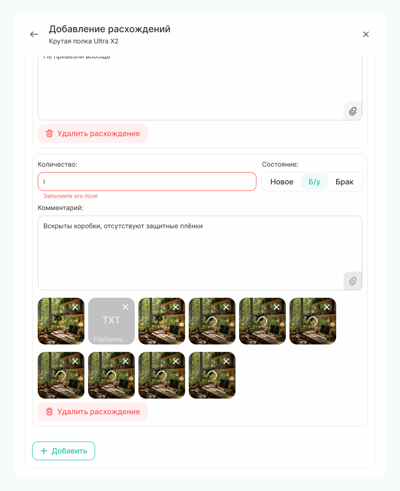{.center width=600}

  Когда вся информация по расхождениям внесена, переходите на вкладку «Излишки» при наличии, или на вкладку «Акт ТОРГ-2». 

  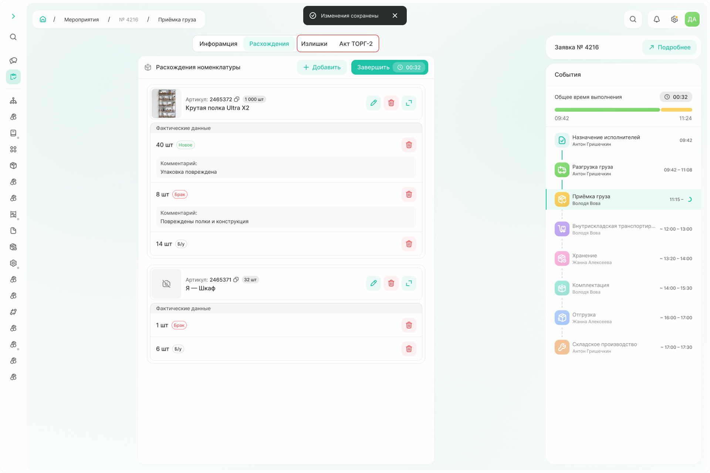{.center width=1200}

  - **«Излишки»**
  
  Вносится информация по номенклатуре
    - которая пришла в большем количестве, чем ожидалось;
    - которой быть не должно. 
  
  На основании внесенных данных создается заявка, по которой излишки будут отгружены обратно.  

  Номенклатура выбирается из той, что внесена в систему. Часть полей предзаполняется, часть — заполняется вручную. Также обязательным для заполнения является поле «Комментарий», где описывается несоответствие поставок.

  Внесенные расхождения можно просмотреть в виде списка и внести изменения по ним. Если все излишки отражены, то переходите на вкладку «Акт ТОРГ-2».

  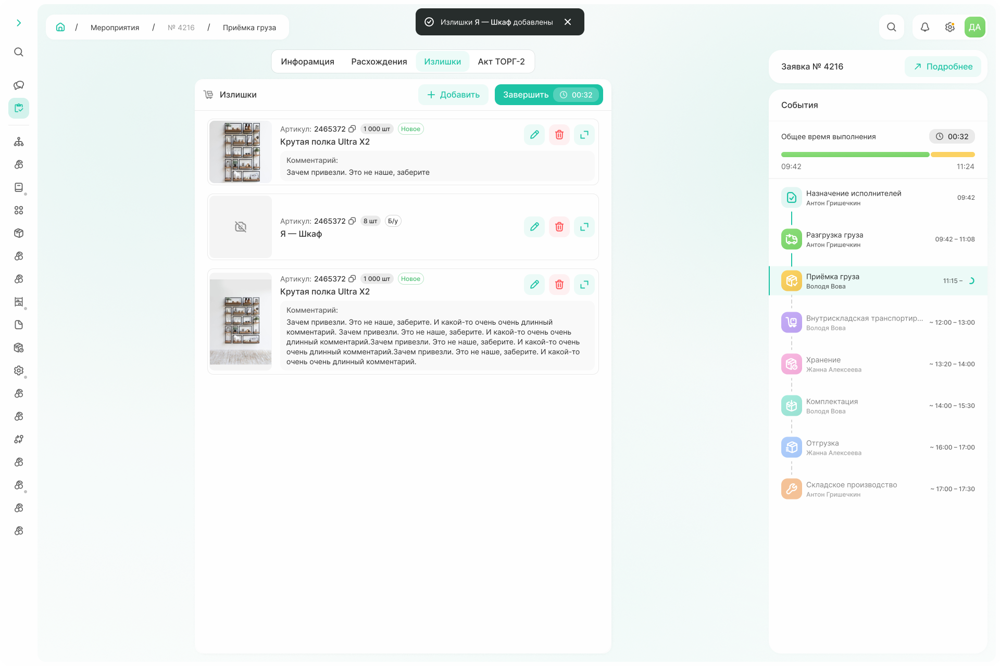{.center width=1200}

  - **«Акт ТОРГ - 2»**

  После фиксации расхождений и излишков, скачайте шаблон акта, заполните и подпишите его, затем прикрепите скан документа в область загрузки.
 
  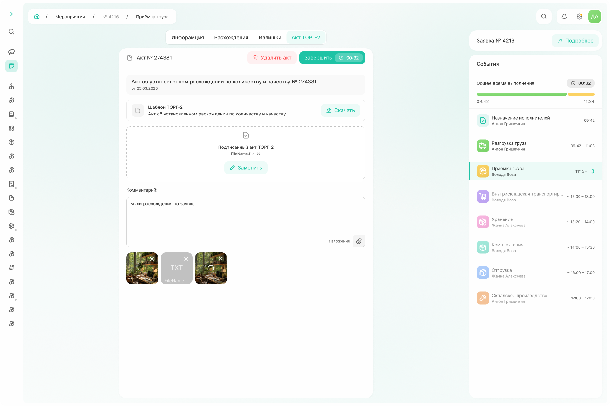{.center width=1200}

  После загрузки мероприятие «Приемка груза» необходимо завершить по команде «Завершить». 

  **3.3. Внутрискладская транспортировка**

  

  Данное мероприятие, а также все последующие по заявке поступления (3.4. хранение, 3.5. комплектация, 3.6. отгрузка, 3.7. складское производство) находятся в разработке.

  
  
- Списание
  
  Начинается с мероприятия «Отгрузки».
  
  Перед стартом проверьте общую информацию и информацию о поставщике, перевозчике, получателе — это необходимо, чтобы удостовериться какую заявку вы взяли в работу. 
  Далее начните выполнение работ по команде «Начать мероприятие».

  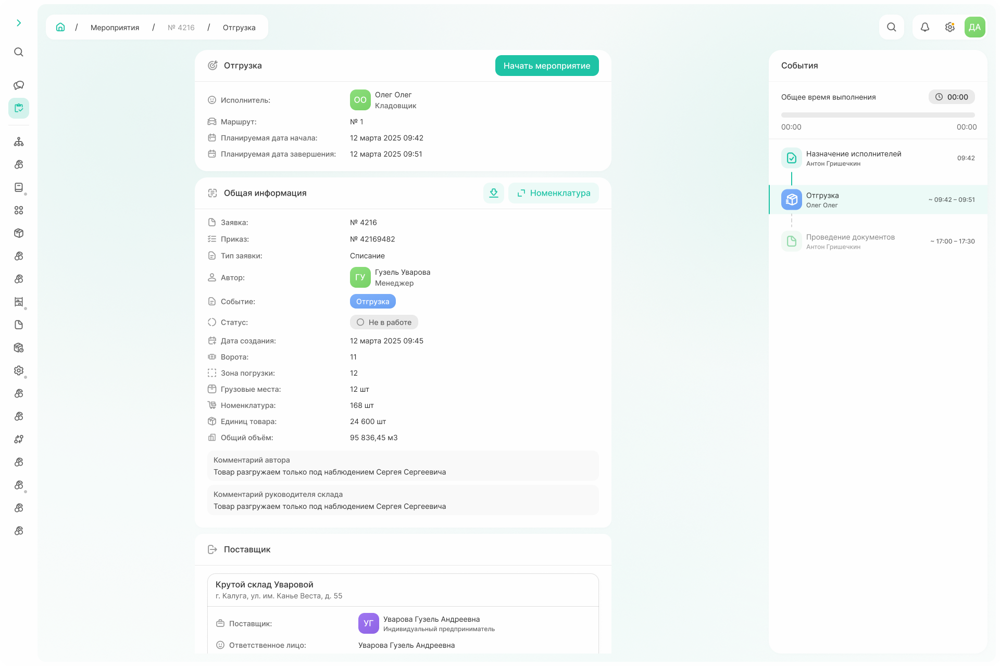{.center width=1200}

  Для мероприятия «Отгрузка» информация по номенклатуре отображается в виде таблицы в разбивке по точкам.  
  
  

  В таблицах может быть разбивка по партиям. Она отображается если списываемая номенклатура поступила на склад из разных заявок на поступление.

  

  Номенклатура с одинаковыми названиями и артикулами, но с разными серийными номерами объединяется в общий элемент таблицы, который можно развернуть по клику. 

  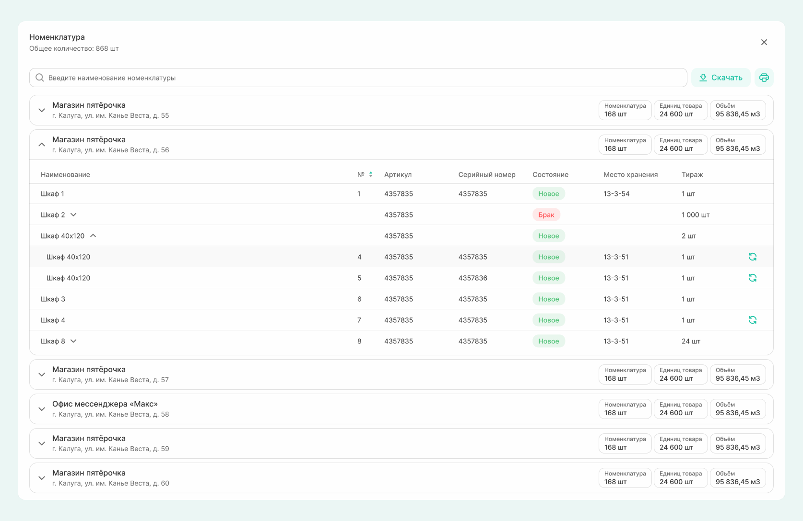{.center width=800}

  Номенклатуру можно заменить, если на складе есть номенклатура, не используемая в других заявках, с таким же артикулом, наименованием и состоянием. Для этого необходимо кликнуть на &#10226; в соответствующей строке. Из открывшейся карточки заменяемой номенклатуры по команде «Заменить товар» откройте карточку той номенклатуры, которая будет использоваться в заявке, и укажите место хранения. 

  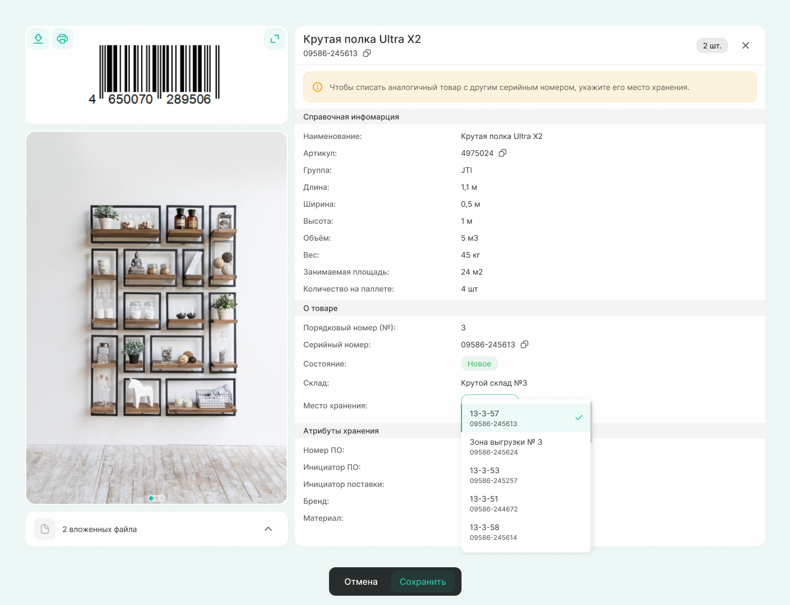{.center width=800}

- Инвентаризация

    

    Функционал в разработке.  

    



После того как все мероприятия по заявке выполнены, новый документ появится в подсистеме «Работа склада» → «Документы», откуда документ можно просмотреть, скачать, провести и пометить на удаление. 

[*key_storage]: Кросс-докинг — логистическая схема, по которой грузы принимаются на складе и тут же, без размещения в зоне длительного хранения, перегружаются для дальнейшей отправки конечному получателю.

[1]: https://lebelena.github.io/diplodoc-example/ru/glossary.html#lcp:~:text=%D0%A0%D0%B0%D0%B1%D0%BE%D1%82%D0%B0%20%D1%81%20%D0%B7%D0%B0%D0%BA%D0%B0%D0%B7%D0%BE%D0%BC-,%D0%97%D0%B0%D1%8F%D0%B2%D0%BA%D0%B0%20(LCP),-%E2%80%93%20%D1%8D%D0%BB%D0%B5%D0%BC%D0%B5%D0%BD%D1%82%20%D1%83%D0%BF%D1%80%D0%B0%D0%B2%D0%BB%D0%B5%D0%BD%D0%B8%D1%8F%2C%20%D0%BD%D0%B5%D0%BE%D0%B1%D1%85%D0%BE%D0%B4%D0%B8%D0%BC%D1%8B%D0%B9

[2]: https://lebelena.github.io/diplodoc-example/ru/glossary.html#:~:text=%D0%A2%D0%BE%D0%B2%D0%B0%D1%80%D0%BD%D0%BE%2D%D0%BC%D0%B0%D1%82%D0%B5%D1%80%D0%B8%D0%B0%D0%BB%D1%8C%D0%BD%D1%8B%D0%B5%20%D1%86%D0%B5%D0%BD%D0%BD%D0%BE%D1%81%D1%82%D0%B8%20(%D0%A2%D0%9C%D0%A6)

[3]: https://lebelena.github.io/diplodoc-example/ru/glossary.html#:~:text=%D0%A0%D0%B0%D0%B1%D0%BE%D1%82%D0%B0%20%D1%81%20%D0%B7%D0%B0%D0%BA%D0%B0%D0%B7%D0%BE%D0%BC-,%D0%A1%D0%BE%D0%B1%D1%8B%D1%82%D0%B8%D0%B5%20(LCP,-)%20%E2%80%93%20%D0%BF%D0%BE%D1%81%D0%BB%D0%B5%D0%B4%D0%BE%D0%B2%D0%B0%D1%82%D0%B5%D0%BB%D1%8C%D0%BD%D0%BE%D1%81%D1%82%D1%8C%20%D0%B7%D0%B0%D1%84%D0%B8%D0%BA%D1%81%D0%B8%D1%80%D0%BE%D0%B2%D0%B0%D0%BD%D0%BD%D1%8B%D1%85

[4]: https://lebelena.github.io/diplodoc-example/ru/glossary.html#:~:text=%D0%9C-,%D0%9C%D0%B5%D1%80%D0%BE%D0%BF%D1%80%D0%B8%D1%8F%D1%82%D0%B8%D0%B5,-%E2%80%93%20%D1%8D%D1%82%D0%BE%20%D0%B4%D0%BE%D1%81%D1%82%D1%83%D0%BF%D0%BD%D0%BE%D0%B5%20%D0%B4%D0%BB%D1%8F

[5]: https://lebelena.github.io/diplodoc-example/ru/glossary.html#:~:text=%D0%BF%D0%BE%D1%81%D0%BB%D0%B5%D0%B4%D1%83%D1%8E%D1%89%D0%B5%D0%B3%D0%BE%20%D0%BA%D0%BE%D1%80%D1%80%D0%B5%D0%BA%D1%82%D0%BD%D0%BE%D0%B3%D0%BE%20%D1%80%D0%B0%D1%81%D1%87%D0%B5%D1%82%D0%B0-,%D0%9A%D0%BE%D0%BD%D1%82%D1%80%D0%B0%D0%B3%D0%B5%D0%BD%D1%82%20(LCP),-%E2%80%93%20%D1%8D%D1%82%D0%BE%20%D0%BB%D1%8E%D0%B1%D0%BE%D0%B5%20%D1%8E%D1%80%D0%B8%D0%B4%D0%B8%D1%87%D0%B5%D1%81%D0%BA%D0%BE%D0%B5