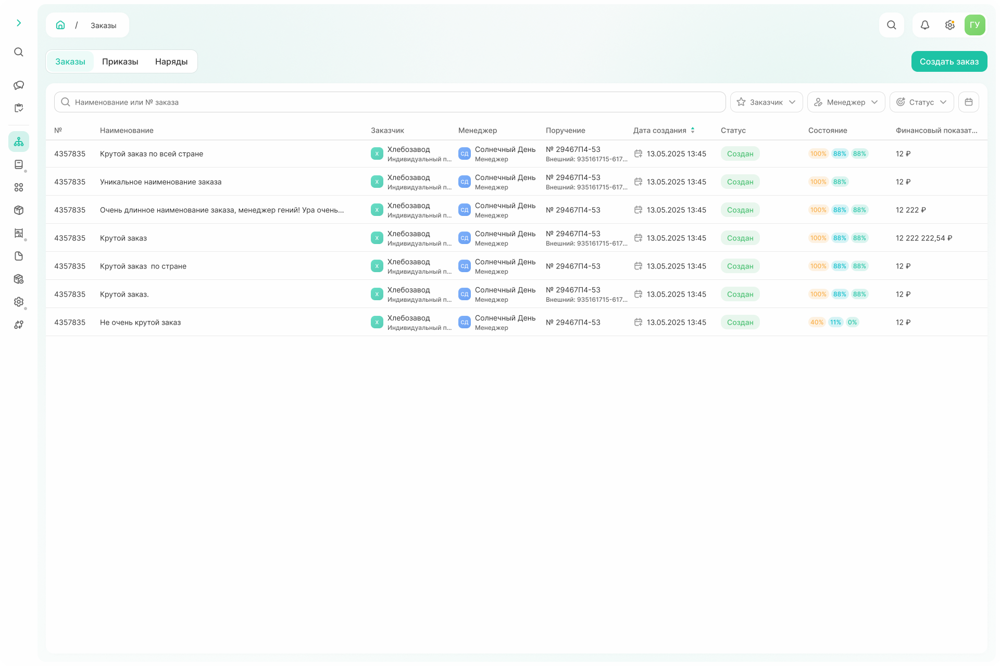
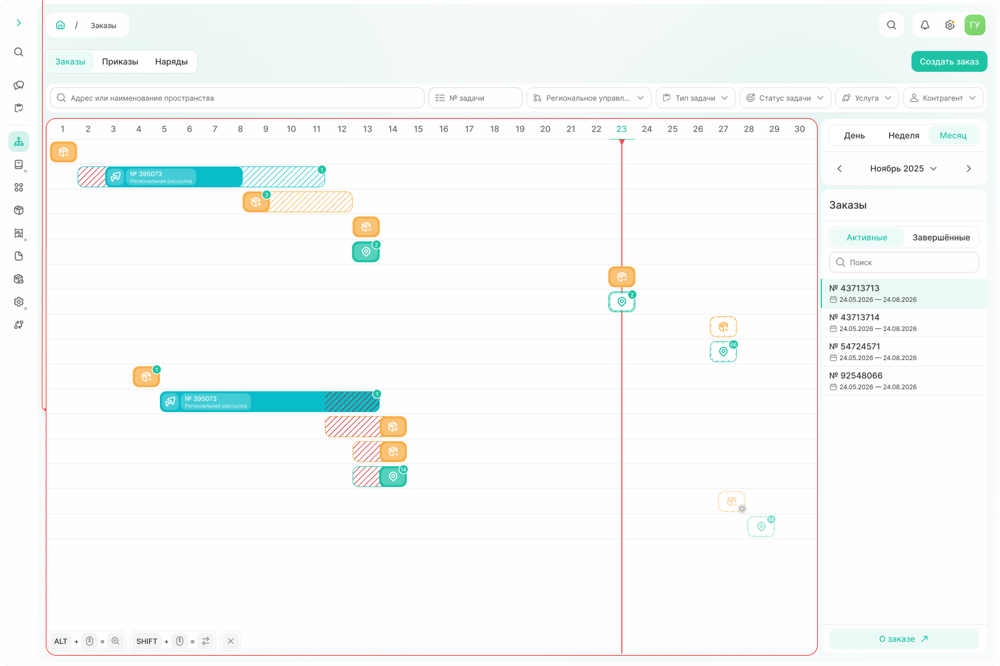
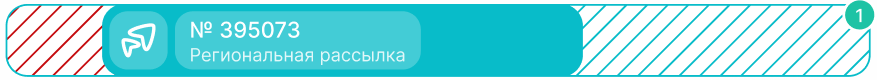
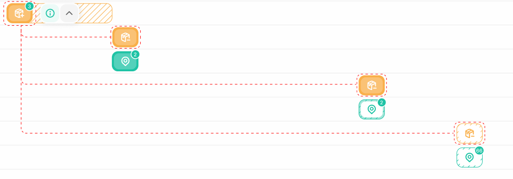
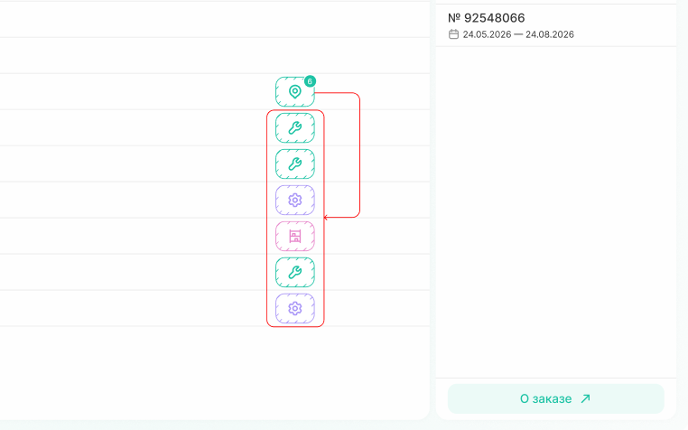
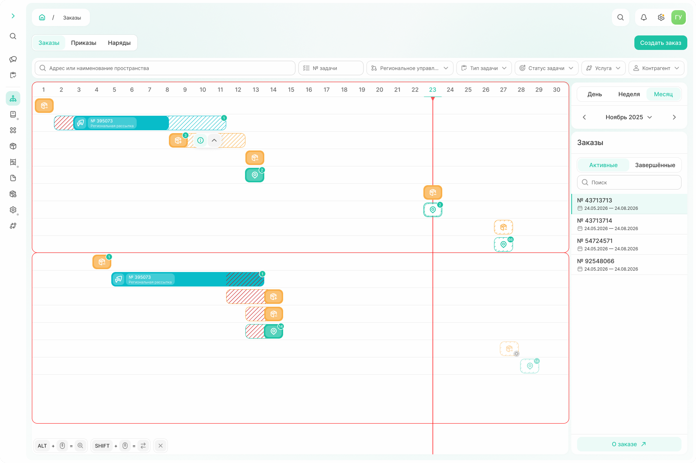

# Список заказов

Список заказов доступен в подсистеме «Список заказов».

{.center width=1200}

Для каждого заказа в списке указаны:
- номер и наименование заказа — по значениям этих полей можно искать нужный заказ через поисковую строку в списке; 
- заказчик, менеджер, дата создания, статус — можно отфильтровать список по одному или нескольким параметрам;  
- поручение — показывает связь с договором; 
- состояние — отражает прогресс выполнения трёх типов задач по всему заказу:
  * 100 % — задачи склада;
  * 88 % — региональная рассылка;
  * 88 % — наряды; 
- финансовый показатель — сумма всех утверждённых работ по заказу. 

Клик по строке открывает [диаграмму Ганта](*key_gant) на текущий месяц.

{.center width=1200}

## Диаграмма Ганта: общая информация

По умолчанию диаграмма Ганта открывается в режиме отображения по месяцам. 

По горизонтали отображены даты текущего месяца, по вертикали — задачи по заявке. Красной вертикальной линией отмечена текущая дата. 

В правой части окна можно выбрать
- **режим отображения**: месяц, неделя, день. Можно переключаться между режимами: зажмите Alt на клавиатуре и прокручивайте колесо мыши;
- **месяц**, по которому строится диаграмма. Можно переключаться между месяцами: зажмите Shift на клавиатуре и прокручивайте колесо мыши;
- **заказ**, по которому отображаются задачи.

Фильтры вверху диаграммы остаются активными. 

Можно кликнуть на задачу и увидеть всплывающее окно со статусом, номером, датами и наименованием пространства. 

{.center width=600}

Также по тому, как отображены задачи, можно понять, на каком этапе выполнения задача и как соотносятся плановые и фактические даты:

| Задача  | Описание |
| :----:  | :---     |
| {.center height=40}| Задача выполнена, плановые и фактические даты по задаче совпадают| 
| {.center height=40}| Задача выполнена, выполнение началось вовремя, но завершилось позже запланированного| 
| {.center height=40} | ЗЗадача выполнена в срок, но началась позже запланированного | 
| {.center height=40} | Задача выполнена, работы начались позже запланированного и завершились раньше запланированного | 
| {.center height=40} | Задача выполняется| 
| {.center height=40} | Задача запланирована, но не выполняется| 

У части задач есть цифры в правом верхнем углу. Для разных типов эти цифры имеют разное значение:
- для задач типа «региональная рассылка» — количество последующих задач на поступление
{.center width=400}

- для задач типа «поступление» — количество списаний, которые необходимо выполнить после
{.center width=400}

- для задач типа «наряд» — количество подзадач: по клику скрытые задачи развернутся вниз на диаграмме   
{.center width=400}

## Диаграмма Ганта: месяц

Задачи на диаграмме группируются по пространству списания из региональной рассылки: если пространства списания или даты списания для одного пространства различаются, задачи будут разнесены на несколько групп. 

{.center width=1200}

## Диаграмма Ганта: неделя

При режиме отображения на неделю по горизонтали откладывается время, по вертикали — дни с понедельника по воскресенье, относящиеся к текущей неделе.
В календаре справа можно выбрать ту неделю, по которой отображаются задачи. 

Задачи группируются по дням и отображаются согласно указанному плановому времени. Если задача идет несколько дней подряд, каждый новый день отображается [хедер](*key_task) задачи. 
В случае, когда задачи пересекаются по времени — отображение друг под другом. 



Если одновременно выполняется много задач, часть из них отображается на диаграмме, остальные сворачиваются и отображаются по клику на число скрытых задач справа по строке.  



{.center width=1200}

## Диаграмма Ганта: день

Горизонтальная шкала — время, по вертикали отображаются задачи. Группировка задач на день такая же, как и для месяца: по региональной рассылке. 

{.center width=1200}

  

[*key_gant]: Диаграмма Ганта — это график работ по проекту. Диаграмма состоит из двух осей: вертикальной со списком задач и горизонтальной со сроками.

[*key_task]: Хедер задачи — это подсказка в левом верхнем углу у задачи на диаграмме Ганта. В ней отражается номер и тип задачи. 