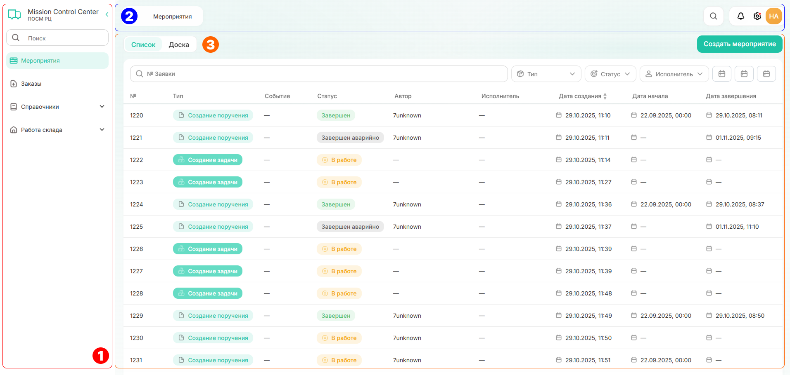
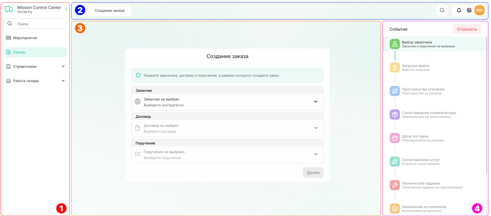

# Навигация

Главная страница разделена на три части:
1. **Левый блок** — это меню. 
Можно переключаться между вкладками и переходить по подразделам. Также нужный подраздел можно найти через поиск.  
2. **Верхнее меню** включает:
      - название открытой вкладки, 
      - поиск (любое упоминание искомого элемента в системе),  
      - уведомления,    
      - настройки, 
      - личный профиль.

3. **Центральный блок** — рабочая область. 
Меняется в зависимости от выбранного пункта в левом меню.

{.center width=1200}

При работе с мероприятием появляется **четвертый дополнительный блок** — события, где показаны шаги, которые нужно выполнить, чтобы завершить мероприятие. Можно возвращаться на несколько шагов назад или отменить последовательность.

{.center width=1200}

# Внутренняя структура

LogiCore Platform состоит из четырех главных сущностей, влияющих на работу с платформой:
* контрагент — любой пользователь, взаимоотношения с которым определены договором;
* договор — документ, подтверждающий соглашение между двумя или более сторонами. Без договора невозможно зарегистрироваться в системе или создать заказ;
* заказ — документ, описывающий объём работ и услуг, которые необходимо выполнить в определённые сроки в рамках рассчитанного бюджета; 
* мероприятие — последовательность шагов (событий) в системе. Например, создание заказа или регистрация контрагента. 

Кроме того, есть сопутствующие сущности: номенклатура, пространства, документы и остатки. Полное описание есть в [руководстве пользователя](./how_to_start.md "С чего начать?") в том разделе, где используется сущность. 

