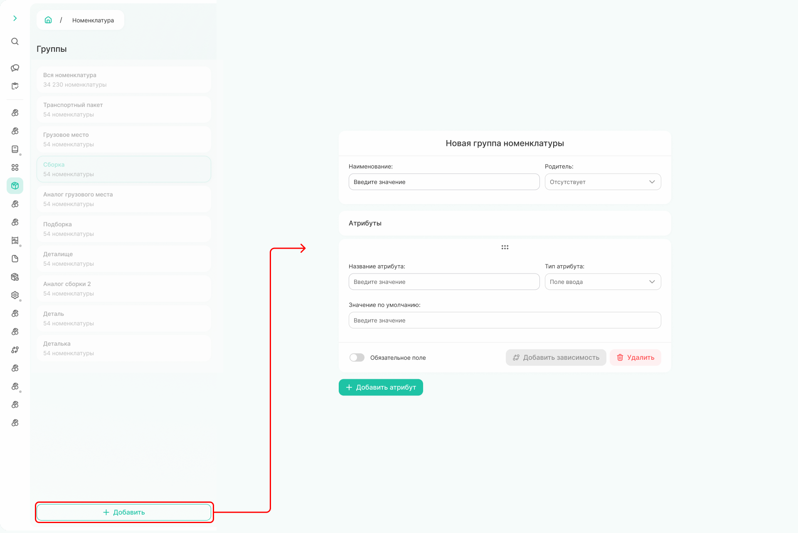
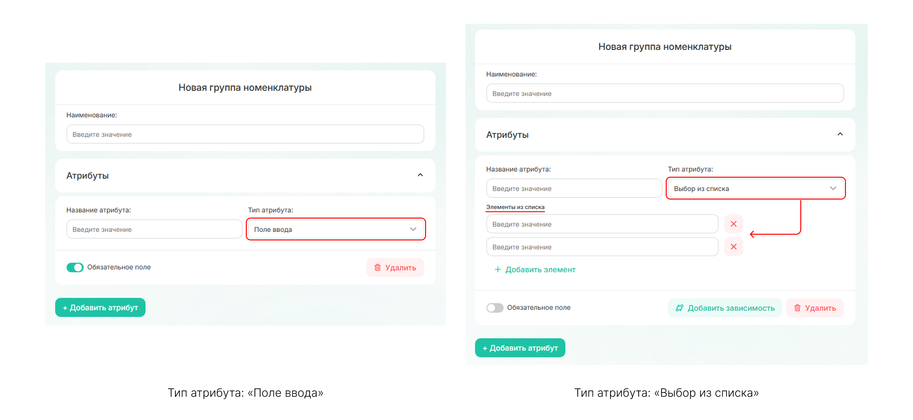
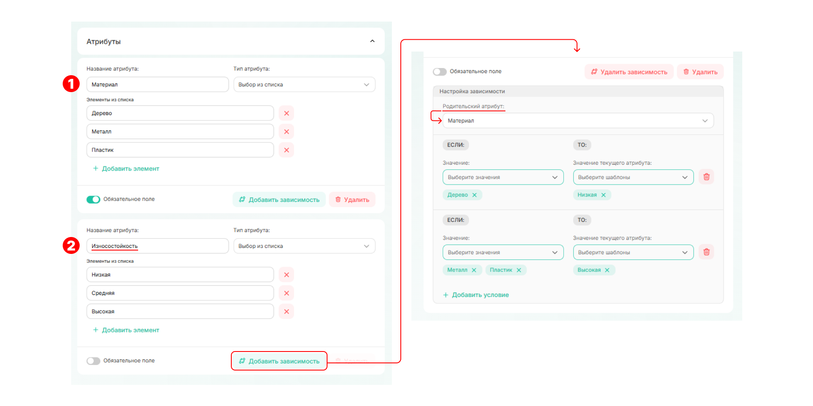
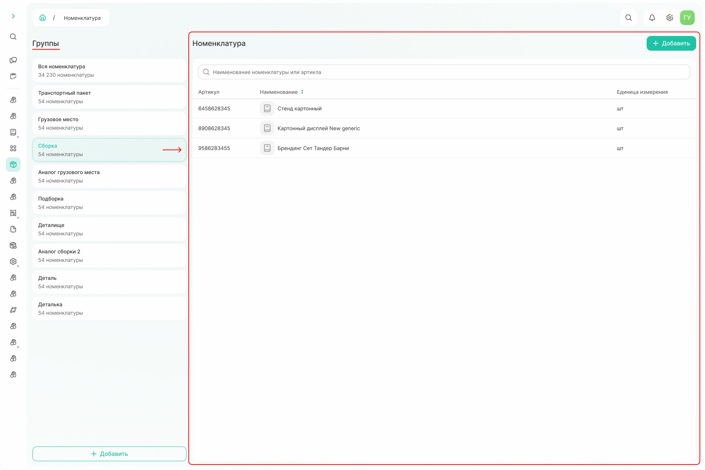
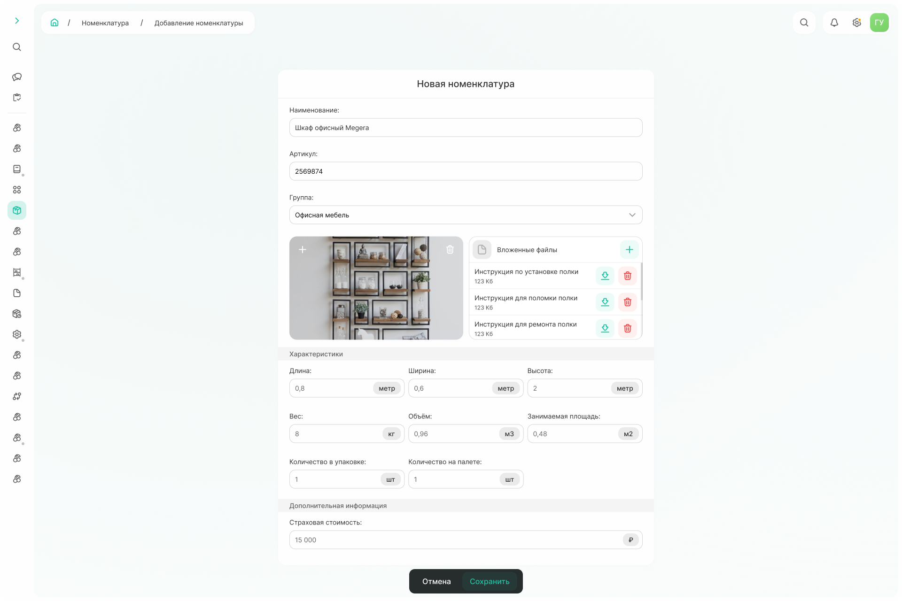

# Работа с группами номенклатур



**[Группа номенклатуры][1]** — справочник пользовательских характеристик, требуемых для описания товара.

**[Номенклатура][2]** — сводный перечень общих характеристик, необходимый для описания товара или оборудования. 



Создание номенклатуры можно разделить на два этапа: первый — работа с группами номенклатуры, второй — добавление самой номенклатуры.

## Шаг 1. Группа номенклатуры

Чтобы добавить группу, нажмите «Добавить» внизу списка групп номенклатуры и заполните все поля в открывшемся окне.

{.center width=1200}

Поля необходимые для создания новой группы:
1. **Наименование** — поле, которое заполняется первым. Здесь указывается название группы. 
2. **Поле «Родитель»** — заполняется, если новая группа похожа на одну из ранее созданных. В этом случае родительская группа выбирается из списка, и её поля автоматически наследуются дочерней группой. Это значит, что все поля родителя появятся в дочерней группе, а их изменение или удаление приведёт к таким же изменениям в дочерней. При этом к унаследованным полям можно добавлять новые, которые будут только у новой группы. Если группа самостоятельная и не наследует поля, для неё выбирается значение «Отсутствует».
3. **Атрибуты** — это те дополнительные поля, которые заполняются для каждой номенклатуры в группе. У [атрибута][3] есть название и тип, который определяет способ ввода значения: вручную или выбором из выпадающего списка. Поле можно сделать обязательным для заполнения, а также настроить зависимость от другого поля. 

{.center width=1200}

**При выборе типа атрибута [«Поле ввода»][4]** указывается только наименование поля — его значение впоследствии вносится вручную.

**При выборе типа «Выбор из списка»** значение выбирается из списка значений, которые указываются ниже. 

Сделать поле обязательным можно, перетащив ползунок. Например, на рисунке выше поле с типом «Поле ввода» обязательно, а атрибут «Выбор из списка» при добавлении номенклатуры может не заполняться.



Настраивать зависимости можно только для атрибутов с типом «Выбор из списка».



Чтобы настроить зависимость необходимо:
1. нажать **«Добавить зависимость»**
2. **выбрать родительский атрибут** — значения родительского атрибута будут определять значения атрибута, для которого задаётся зависимость. Можно выбрать несколько значений. 
После в поле «Значение» появится список значений из родительского атрибута, а в значении текущего атрибута — поля, настроенные как выпадающие.
3. **задать условие в формате: если** *значение родительского атрибута*, **то** *значение текущего дочернего атрибута*.** Таких условий может быть несколько.

В результате при создании номенклатуры значение в зависимом поле будет проставляться автоматически — в соответствии с выбранным значением в родительском поле.

{.center width=1200}

Например, для группы номенклатуры «Мебель» зададим 2 дополнительных поля: «Материал»(1) и «Износостойкость»(2). Значение каждого поля выбирается из выпадающего списка: для материала добавим значения «дерево», «металл», «пластик», для износостойкости — «низкая», «средняя» и «высокая».

Износостойкость зависит от выбранного материала. Поэтому в качестве родительского атрибута выбираем поле «Материал» (его значение будет определять значение поля, для которого задаётся зависимость, — в нашем случае «Износостойкость»). Далее настраиваем зависимость:
* если выбран материал «дерево», износостойкость автоматически проставляется «низкая»; 
* если выбран «металл» и «пластик», износостойкость автоматически проставляется «высокая».

Когда все поля добавлены, нажмите «Сохранить». Если команды сохранить нет - значит какое-то из обязательных полей не заполнено. 

Чтобы отредактировать или удалить группу номенклатуры, наведите курсор на её наименование. Слева появятся [иконки][5] для редактирования или удаления выбранной группы.

{.center width=1200}

## Шаг 2. Номенклатура

Список номенклатуры зависит от выбранной группы. По умолчанию отображается вся добавленная номенклатура. Если выбрать группу, она выделится зелёным, а в списке останутся только позиции, относящиеся к этой группе. 

{.center width=1200}

Номенклатура добавляется по команде «Добавить», расположенной над списком номенклатуры. Если в момент добавления выбрана определённая группа, номенклатура автоматически отнесётся к ней. 

У любой номенклатуры есть обязательные поля: наименование, артикул, группа, фото, вложенные файлы, длина, ширина, высота, вес, количество в упаковке, количество на палете. Поля объёма и площади рассчитываются автоматически.

{.center width=1200}

Также в форме номенклатуры также отображаются дополнительные поля — они относятся только к группе, в которую добавляется номенклатура. *Например, для группы «Офисная мебель» дополнительным полем будет «Страховая стоимость».*

Когда все поля заполнены, нажмите «Сохранить». Если нет [сейв-бара][6] - значит какое-то из обязательных полей не заполнено. 

Чтобы отредактировать или удалить номенклатуру, наведите курсор на её наименование. Слева появятся иконки для редактирования или удаления.

[1]: https://lebelena.github.io/diplodoc-example/ru/glossary.html?tabs=defaultTabsGroup-tan0re0d_%25d0%2593%25d1%2580%25d1%2583%25d0%25bf%25d0%25bf%25d0%25b0%2520%25d0%25bd%25d0%25be%25d0%25bc%25d0%25b5%25d0%25bd%25d0%25ba%25d0%25bb%25d0%25b0%25d1%2582%25d1%2583%25d1%2580%25d1%258b_accordion#lcp:~:text=%D1%81%D0%BF%D1%80%D0%B0%D0%B2%D0%BE%D1%87%D0%BD%D0%B8%D0%BA%20%D0%BF%D0%BE%D0%BB%D1%8C%D0%B7%D0%BE%D0%B2%D0%B0%D1%82%D0%B5%D0%BB%D1%8C%D1%81%D0%BA%D0%B8%D1%85%20%D1%85%D0%B0%D1%80%D0%B0%D0%BA%D1%82%D0%B5%D1%80%D0%B8%D1%81%D1%82%D0%B8%D0%BA%2C%20%D1%82%D1%80%D0%B5%D0%B1%D1%83%D0%B5%D0%BC%D1%8B%D1%85%20%D0%B4%D0%BB%D1%8F%20%D0%BE%D0%BF%D0%B8%D1%81%D0%B0%D0%BD%D0%B8%D1%8F%20%D1%82%D0%BE%D0%B2%D0%B0%D1%80%D0%B0

[2]: https://lebelena.github.io/diplodoc-example/ru/glossary.html?tabs=defaultTabsGroup-ovufa9cp_%25d0%2593%25d1%2580%25d1%2583%25d0%25bf%25d0%25bf%25d0%25b0%2520%25d0%25bd%25d0%25be%25d0%25bc%25d0%25b5%25d0%25bd%25d0%25ba%25d0%25bb%25d0%25b0%25d1%2582%25d1%2583%25d1%2580%25d1%258b_accordion%2CdefaultTabsGroup-5gtvmid4_%25d0%259d%25d0%25be%25d0%25bc%25d0%25b5%25d0%25bd%25d0%25ba%25d0%25bb%25d0%25b0%25d1%2582%25d1%2583%25d1%2580%25d0%25b0%2520%28lcp%29_accordion#lcp:~:text=%D1%81%D0%B2%D0%BE%D0%B4%D0%BD%D1%8B%D0%B9%20%D0%BF%D0%B5%D1%80%D0%B5%D1%87%D0%B5%D0%BD%D1%8C%20%D0%BE%D0%B1%D1%89%D0%B8%D1%85%20%D1%85%D0%B0%D1%80%D0%B0%D0%BA%D1%82%D0%B5%D1%80%D0%B8%D1%81%D1%82%D0%B8%D0%BA%2C%20%D0%BD%D0%B5%D0%BE%D0%B1%D1%85%D0%BE%D0%B4%D0%B8%D0%BC%D1%8B%D0%B9%20%D0%B4%D0%BB%D1%8F%20%D0%BE%D0%BF%D0%B8%D1%81%D0%B0%D0%BD%D0%B8%D1%8F%20%D1%82%D0%BE%D0%B2%D0%B0%D1%80%D0%B0%20%D0%B8%D0%BB%D0%B8%20%D0%BE%D0%B1%D0%BE%D1%80%D1%83%D0%B4%D0%BE%D0%B2%D0%B0%D0%BD%D0%B8%D1%8F.

[3]: https://lebelena.github.io/diplodoc-example/ru/glossary.html?tabs=defaultTabsGroup-vx0gj30c_%25d0%2593%25d1%2580%25d1%2583%25d0%25bf%25d0%25bf%25d0%25b0%2520%25d0%25bd%25d0%25be%25d0%25bc%25d0%25b5%25d0%25bd%25d0%25ba%25d0%25bb%25d0%25b0%25d1%2582%25d1%2583%25d1%2580%25d1%258b_accordion%2CdefaultTabsGroup-gi3zq8t1_%25d0%259d%25d0%25be%25d0%25bc%25d0%25b5%25d0%25bd%25d0%25ba%25d0%25bb%25d0%25b0%25d1%2582%25d1%2583%25d1%2580%25d0%25b0%2520%28lcp%29_accordion%2CdefaultTabsGroup-g7s9rwhm_%25d0%2590%25d1%2582%25d1%2580%25d0%25b8%25d0%25b1%25d1%2583%25d1%2582%2520%25d0%25b3%25d1%2580%25d1%2583%25d0%25bf%25d0%25bf%25d1%258b%2520%25d0%25bd%25d0%25be%25d0%25bc%25d0%25b5%25d0%25bd%25d0%25ba%25d0%25bb%25d0%25b0%25d1%2582%25d1%2583%25d1%2580%25d1%258b_accordion#lcp:~:text=%D0%BF%D0%BE%D0%BB%D0%B5%2C%20%D0%BA%D0%BE%D1%82%D0%BE%D1%80%D0%BE%D0%B5%20%D0%B4%D0%BE%D0%B1%D0%B0%D0%B2%D0%BB%D1%8F%D0%B5%D1%82%D1%81%D1%8F%20%D0%BF%D0%BE%D0%BB%D1%8C%D0%B7%D0%BE%D0%B2%D0%B0%D1%82%D0%B5%D0%BB%D0%B5%D0%BC%20%D0%B4%D0%BB%D1%8F%20%D0%BA%D0%B0%D0%B6%D0%B4%D0%BE%D0%B9%20%D0%BD%D0%BE%D0%BC%D0%B5%D0%BD%D0%BA%D0%BB%D0%B0%D1%82%D1%83%D1%80%D1%8B%2C%20%D0%B2%D1%85%D0%BE%D0%B4%D1%8F%D1%89%D0%B5%D0%B9%20%D0%B2%20%D0%B3%D1%80%D1%83%D0%BF%D0%BF%D1%83.%20%D0%9E%D0%B4%D0%B8%D0%BD%20%D0%B0%D1%82%D1%80%D0%B8%D0%B1%D1%83%D1%82%20%D0%BE%D0%BF%D0%B8%D1%81%D1%8B%D0%B2%D0%B0%D0%B5%D1%82%20%D0%BE%D0%B4%D0%BD%D1%83%20%D1%85%D0%B0%D1%80%D0%B0%D0%BA%D1%82%D0%B5%D1%80%D0%B8%D1%81%D1%82%D0%B8%D0%BA%D1%83%2C%20%D0%BE%D0%B1%D1%89%D1%83%D1%8E%20%D0%B4%D0%BB%D1%8F%20%D0%B2%D1%81%D0%B5%D1%85%20%D0%BF%D0%BE%D0%B7%D0%B8%D1%86%D0%B8%D0%B9%20%D0%B3%D1%80%D1%83%D0%BF%D0%BF%D1%8B

[4]: https://lebelena.github.io/diplodoc-example/ru/glossary.html?tabs=defaultTabsGroup-hyv82y65_%25d0%2590%25d1%2582%25d1%2580%25d0%25b8%25d0%25b1%25d1%2583%25d1%2582%2520%25d0%25b3%25d1%2580%25d1%2583%25d0%25bf%25d0%25bf%25d1%258b%2520%25d0%25bd%25d0%25be%25d0%25bc%25d0%25b5%25d0%25bd%25d0%25ba%25d0%25bb%25d0%25b0%25d1%2582%25d1%2583%25d1%2580%25d1%258b_accordion%2CdefaultTabsGroup-aviwgsqb_%25d0%259f%25d0%25be%25d0%25bb%25d0%25b5%2520%25d0%25b2%25d0%25b2%25d0%25be%25d0%25b4%25d0%25b0_accordion#lcp:~:text=%D1%8D%D0%BB%D0%B5%D0%BC%D0%B5%D0%BD%D1%82%20%D0%B8%D0%BD%D1%82%D0%B5%D1%80%D1%84%D0%B5%D0%B9%D1%81%D0%B0%20%D0%B4%D0%BB%D1%8F%20%D0%B2%D0%B2%D0%BE%D0%B4%D0%B0%20%D0%BF%D0%BE%D0%BB%D1%8C%D0%B7%D0%BE%D0%B2%D0%B0%D1%82%D0%B5%D0%BB%D0%B5%D0%BC%20%D1%82%D0%B5%D0%BA%D1%81%D1%82%D0%BE%D0%B2%D0%BE%D0%B9%20%D0%B8%D0%BB%D0%B8%20%D1%87%D0%B8%D1%81%D0%BB%D0%BE%D0%B2%D0%BE%D0%B9%20%D0%B8%D0%BD%D1%84%D0%BE%D1%80%D0%BC%D0%B0%D1%86%D0%B8%D0%B8

[5]: https://lebelena.github.io/diplodoc-example/ru/glossary.html?tabs=defaultTabsGroup-hyv82y65_%25d0%2590%25d1%2582%25d1%2580%25d0%25b8%25d0%25b1%25d1%2583%25d1%2582%2520%25d0%25b3%25d1%2580%25d1%2583%25d0%25bf%25d0%25bf%25d1%258b%2520%25d0%25bd%25d0%25be%25d0%25bc%25d0%25b5%25d0%25bd%25d0%25ba%25d0%25bb%25d0%25b0%25d1%2582%25d1%2583%25d1%2580%25d1%258b_accordion%2CdefaultTabsGroup-aviwgsqb_%25d0%259f%25d0%25be%25d0%25bb%25d0%25b5%2520%25d0%25b2%25d0%25b2%25d0%25be%25d0%25b4%25d0%25b0_accordion%2CdefaultTabsGroup-8eyzbbeo_%25d0%2598%25d0%25ba%25d0%25be%25d0%25bd%25d0%25ba%25d0%25b0%2520%28%25d0%25b0%25d0%25bd%25d0%25b3.%2520icon%29_accordion#lcp:~:text=%D0%BC%D0%B0%D0%BB%D0%B5%D0%BD%D1%8C%D0%BA%D0%B8%D0%B9%20%D0%B3%D1%80%D0%B0%D1%84%D0%B8%D1%87%D0%B5%D1%81%D0%BA%D0%B8%D0%B9%20%D0%B7%D0%BD%D0%B0%D1%87%D0%BE%D0%BA%20%D0%B2%20%D0%B8%D0%BD%D1%82%D0%B5%D1%80%D1%84%D0%B5%D0%B9%D1%81%D0%B5%2C%20%D0%BE%D0%B1%D0%BE%D0%B7%D0%BD%D0%B0%D1%87%D0%B0%D1%8E%D1%89%D0%B8%D0%B9%20%D0%BA%D0%BE%D0%BC%D0%B0%D0%BD%D0%B4%D1%83

[6]: https://lebelena.github.io/diplodoc-example/ru/glossary.html?tabs=defaultTabsGroup-hyv82y65_%25d0%2590%25d1%2582%25d1%2580%25d0%25b8%25d0%25b1%25d1%2583%25d1%2582%2520%25d0%25b3%25d1%2580%25d1%2583%25d0%25bf%25d0%25bf%25d1%258b%2520%25d0%25bd%25d0%25be%25d0%25bc%25d0%25b5%25d0%25bd%25d0%25ba%25d0%25bb%25d0%25b0%25d1%2582%25d1%2583%25d1%2580%25d1%258b_accordion%2CdefaultTabsGroup-aviwgsqb_%25d0%259f%25d0%25be%25d0%25bb%25d0%25b5%2520%25d0%25b2%25d0%25b2%25d0%25be%25d0%25b4%25d0%25b0_accordion%2CdefaultTabsGroup-8eyzbbeo_%25d0%2598%25d0%25ba%25d0%25be%25d0%25bd%25d0%25ba%25d0%25b0%2520%28%25d0%25b0%25d0%25bd%25d0%25b3.%2520icon%29_accordion%2CdefaultTabsGroup-bajpv5n1_%25d0%25a1%25d0%25b5%25d0%25b9%25d0%25b2-%25d0%25b1%25d0%25b0%25d1%2580%2520%28%25d0%25b0%25d0%25bd%25d0%25b3%25d0%25bb.%2520save-bar%29_accordion#lcp:~:text=%D0%B2%D1%81%D0%BF%D0%BB%D1%8B%D0%B2%D0%B0%D1%8E%D1%89%D0%B0%D1%8F%20%D0%BF%D0%B0%D0%BD%D0%B5%D0%BB%D1%8C%2C%20%D0%BF%D0%BE%D1%8F%D0%B2%D0%BB%D1%8F%D1%8E%D1%89%D0%B0%D1%8F%D1%81%D1%8F%20%D0%BF%D0%BE%D1%81%D0%BB%D0%B5%20%D0%B2%D0%BD%D0%B5%D1%81%D0%B5%D0%BD%D0%B8%D1%8F%20%D0%B8%D0%B7%D0%BC%D0%B5%D0%BD%D0%B5%D0%BD%D0%B8%D0%B9%20%D0%BD%D0%B0%20%D1%81%D1%82%D1%80%D0%B0%D0%BD%D0%B8%D1%86%D0%B0%D1%85%2C%20%D0%B3%D0%B4%D0%B5%20%D1%82%D1%80%D0%B5%D0%B1%D1%83%D0%B5%D1%82%D1%81%D1%8F%20%D0%BF%D0%BE%D0%B4%D1%82%D0%B2%D0%B5%D1%80%D0%B6%D0%B4%D0%B5%D0%BD%D0%B8%D0%B5.%20%D0%A1%D0%BE%D0%B4%D0%B5%D1%80%D0%B6%D0%B8%D1%82%20%D0%BA%D0%BE%D0%BC%D0%B0%D0%BD%D0%B4%D1%8B%20%C2%AB%D0%A1%D0%BE%D1%85%D1%80%D0%B0%D0%BD%D0%B8%D1%82%D1%8C%C2%BB%20%D0%B8%20%C2%AB%D0%9E%D1%82%D0%BC%D0%B5%D0%BD%D0%B0%C2%BB.%20%D0%AF%D0%B2%D0%BB%D1%8F%D0%B5%D1%82%D1%81%D1%8F%20%D0%BE%D0%BF%D1%86%D0%B8%D0%BE%D0%BD%D0%B0%D0%BB%D1%8C%D0%BD%D1%8B%D0%BC%20%D1%8D%D0%BB%D0%B5%D0%BC%D0%B5%D0%BD%D1%82%D0%BE%D0%BC

