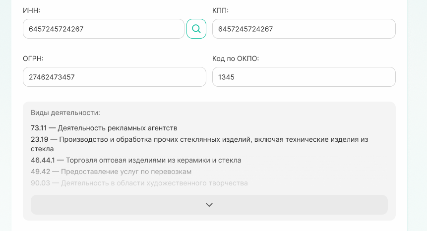
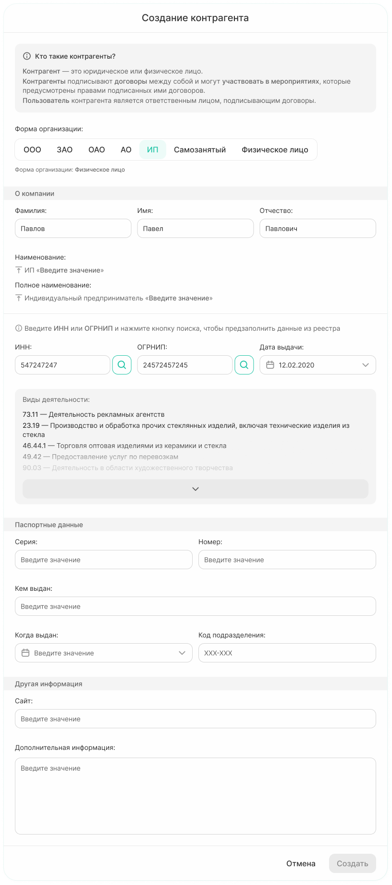
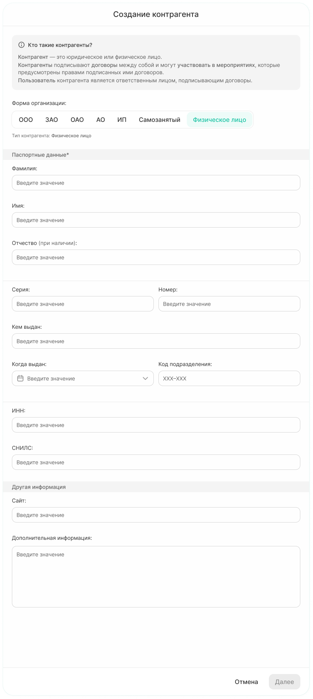
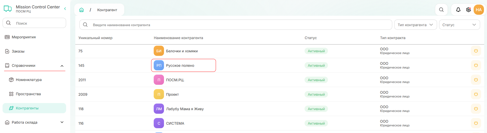
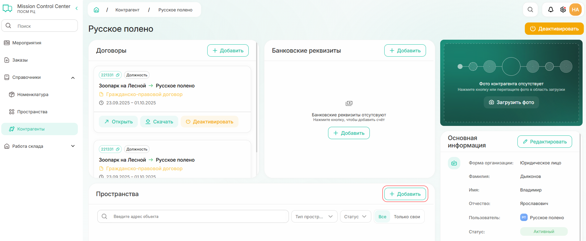
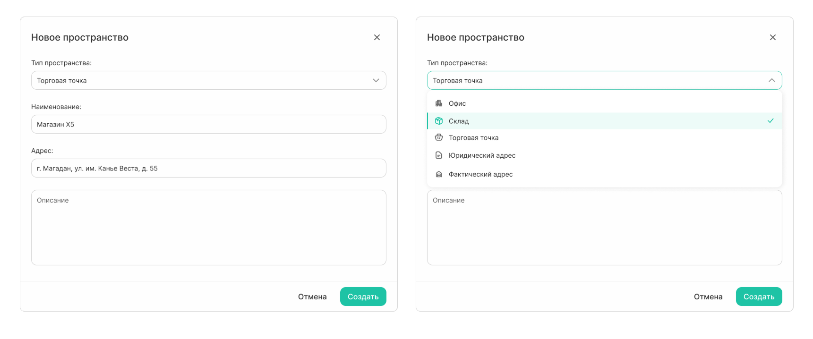

# Как создать контрагента

Чтобы создать контрагента:
1. Перейдите в раздел «Справочники» — «Контрагенты» и нажмите на кнопку «Создать контрагента» в правом верхнем углу

{width=800}

2. В появившейся форме «Пользователь» необходимо ввести электронную почту и нажать продолжить

{width=700}



Почта может быть указана в любом домене (например, @yandex.ru, @gmail.com или @mail.ru). Однако, если  контрагент регистрировался в системе ранее с другой почтой, то сопоставить их не получится и в системе будет создан новый пользователь 



3. Для дальнейшей работы система будет создавать пользователя для контрагента в системе или связывать с уже существующим:
    1. Если пользователь не был зарегистрирован ранее в системе, то появится форма «Пользователь», где необходимо будет заполнить все поля и продолжить по кнопке «Создать пользователя»
    
{width=700}

    2. Если пользователь был добавлен ранее, то система предложит связать нового создаваемого контрагента с найденным пользователем. Для продолжения необходимо кликнуть по кнопке «Продолжить»
    
{width=700}

Заполняемые поля при создании контрагента зависят от юридической формы контрагента.

4. При создании контрагента с формой организации **юридическое лицо** будут доступны поля:

{width=500}



Данные по всем полям можно заполнить автоматически. Для этого необходимо заполнить поле ИНН и после нажать на кнопку поиска («лупа»). Вся актуальная информация предзаполнится из Единого государственного реестра юридических лиц.

{width=800}

Также **только при автоматическом заполнении полей** в карточку контрагента подтянутся данные о видах деятельности по ИНН.

{width=800}



5. При создании контрагента с формой **ИП** будут доступны поля:

{width=800}

Данные, также как и для юридического лица, могут быть предзаполнены из реестра по ИНН и ОГРНИП.

6. 5. При создании контрагента с формой **Физическое лицо** будут доступны поля:

{width=800}

Все поля заполняются вручную.

7. После внесения основной информации есть возможность добавить пространства, относящиеся к контрагенту.

{width=800}



Информацию можно добавить позже из справочника «Котнрагенты» в созданной карточке.

{width=800}

{width=800}



При добавлении нового пространства тип пространства выбирается из выпадающего списка, добавить новый тип пространства нельзя.

{width=500}

