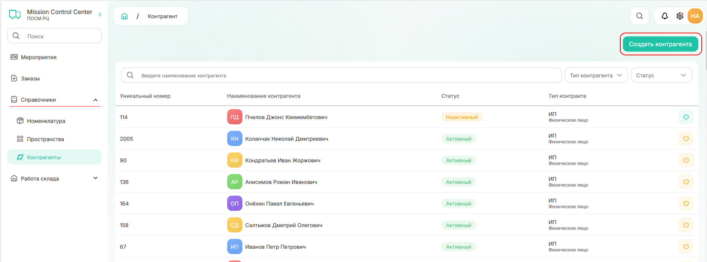
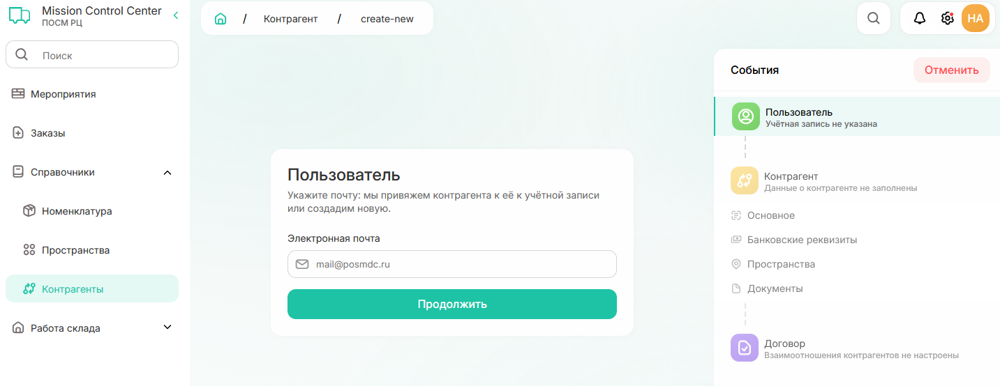
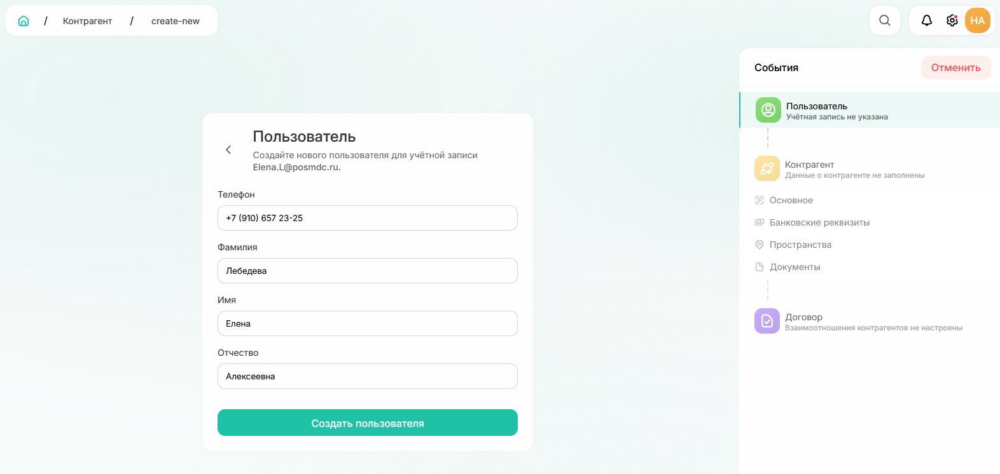
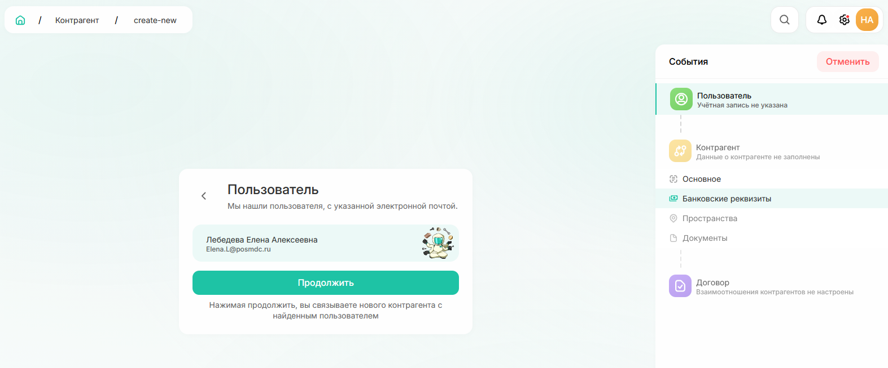
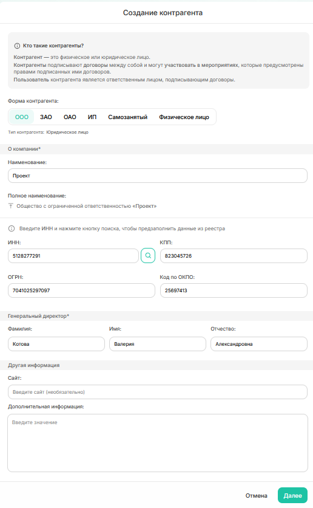
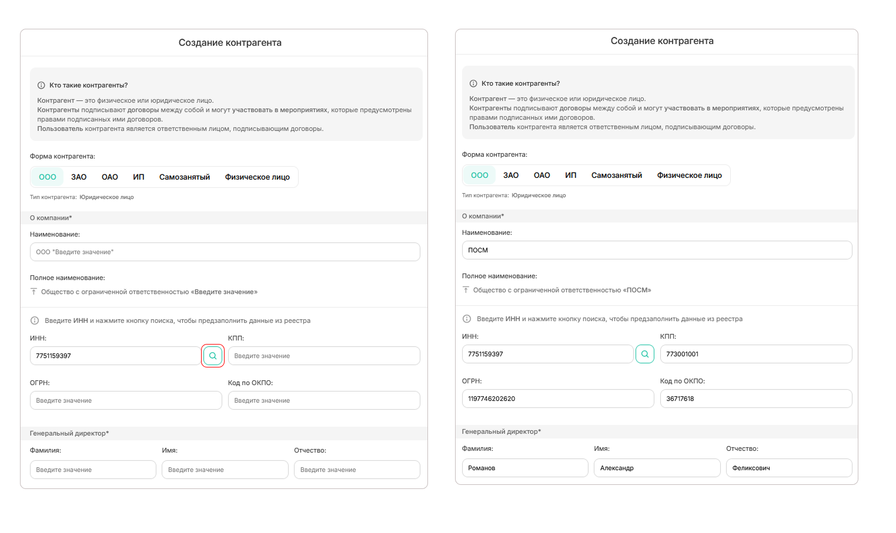

# Как создать контрагента

Чтобы создать контрагента:
1. Перейдите в раздел «Справочники» — «Контрагенты» и нажмите на кнопку «Создать контрагента» в правом верхнем углу
{width=800}

2. В появившейся форме «Пользователь» необходимо ввести электронную почту и нажать продолжить
{width=700}



Почта может быть указана в любом домене (например, @yandex.ru, @gmail.com или @mail.ru). Однако, если  контрагент регистрировался в системе ранее с другой почтой, то сопоставить их не получится и в системе будет создан новый пользователь 



3. Для дальнейшей работы система будет создавать пользователя для контрагента в системе или связывать с уже существующим:
    1. Если пользователь не был зарегистрирован ранее в системе, то появится форма «Пользователь», где необходимо будет заполнить все поля и продолжить по кнопке «Создать пользователя»
{width=700}

    2. Если пользователь был добавлен ранее, то система предложит связать нового создаваемого контрагента с найденным пользователем. Для продолжения необходимо кликнуть по кнопке «Продолжить».
{width=700}

Заполняемые поля при создании контрагента зависят от юридической формы контрагента.

4. При создании **юридического лица** будут доступны поля:
{width=500}



Можно заполнить поле ИНН и по кнопке поиска («лупа») данные по всем полям будут предзаполнены из Единого государственного реестра юридических лиц.
{width=800}



