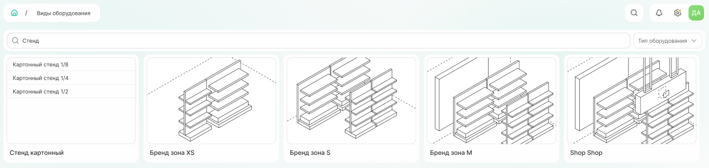
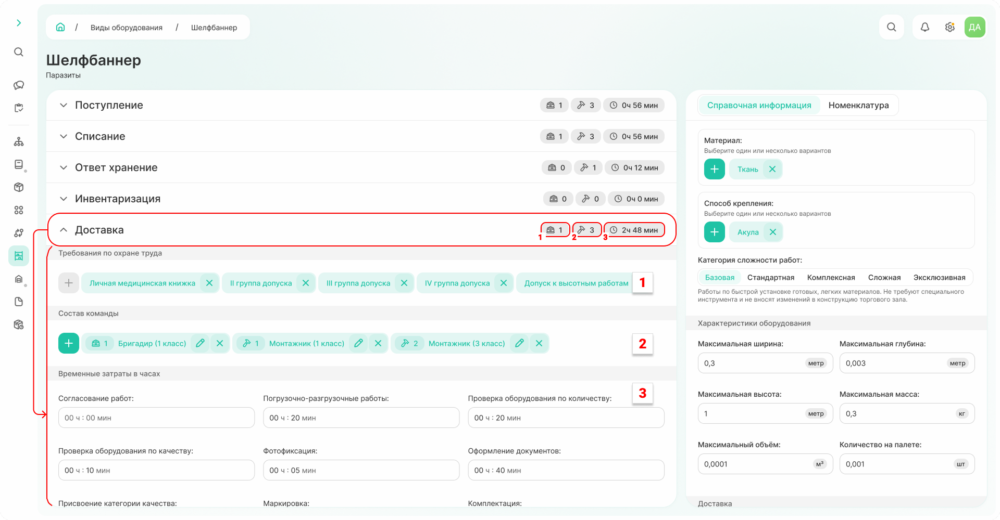
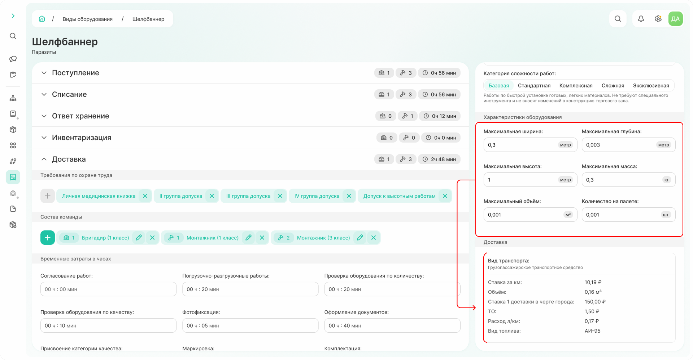
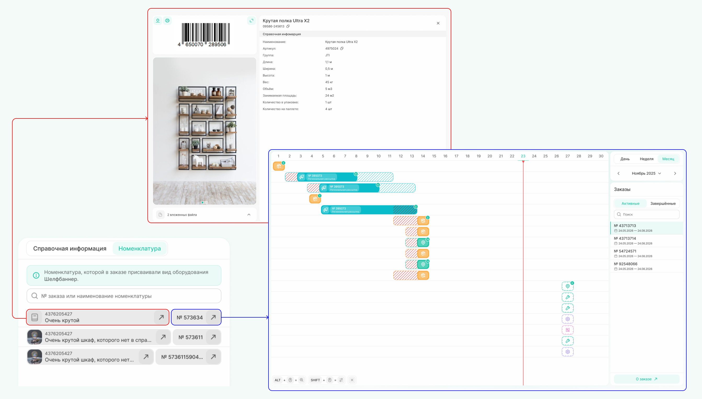

# Виды оборудования

**Вид оборудования** - это справочник, который содержит описание и характеристики оборудования. При клике по группе-карточке выводится список, из которого можно перейти на страницу конкретного вида оборудования.

{.center width=1200}



**Если известно только название оборудования, воспользуйтесь поиском.** Система определит вид, к которому может относиться оборудование, и покажет все карточки, где встречается указанное наименование.

{.center width=1200}



## Страница оборудования

На странице оборудования представлен список доступных действий с оборудованием. 
В свернутом виде отображается количество требований по охране труда (1), состав команды (2) и общие временные затраты на одно действие (3). 

{.center width=1200}

В развернутом виде можно посмотреть:
- конкретные требования по охране труда — это может быть наличие медицинской книжки или доступа к высотным работам;
- необходимое количество специалистов — например, для доставки шелфбаннера потребуется 1 бригадир 1 класса, 1 монтажник 1 класса и 2 монтажника 3 класса;
- разбивку по минутам для каждого этапа доставки.

Справа есть вкладки со справочной информацией и номенклатурой.

**Справочная информация** содержит сведения о материале, способе крепления, габаритах оборудования и категорию сложности работ. Также в зависимости от характеристик оборудования автоматически выбирается вид транспорта и вся сопутствующая информация. 

{.center width=1200}

**Вкладка «Номенклатура»** содержит список тех номенклатур, которым присвоен данный вид оборудования. Отсюда можно перейти к карточке конкретной номенклатуры и посмотреть диаграмму Ганта заказа.

{.center width=1200}



**Вся справочная информация**, кроме автоматически рассчитываемой, при необходимости **может быть изменена руководителем РПУ.** Для остальных пользователей доступен только просмотр.  

