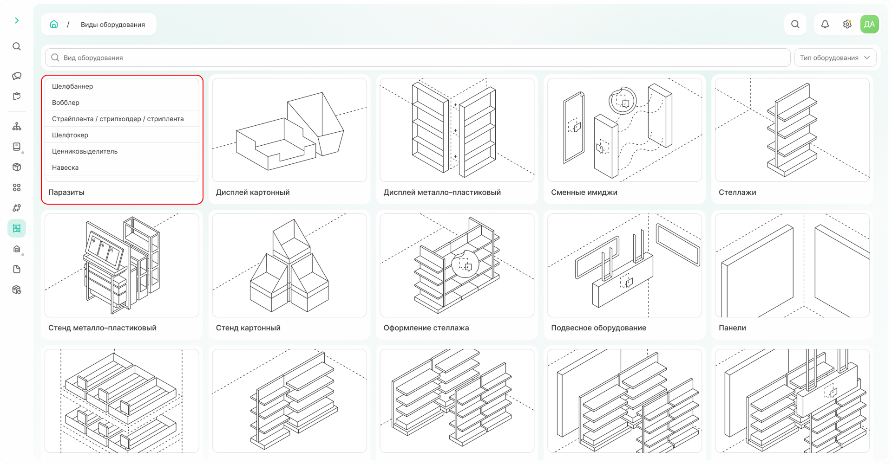
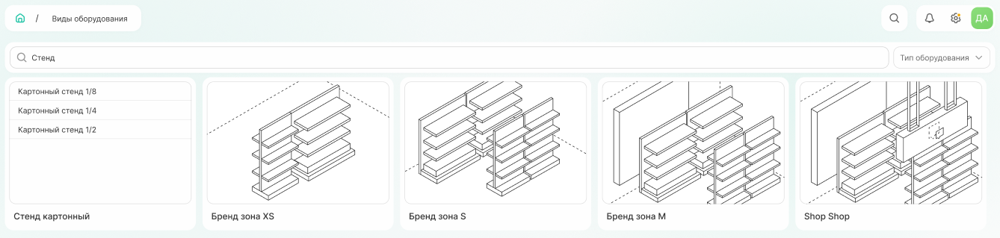
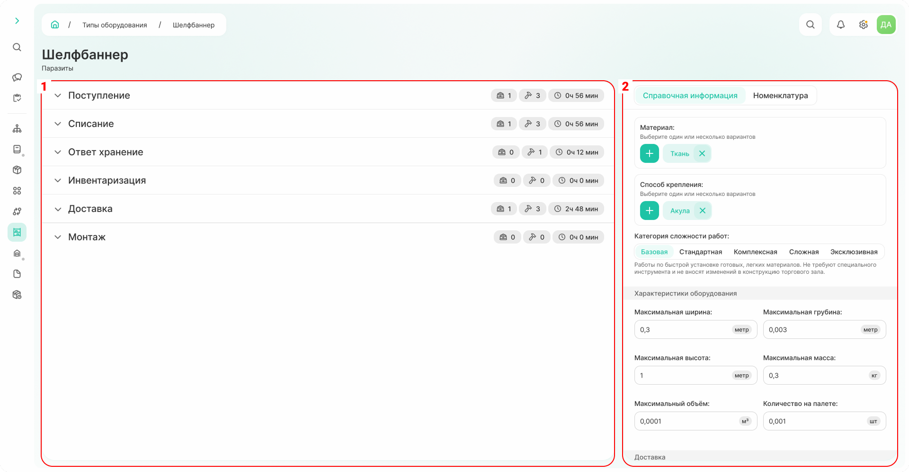
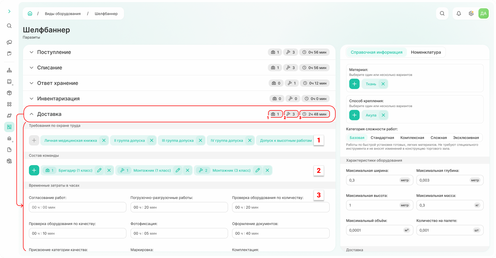
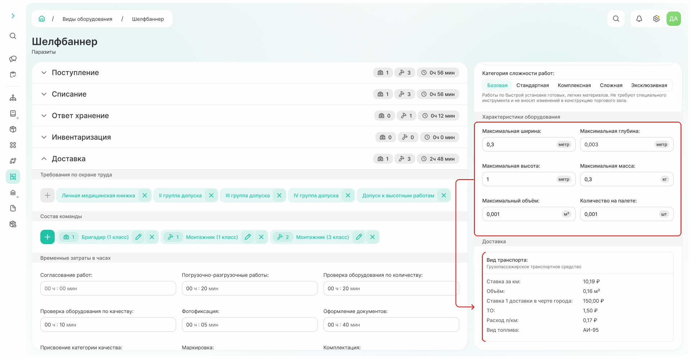
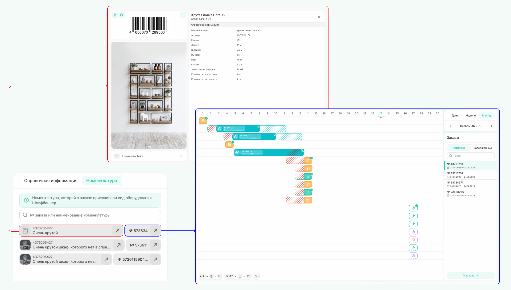

# Типы оборудования



**[Тип оборудования][2]** — сущность, необходимая для объединения разных видов оборудования с общими признаками в одну группу. 

**[Вид оборудования][1]** — справочник с информацией об объектах, над которыми выполняются различные операции. 



Данные о типах и зависимых видах оборудования содержатся в [подсистеме][3] «Справочники» → «Типы оборудования».
- **Тип оборудования** отображается графически, под каждым изображением указано наименование типа.
- Для перехода к **виду оборудования** необходимо кликнуть по соответствующему типу, в списке найти нужное наименование и выбрать его — откроется [форма][4], содержащая в себе всю информацию.

{.center width=1200}



**Если известно только название вида, воспользуйтесь поиском.** Система определит тип, к которому может относиться искомый вид оборудования, и покажет все [карточки][5], где встречается указанное наименование.

{.center width=1200}



## Страница вида оборудования

Страница(форма) вида оборудования содержит:
- список действий, которые необходимо осуществить, чтобы его установить(1);
- справочную информацию и связанную [номенклатуру][6](2). 

{.center width=1200}

### Список действий над оборудованием

У каждого действия есть 3 [иконки][7] с информацией о:
- требованиях к охране труда;
- составе команды;
- ожидавемом времени выполнения.
При клике по действию разворачивается вся информация, которая суммарно отображена в иконках.  

{.center width=1200}

### Справочная информация

**Справочная информация** содержит сведения о материале, способе крепления, габаритах оборудования и категорию сложности работ. Также в зависимости от характеристик оборудования автоматически выбирается вид транспорта и сопутствующая информация. 

{.center width=1200}

### Номенклатура вида оборудования

**Вкладка «Номенклатура»** содержит список тех номенклатур, для которых был выбран данный вид оборудования. 
Отсюда можно перейти к карточке конкретной номенклатуры (переход происходит при клике по наименованию номенклатуры) и посмотреть заказ, в котором она была использована (переход по номеру заказа).

{.center width=1200}



**Руководитель РПУ может изменить всю справочную информацию**, кроме автоматически рассчитываемой. Для остальных пользователей доступен только просмотр. 



[1]: https://lebelena.github.io/diplodoc-example/ru/glossary.html#lcp:~:text=%D0%92%D0%B8%D0%B4%20%D0%BE%D0%B1%D0%BE%D1%80%D1%83%D0%B4%D0%BE%D0%B2%D0%B0%D0%BD%D0%B8%D1%8F%20(LCP)

[2]: https://lebelena.github.io/diplodoc-example/ru/glossary.html#:~:text=%D0%B8%D0%B7%20%D0%B2%D1%8B%D0%BF%D0%B0%D0%B4%D0%B0%D1%8E%D1%89%D0%B5%D0%B3%D0%BE%20%D1%81%D0%BF%D0%B8%D1%81%D0%BA%D0%B0-,%D0%A2%D0%B8%D0%BF%20%D0%BE%D0%B1%D0%BE%D1%80%D1%83%D0%B4%D0%BE%D0%B2%D0%B0%D0%BD%D0%B8%D1%8F,-%E2%80%93%20%D0%B2%D0%BD%D1%83%D1%82%D1%80%D0%B5%D0%BD%D0%BD%D1%8F%D1%8F%20%D1%81%D1%83%D1%89%D0%BD%D0%BE%D1%81%D1%82%D1%8C%20%D0%B2

[3]: https://lebelena.github.io/diplodoc-example/ru/glossary.html#:~:text=%D0%BE%D1%81%D0%BD%D0%BE%D0%B2%D0%BD%D0%BE%D0%B3%D0%BE%20%D0%BF%D1%83%D0%BD%D0%BA%D1%82%D0%B0%20%D0%BC%D0%B5%D0%BD%D1%8E-,%D0%9F%D0%BE%D0%B4%D1%81%D0%B8%D1%81%D1%82%D0%B5%D0%BC%D0%B0,-%E2%80%93%20%D0%BA%D1%80%D1%83%D0%BF%D0%BD%D1%8B%D0%B9%20%D1%84%D1%83%D0%BD%D0%BA%D1%86%D0%B8%D0%BE%D0%BD%D0%B0%D0%BB%D1%8C%D0%BD%D1%8B%D0%B9%20%D0%B1%D0%BB%D0%BE%D0%BA

[4]: https://lebelena.github.io/diplodoc-example/ru/glossary.html#:~:text=%D0%9C%D0%BE%D0%B4%D0%B0%D0%BB%D1%8C%D0%BD%D0%BE%D0%B5%20%D0%BE%D0%BA%D0%BD%D0%BE/%D1%84%D0%BE%D1%80%D0%BC%D0%B0

[5]: https://lebelena.github.io/diplodoc-example/ru/glossary.html#:~:text=%D0%9A%D0%B0%D1%80%D1%82%D0%BE%D1%87%D0%BA%D0%B0%20%D0%B7%D0%B0%D0%B4%D0%B0%D1%87%D0%B8/%D0%BA%D0%BE%D0%BD%D1%82%D1%80%D0%B0%D0%B3%D0%B5%D0%BD%D1%82%D0%B0/%D0%BF%D0%BE%D1%80%D1%83%D1%87%D0%B5%D0%BD%D0%B8%D1%8F%20%D0%BF%D0%BE%20%D0%B4%D0%BE%D0%B3%D0%BE%D0%B2%D0%BE%D1%80%D1%83

[6]:https://lebelena.github.io/diplodoc-example/ru/glossary.html#:~:text=%D0%9D-,%D0%9D%D0%BE%D0%BC%D0%B5%D0%BD%D0%BA%D0%BB%D0%B0%D1%82%D1%83%D1%80%D0%B0%20(LCP),-%E2%80%93%20%D1%81%D0%B2%D0%BE%D0%B4%D0%BD%D1%8B%D0%B9%20%D0%BF%D0%B5%D1%80%D0%B5%D1%87%D0%B5%D0%BD%D1%8C%20%D0%BE%D0%B1%D1%89%D0%B8%D1%85

[7]: https://lebelena.github.io/diplodoc-example/ru/glossary.html#:~:text=%D0%98-,%D0%98%D0%BA%D0%BE%D0%BD%D0%BA%D0%B0%20(%D0%B0%D0%BD%D0%B3.%20icon),-%E2%80%93%20%D0%BC%D0%B0%D0%BB%D0%B5%D0%BD%D1%8C%D0%BA%D0%B8%D0%B9%20%D0%B3%D1%80%D0%B0%D1%84%D0%B8%D1%87%D0%B5%D1%81%D0%BA%D0%B8%D0%B9%20%D0%B7%D0%BD%D0%B0%D1%87%D0%BE%D0%BA